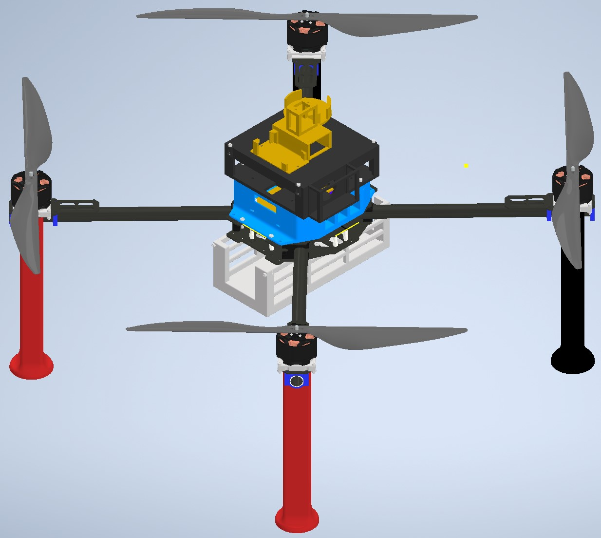
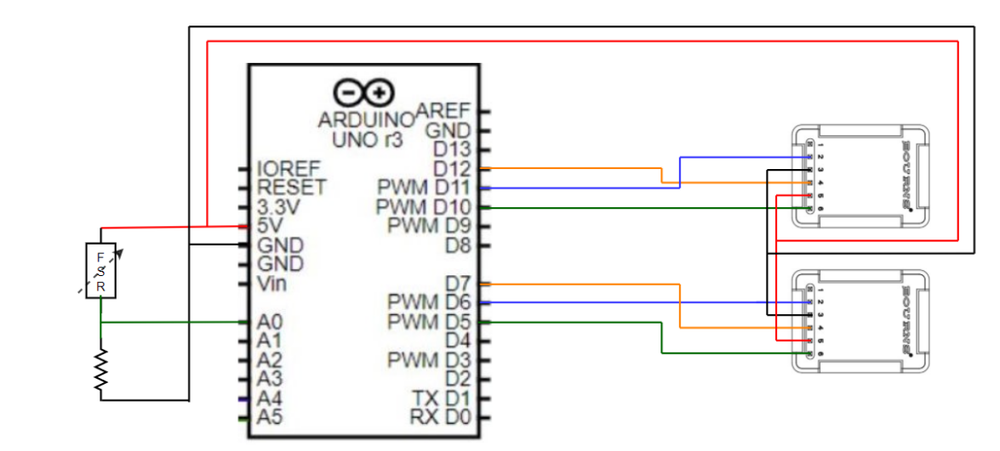
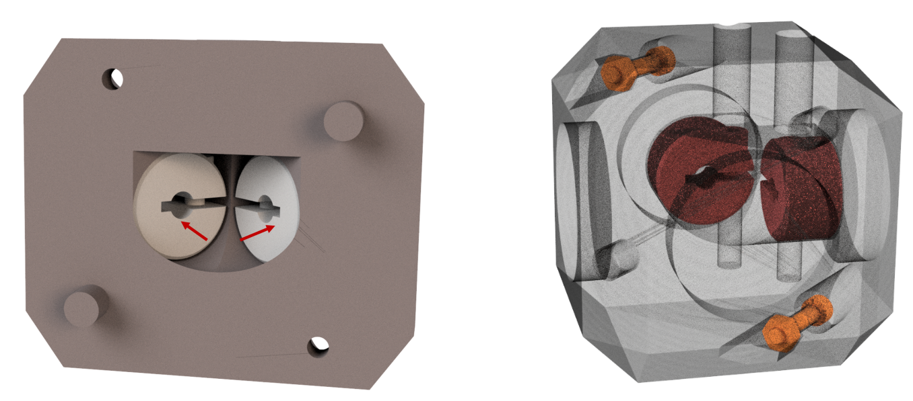
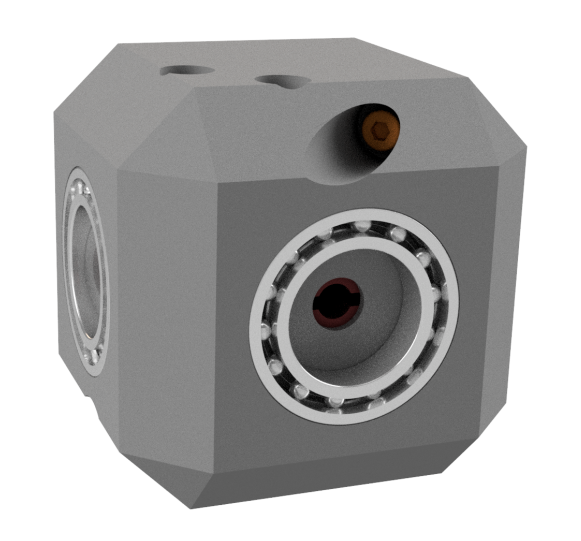

Building the Hardware
=====================
This chapter explains which components are to be ordered and and how to build a custom UAV from its different components.
We provide details for the development of two distinct UAV versions based on the frame size: an F450 and a T650 UAV.
Moreover, we provide the details of additional hardware modules that extends the functionality of the UAVs.
To know which UAV and additional hardware can be used for which type of experiments, please read 

.. admonition:: todo

   Bryan refer to other section(s).

.. admonition:: todo

   Bryan add for all componenets a link of where there can be ordered

F450 UAV
--------

.. admonition:: todo

   Bryan complete section(s).

T650 UAV
--------

Components
^^^^^^^^^^
This section lists all the components required to build the UAV.

Off-the-shelf
*************

* **Frame**: the body of the UAV, to which all other components are fixed.

  *Choice*: the Tarot Ironman 650 frame.

  .. figure:: _static/frame.jpg
     :width: 800
     :alt: alternate text
     :align: center

     Tarot Ironman 650 frame

  .. admonition:: note

     We do not use the feet of the frame but instead 3D print custom feet as to reserve more space for additional hardware (e.g., an encoder mechnism for payload transport) at the bottom part of the UAV.

(updated)
  .. admonition:: todo

     make sure the picture gets cropped (as to delete the excessive white borders)

* **Flight Controller (FC)**: the FC is an electronic board with sensors (e.g., accelerometer, gyroscope, barometer, GPS) required for controlling the attitude (and position) of the UAV.
  
  *Choice*: the Pixhawk 4 flight controller, which comes with its own GPS sensor and power distribution board.

  .. figure:: _static/PX4.jpg
     :width: 800
     :alt: alternate text
     :align: center

     Pixhawk 4 FC

* **Power Distribution Board (PDB)**: the PDB is the central board of the UAV where the power supplied of most of the the electrical components converge and are connected to the battery.

  *Choice*: PDB delivered with the Pixhawk 4.

  .. figure:: _static/PDB.jpg
     :width: 400
     :alt: alternate text
     :align: center

     Pixhawk 4 PDB

(updated)
  .. admonition:: todo

     replace with higher resolution picture

* **GPS**: retrieves the absolute (i.e., global) position of the UAV.

  *Choice*: the GPS from the Pixhawk 4.

  .. figure:: _static/gps.jpg
     :width: 400
     :alt: alternate text
     :align: center

     Pixhawk 4 GPS

(updated)
  .. admonition:: todo

     replace with higher resolution picture and make sure the picture cropped (as to delete the grey bottom reactangle)

* **Motors**: when a voltage is supplied these rotate their propellors at a desired speed command proportianal to the applied voltage.
  
  *Choice*: two pairs of the Tarot 4114 320KV Multi-Rotor brushless motors.

  .. figure:: _static/motor.jpg
     :width: 800
     :alt: alternate text
     :align: center

     Tarot 4114 320KV Multi-Rotor brushless motor
  
(updated)
  .. admonition:: todo

     make sure the picture gets cropped (as to delete the excessive grey borders)

* **Propellers**: move the air due to the motor's motion and prdocue a thrust force that move the UAV.

  *Choice*: two pairs (CW and CCW) of the Tarot 15X5.5 Carbon Fiber Propeller TL2831

   .. figure:: _static/propeller.jpg
      :width: 800
      :alt: alternate text
      :align: center

      Tarot 15X5.5 Carbon Fiber Propeller TL2831

* **Electronic Speed Controllers (ESCs)**: are electronic circuits used to control the speed of the motors.

  *Choice*: for each motor a Turnigy MultiStar BLheli_32 ARM 51A Race Spec ESC 2~6S.

   .. figure:: _static/esc.jpg
      :width: 800
      :alt: alternate text
      :align: center

      Turnigy MultiStar BLheli_32 ARM 51A Race Spec ESC 2~6S

(updated)
   .. admonition:: todo

     make sure the picture gets cropped (as to delete the excessive grey borders)

* **Battery**: the battery powers all electrical components on the UAV and is typically on of the heaviest components on the UAV. It is recommended to buy enough spare batteries.

  *Choice*: a Turnigy Graphene Professional 12000mAh 6S15C LiPo Pack.

   .. figure:: _static/battery.jpg
      :width: 800
      :alt: alternate text
      :align: center

      Turnigy Graphene Professional 12000mAh 6S15C LiPo Pack

(updated)
   .. admonition:: todo

     make sure the picture gets cropped (as to delete the excessive grey borders)

* **RC Receiver (RCR)**: the RCR is a device that allows unidirectional wireless communication with the UAV. It receives and sends information from/to the RC transmitter that is located off-board the UAV.

  *Choice*: Hitec Optima SL

  .. figure:: _static/optima.jpg
     :width: 800
     :alt: alternate text
     :align: center

     Hitec Optima SL

(updated)
.. admonition:: todo

     make sure the picture gets cropped (as to delete the excessive grey borders)

* **RC Transmitter (RCT)**: the RCT is held by a human operator and teleoperates the UAV (i.e., it sends toggle and joystick commands to the UAV and receives some limited on-board information). This can be used to manually fly the UAV or as a safety control that overtakes autonomous flight if the operated sees somethings goes wrong.

  *Choice*: Hitec Flash 8

  .. figure:: _static/hitec.jpg
     :width: 800
     :alt: alternate text
     :align: center

     Hitec Flash 8

(updated)
  .. admonition:: todo

     make sure the picture gets cropped (as to delete the excessive grey borders)

* **Other**: 

   Electrical cables: 
      * 20 x this used for that
      * 10 x this used for that

   Electrical connectors: 
      * 3 x this used for that
      * 5 x this used for that
   
   Mechanical connectors (screw, bolts and nuts): 
      * 3 x this used for that
      * 5 x this used for that
   
   Other?:
      * 3 x this used for that
      * 5 x this used for that

still to be done. I'll try to get clearer on the explanations.
  .. admonition:: todo

     add here all screws, nuts, and their sizes, and other things like tape, straps, jumper cables, soldering iron, cables (which type of cable thickness and flexible), connectors (all yellow connectors or metal connectors to power things) and explain for what these are used.
     Old text of Maxime I placed here: All the holes used to attach something directly on the frame are for M3 bolts and the other holes M2.5 bolts. Use M3x12mm and M2.5x12mm bolts.

.. admonition:: note

   The components listed above are all you need to build a UAV for manual flight. Optionally, if one wants to build a UAV for more advanced autonomous flight, one will need some of (your choice) the additional components listed below.

* **Companion computer**: the main computational unit on-board the UAV, used to compute most estimation, planning and control algorithms in real-time.

  *Choice*: the Intel NUC BXNUC10i7FNK2.

   .. figure:: _static/nuc.jpg
      :width: 800
      :alt: alternate text
      :align: center

      Intel NUC BXNUC10i7FNK2

* **FTDI cable**: the FTDI cable is a USB to Serial (TTL level) converter which allows for a simple way to connect TTL interface devices to USB. The I/O pins of this FTDI cable are configured to operate at 5V. It basically enables the Pixhawk and the companion computer to communicate.

  *Choice*: To check correct name

  .. admonition:: todo

     Bryan

  .. figure:: _static/ftdi.jpg
     :width: 800
     :alt: alternate text
     :align: center

     TODO ADD CORRECT NAME

* **DC-DC converter**: enables to provide the appropriate supply voltage to the companion computer which is typically in a different range of voltage/current/power as the battery.

  *Choice*: Wingoneer XL4016E1 (input: 4-40V, output: 1.25-36V at max 8A, max power: 200W). Since the 6S LiPo battery (i.e., a Turnigy Graphene Professional 12000mAh 6S15C LiPo Pack) provides at most 25.2V and at least 18.0V and the Intel NUC companion computer needs a supply voltage between 12V and 19V and has a rated power supply of 19V/6.33A, the converter must be able to take 18V-25.2V in and deliver 19V/6.33A (or 121W).
You can find `here https://www.alldatasheet.com/datasheet-pdf/pdf/1134370/XLSEMI/XL4016E1.html>`__ the datasheet of the XL4016E1. 
Go `here <https://www.amazon.fr/WINGONEER-R%C3%A9gulateur-convertisseur-Efficacit%C3%A9-Alimentation/dp/B071L34ZXB>`__ for more information about the Wingoneer circuit and where to buy it.

(updated)
    .. admonition:: todo

     add links to datasheets onlien and cite the pages where you found this info. 

    .. admonition:: todo

     add link where you ordered this convertor

  .. figure:: _static/converter.jpg
     :width: 800
     :alt: alternate text
     :align: center

     Wingoneer XL4016E1

* **Real-Time Kinematic (RTK) GPS**: RTK is a GPS-based positioning system that allows to get more precise (i.e., cm-precise) global (in XY and Z) position from Global Navigation Satellite System (GNSS) measurements. It is used additionality to the standard GPS senor on-board the UAV which typically only obtain m-level precision. The RTK system typically consists of a stationary ground "base" station that sends corrections to an RTK module on-board the UAV which is called the "rover". Both devices individually can get GNSS measurements with usual GPS precision. The RTK system computes the baseline, the difference between both measurements then gives the rover’s position relative to the base.

  *Choice*: the Emlid Reach M2 UAV Mapping Kit. It is composed of the Emlid Reach RS2 as the base and the Emlid Reach M2 attached to the UAV as the rover. To the latter is connected via a cable the Multi-band GNSS antenna.
 
   .. figure:: _static/rtk.jpg
      :width: 800
      :alt: alternate text
      :align: center

      Emlid Reach M2 UAV Mapping Kit

Custom-made
************
In this section all custom made parts to build the autonomous UAV are explained.

.. admonition:: todo

   Once the final designs are finished of both your thesis, I will need the inventor files and all stl files of the UAV (also for the F450 from which you started). I will put them on a drive that people can download it. We cannot put it on github since too large files. 
   They are accessible here (TO DO).

We 3D print all these pieces with 20% infill:

* **Main piece (x 1)**: used to provide enough space for all the components. The PDB is fixed on its lower stage, the Pixhawk and its middle stage and the Intel NUC on its top stage. 

  .. figure:: _static/pb_stage.jpg
     :width: 800
     :alt: alternate text
     :align: center

     Main piece 

* **Pixhawk case (x 1)**: used to fix the Pixhawk on the Main piece.

  .. figure:: _static/pixhawk_case.jpg
     :width: 800
     :alt: alternate text
     :align: center

     Pixhawk case

* **NUC case and cover (x 1 per piece)**: the inside of the case is used to fix the Intel NUC. The side part of the case is used to fix the Emlid Reach M2. The case cover is used to atached multiple other components to the Upper case.

  .. figure:: _static/Nuc_cad.jpg
     :width: 800
     :alt: alternate text
     :align: center

     NUC case and cover

* **Upper case (x 1)**: used to fix the RC receiver, the Pixhawk GPS, and the RTK Multi-band GNSS antenna.

  .. figure:: _static/upper_part.jpg
     :width: 800
     :alt: alternate text
     :align: center
     
     Upper case

  When the Main piece, the Nuc case and cover, and the Upper case are assembled one gets:

  .. figure:: _static/Top.jpg
     :width: 800
     :alt: alternate text
     :align: center
     
     All the cases assembled

* **Motor top and bottom fixation (x 4 per piece)**: used to attach the motors to the frame and to fix the legs.

  .. figure:: _static/motor_fixation_top.jpg
     :width: 800
     :alt: alternate text
     :align: center
   
     Motor top fixation

  .. figure:: _static/motor_fix_bottom.jpg
     :width: 800
     :alt: alternate text
     :align: center
   
     Motor bottom fixation

  .. figure:: _static/motor_cad.jpg
     :width: 800
     :alt: alternate text
     :align: center

     Motor fixed to Motor top fixation

(updated)
  .. admonition:: todo

     for completeness add picture of how Motor bottom fixation is used to connect frame to Motor top fixation

  .. figure:: _static/motor_on_arm_cad_1.jpg
     :width: 800
     :alt: alternate text
     :align: center

* **Leg (x 4)**: used to support the drone while on the ground.

  .. figure:: _static/leg.jpg
     :alt: alternate text
     :align: center
     :scale: 50
     
     Leg

* **Battery case with side (x 2), front (x 1) and core (x 1) piece**: used to attach the battery to the frame.

(updated) Also updated the picture of the assembly.
  .. admonition:: todo

     add pictures of all pieces

  .. figure:: _static/battery_assembly.jpg
     :width: 800
     :alt: alternate text
     :align: center
     
     Battery case

  .. figure:: _static/bottom_battery.jpg
     :width: 800
     :alt: alternate text
     :align: center
     
     Bottom of the battery case

  .. figure:: _static/battery_front.jpg
     :width: 800
     :alt: alternate text
     :align: center
     
     Front of the battery case

  .. figure:: _static/sideR_battery.jpg
     :width: 800
     :alt: alternate text
     :align: center
     
     Right side of the battery case

  .. figure:: _static/sideL_battery.jpg
     :width: 800
     :alt: alternate text
     :align: center
     
     Left side of the battery case

Step-by-step assembly instructions
^^^^^^^^^^^^^^^^^^^^^^^^^^^^^^^^^^^

In this section you will learn how to fix all the components on their (custom-made) piece, assemble everything, and solder/connect every cable/connector to electronic components.

**Goal**: assemble the UAV that looks like in this CAD: 

   
   Fully assembled CAD of the T650 UAV

.. admonition:: todo

   in the picture above are missing several components. There is no NUC, battery, Reach M2, Antenna, GPS, ... A final assembly has ALL componenents (even screw). The only thing you cannot draw in CAD are the cables and connectors. If a user want to build it, it helps to see how all componenets fit in the custom-made parts.

**Required tools**:

.. admonition:: todo

   list the tools needed during the assembly: e.g. soldering iron, screwdriver numbers...

**Tips**:

.. admonition:: note

   Every time you solder cables, put a piece of shrink tube beforehand on the cables and heat them on the soldering once it is done.

**Steps**

.. admonition:: todo

   When building the second drone you need to add the steps of "Connecting the NUC on the drone" in this section in a logical order. 
   This should not be a seperate section as you need to explain the build procedure of how to build the autonomous drone (as you design is made for that one).

1. Mount the frame as explained `in this tutorial <https://www.youtube.com/watch?v=Ddvgs200OaY&ab_channel=MultiCopterBuild>`__. You only need to attach the arms to the body and you can skip the assembly of the legs and the top part.

2. Drill the holes of all the 3D printed pieces to deal with imperfections due to shrinkage. Use a drill bit of size 2.5mm for every hole **NOT** directly touching the frame. For the holes used to fix the parts on the frame itself, use a 3mm drill bit.

.. admonition:: todo

   I have difficulties understandign what you mean with these 2 categories of parts. Can you give a list of parts (see names above) that need which drill size? 

  .. figure:: _static/material_motor.jpg
     :width: 800
     :alt: alternate text
     :align: center
     
     Material for steps 3, 4 and 6 to 9

3. Put the motor on the "Motor top fixation" piece (cables go through the elliptical hole), with the help of the screws provided with the motor. Repeat for all motors.

  .. figure:: _static/motor_top.jpg
     :width: 800
     :alt: alternate text
     :align: center
     
     Step 3

.. admonition:: todo

   Take picture on white background (use a clean white sheet of paper, you can find those at the printer up the stairs in front of you). Make sure there are no unnecessary things (noise) in the picture. In this case we do not need to see the soldering yet. Crop the image to what is actually useful. **these comments applies to all pictures below you take of the prototype**

4. Take 3 jumper wires (more or less 30cm) with at least one female connector, remove the other connector and solder them to the three signal cables from the ESC (blue, brown and orange). Try to keep the same colors for all the ESCs. Repeat for all ESCs.

  .. figure:: _static/esc_signal.jpg
     :width: 800
     :alt: alternate text
     :align: center

     Step 4 

(updated)
  .. admonition:: todo

     Take picture

5. Solder the three motor cables to the ESC in arbitrary order. Repeat for all ESCs.
(updated)

  .. figure:: _static/motor_esc_soldering.jpg
     :width: 800
     :alt: alternate text
     :align: center

     Step 5 
     

  .. admonition:: todo

     Take picture

  .. admonition:: note

     The ordering of the connectors will be corrected later in the calibration phase. Make sure you allow the space to resolder thse cables easily.

6. Fix the "Motor bottom fixation" piece to the frame's part (shown in next figure) with 4x M3 bolts (head on bottom).

(updated)
  .. figure:: _static/step6.jpg
     :width: 800
     :alt: alternate text
     :align: center

      Step 6

7. Put 2 straps in it through the side windows. The loops will be done downward.

  .. figure:: _static/step7.jpg
     :width: 800
     :alt: alternate text
     :align: center

      Step 7

8. Fix the assembly to the end of an arm, using the bolts and parts (orange and blue) provided with the frame. With the help of a level, try to put it as horizontal as possible.

  .. figure:: _static/motorb_frame.jpg
     :width: 800
     :alt: alternate text
     :align: center

     Step 8

     todo: caption

  .. admonition:: todo

     orange and blue parts are not clear on the picture   

9. Fix the "Motor top fixation" on the "Motor bottom fixation" with the help of 4x M2.5 bolts (holes on the corner of the parts). Repeat the last four steps for each motor.

  .. figure:: _static/motort_motorb.jpg
     :width: 800
     :alt: alternate text
     :align: center

     Step 9

     todo caption

10. You could now attach the propellors to the motors. However, for safety you should only do this when preparing for a real flight.

  .. admonition:: todo

     Take picture

11. Take four pairs of power supply cables (more or less 18cm long, thick red and black cables, a single pair per motor). Make sure that the four pairs can reach the ESCs starting from the middle of the frame. Solder all the pairs on the power distribution board (PDB). The position of each pair is shown in the picture below. As the UAV requires four motors but the PDB can supply up to eight motors, you can solder each red cable to both B+ connections available on each corner of the PDB. In each corner, where the red cables are, choose one of the two GND connection to solder the black cables.

(updated)
  .. figure:: _static/material_step11.jpg
     :width: 800
     :alt: alternate text
     :align: center

     Material for step 11

  .. figure:: _static/pdb_soldering_2.jpg
     :width: 800
     :alt: alternate text
     :align: center

      Step 11
   
(updated)
  .. admonition:: todo
      
     

  .. admonition:: todo

     Take new picture(s) with the following corrections:
     i) less noise, so do not show jumber cables going to the PDB as you did not tell this before in the instructions. If you forgot this, then add it in a step before. 
     ii) The lengths of the cables: say how long you cut the cables in the text above (e.g. XX cm), 
     iii) a pair with an XT60 connector on them (provided with the PDB) is not visible on the picture what you do with it. So maybe not important here, but say the elngth of the cable so if we don't see the cable we know at elast how long it should be.

12. Fix the PDB to the "Main piece" by help of 4x M3 bolts (head on bottom), use the 4 holes in the middle of the "Main piece". As you can see in the picture below the holes are off-centered. Put the cables with the XTC connector on the side with the biggest space (on the right in the picture below) and put them out of the piece thanks to the hole on that side (see second picture). In between the main piece and the PDB, put a nut on each bolt that serve as spacers.

  .. figure:: _static/main_piece_spacer.jpg
     :width: 800
     :alt: alternate text
     :align: center

      Step 12

  .. figure:: _static/pdb_mp_1.jpg
     :width: 800
     :alt: alternate text
     :align: center

      Step 12

(updated)
  .. admonition:: todo

     Take picture

13. Put the free end of each of the eight power supply cables outside the "main piece" with help of the holes in the corners.

  .. figure:: _static/pdb_mp_2.jpg
     :width: 800
     :alt: alternate text
     :align: center

      Step 13

(updated)
  .. admonition:: todo

     Take picture

14. Fix the "Main piece" on the upper plate of the frame, by help of 8x M3 bolts.

  .. admonition:: todo

     Take picture

15. Connect the signal cables of the ESCs (by passing them through the windows of the "main piece") to the "FMU-PWM-out" port of the PDB. Use the pins labeled 1 to 4 (to know which motor to connect to which set of pins, please refer to the chapter "Setting up QGroundControl"). If you have matched rightly the colors of the cables previously, connect the blue ones to the "S" pins, the brown ones to the "+" pins and the orange ones to the "-" pins (on top the blue cables, in the middle the brown cables and at the bottom the orange ones).

  .. admonition:: todo

     Take picture

  .. admonition:: todo

     Chapter Setting up QGroundControl: try to be more specific and say which subsection or image you can find this information.

16. Connect the cables provided with the Pixhawk to the ports "FMU-PWM-in", "PWR1" and "PWR2" of the PDB.

  .. figure:: _static/pdb_connection.jpg
     :width: 800
     :alt: alternate text
     :align: center

     todo: caption

  .. admonition:: todo

     be more specific about which cables and how you attach them.

17. Put the Pixhawk in its case and connect these cables respectively to the ports "I/O PWM OUT", "POWER1" and "POWER2" of the Pixhawk.

  .. figure:: _static/PX_pdb_connection.jpg
     :width: 800
     :alt: alternate text
     :align: center

     todo: caption

  .. admonition:: todo

     redo and crop figure

18.  Put a cable provided with the Pixhawk on its "DSM/SBUS RC" port. It will be used for the RC receiver.

  .. admonition:: todo

     Take picture

19. Connect the GPS to the Pixhawk using the "GPS MODULE" port.

  .. admonition:: todo

     Take picture

20. Be aware that you'll need to make another connection later. You can do it now but you'll need to follow the steps to make the picoblade cable with jumper wires explained in chapter "Connecting the NUC to the drone".

  .. admonition:: todo

     Take picture

21. You will also need an USB cable to setting up QGroundControl later on, if you want, you can already put the cable on the side of the Pixhawk (and let it hang by a window of the "main piece").

  .. admonition:: todo

     Take picture

22. Fix the Pixhawk case to the "main piece" by help of 4x M2.5 bolts, on the middle stage. Try to have the Pixhawk as horizontal as possible in the drone.

  .. admonition:: todo

     Take picture

23. Solder the battery cables coming from the PDB to each pair coming from the ESCs (black on black, red on red). Don't forget to put beforhand a piece of shrink tube on the cables.

  .. admonition:: todo

     redo picture

  .. figure:: _static/all_untill_optima.jpg
     :width: 800
     :alt: alternate text
     :align: center

     todo: caption

24. On top of the "main piece", fix the NUC case by help of 4x M2.5 bolts.

  .. admonition:: todo

     Take picture

25. Put the GPS, the RTK antenna (not yet done) and the Optima (RC receiver) in their respectives cases in the "upper case".

  .. admonition:: todo

     Take picture

26. Fix the "upper case" to the cover of the NUC case, by help of 3x M2.5 bolts.

  .. admonition:: todo

     redo picture

  .. figure:: _static/upper_case_fixed.jpg
     :width: 800
     :alt: alternate text
     :align: center

     todo: caption

27. Fix the NUC case cover on top of the NUC case. 

  .. admonition:: todo

     Take picture

28. Use the straps on the motor fixation parts to fix the legs on each arm. Pass the straps through the rectangular holes on the legs and tighten well.

  .. admonition:: todo

     Take picture

29. Assemble the battery case by assembling the sides to the main part of the case. (I don't remeber exactly how many bolts are used with the latest changes, need to check). No need to add the front part to it for now.

  .. admonition:: todo

     Take picture

30. Fix the battery case to the bottom plate of the frame (clear picture with the recent changes to add).

  .. admonition:: todo

     Take picture

31. When needed, put the battery in its case (wires facing the wires hanging from the PDB) and add its front part to disable the movements of the battery.

  .. admonition:: todo

     Take picture

32. With help of tape, fix the ESCs and their wires to the frame such that none of them are hanging.

  .. admonition:: todo

     redo picture

  .. figure:: _static/drone_complete.jpg
     :width: 800
     :alt: alternate text
     :align: center

     todo: caption

(Need to add a picture with the battery case).

Your UAV is built!

Cable-Suspended Payload Module
-------------------------------

.. admonition:: todo

   Raphael: write this section on the the hardware design and construction of the module similar as we explained it for the UAV above. Make sure to take clean pictures on a white background without noise and that they are cropped. (see my comments before for UAV)

This module is installed at the bottom of the UAV and allows to measure the state (position and velocity) of a cable-suspended load hanging below the UAV. 

.. admonition:: todo

   Raphael todo: integrate the next section better in the hardware building chapter using a similar structure as for UAV (see example given below). Give more pictures and explain better each step of the setup.

Components
^^^^^^^^^^
This section lists all the components required to build the Suspended Payload Module for a UAV.
This is currently only compatible with the 650 UAV.

Off-the-shelf
*************

* **Encoders x2** : Sensor used to measure the actual orientation of the cable, fit inside the universal joint.

  *Choice*: `EMS22A <https://www.bourns.com/docs/product-datasheets/EMS22A.pdf>`__ because of its absolute nature, making it suitable to measure an absolute angle. It has a good resolution and its plain shaft makes it lightweight and compact, which is perfect to fit in the joint.  

  .. figure:: _static/RotaryEncoderEMS22A.png
     :width: 400
     :alt: alternate text
     :align: center

* **Ball bearings x2** : To avoid friction losses in the joint and support the weight of the payload, to preserve encoder shaft.

  *Choice*: `RS PRO Deep Groove Ball Bearing - Plain Race Type, 15mm I.D, 24mm O.D <https://benl.rs-online.com/web/p/ball-bearings/6190159>`__

  .. figure:: _static/BearingAlone.png
     :width: 400
     :alt: alternate text
     :align: center

* **Collar clamp screw x2** : To fix the shaft of the encoders to axis of the joint.

   *Choice*: `Huco Shaft Collar One Piece Clamp Screw, Bore 4mm, OD 16mm, W 9mm, Steel <https://benl.rs-online.com/web/p/shaft-collars/6918027>`__

  .. figure:: _static/CollarClamps.png
     :width: 400
     :alt: alternate text
     :align: center

* **Arduino** : To process the data coming from the sensors and communicate with the controller.

   *Choice*: `Arduino Uno rev3 <https://store.arduino.cc/products/arduino-uno-rev3>`__

* **Stripboard** : to solder the electronic circuit between each components. I don't have the exact reference (no indication in thesis or old tutorial, no brand on the stripboard itself)

   *Suggested choice*: `Single-Sided Stripboard 50x100mm <https://uk.rs-online.com/web/p/stripboards/2189160>`__ 
    Very small area reaquired, might take any other stribord even a smaller one.

* **Hex socket cap screw**

   *Choice*: `M2.5 x 12 mm <https://benl.rs-online.com/web/p/socket-screws/4838130>`__

Optionnal: 

* **Force sensor** : To deduce if the cable is well taut.

   *Choice*: `FSR04CE <https://www.mouser.be/datasheet/2/303/res_fsr-1590094.pdf>`__

  .. figure:: _static/ForceSensor.png
     :width: 400
     :alt: alternate text
     :align: center

* **Resistor** : To do a pull down circuit for measuring the output of the force sensor.

   Need to be 10k Ohms.
   

Custom-made
************
All the following parts need to be 3D printed with PLA and infill of 10 to 15%. LINK TO CAD FILES (not uploaded yet)

* **Center piece** : on which every other parts will be attached to. Must fit the colar clamps and the bearings. Separated in two parts to make assembly and printing possible. 

  .. figure:: _static/centerPiecepart1front.png
     :width: 400
     :alt: alternate text
     :align: center

  .. figure:: _static/Centerpiecepart1back.png
     :width: 400
     :alt: alternate text
     :align: center

  .. figure:: _static/Centerpiecepart2front.png
     :width: 400
     :alt: alternate text
     :align: center

  .. figure:: _static/Centerpiecepart2back.png
     :width: 400
     :alt: alternate text
     :align: center

* **Upper arms** : Will be attached to the battery by its support. Must fit an encoder.

  .. figure:: _static/UpperArm1Back.png
     :width: 100
     :alt: alternate text
     :align: center

  .. figure:: _static/UpperArm1Front.png
     :width: 100
     :alt: alternate text
     :align: center

  .. figure:: _static/UpperArm2.png
     :width: 100
     :alt: alternate text
     :align: center

* **Lower arms** : Same purpose as upper arm. 

   Note that this part is printed in two separated ones, then assembled why one bolt. This was done to ease the printing process and to allow a clean mounting and unmounting of this part.

   .. figure:: _static/LowerArmFull.png
     :width: 300
     :alt: alternate text
     :align: center

* **Attachment for the cable** : Must fit on the lower arm (And on the force sensor if there is one).

   .. figure:: _static/AttachmentCable.png
     :width: 100
     :alt: alternate text
     :align: center

* **Support attached to the battery case** : Link the battery of the UAV to the upper arm of the encoder module.

   .. figure:: _static/AttachmentBatteryCase.png
     :width: 300
     :alt: alternate text
     :align: center

* **Arduino plate** : Support to screw the arduino and the stripboard on the side of the battery case.

   .. figure:: _static/AttachmentArduino.png
     :width: 300
     :alt: alternate text
     :align: center

Step-by-step assembly instructions
^^^^^^^^^^^^^^^^^^^^^^^^^^^^^^^^^^
Once everypart is ready, one can proceed with the assembly of the encoder system (mechanical and electronic).

Electronic circuit
******************
First, the electronic components can be assembled. This will require a soldring station as everything will be connected via the stripboard.
On the following figure, one can see the correct circuit to reproduce. 

.. note::
  It is better to use flexible cables (REF ??? I used the one that are at the lab on big rolls) to do the circuit as rigid ones might disconnect more easily in case they are pulled a bit.

5 cables are needed per encoders. 2 are for the power (V+ and ground) and 3 are for the signal. To solder these correctly, put a small amount of tin on both the pin of the encoder and the cable. Then put the cable on the pin and heat up the two with the soldering iron. Both preapplied tin layers should melt easilly and fuse togheter on the pin. Once the shape of the weld is looking regular and well spreaded over the pin, just take out the iron and wait.
Don't hesitate to redo some of the weldings if they don't look strong enough, as it is very important that the cables stay in place. Also, the welds must not touch each other of course.
Once all the cables are welded to the encoder, cables from the same encoder can be attached togheter with tape to keep a readable circuit and avoid mistakes. 

Mechanical assembly 
*******************

.. admonition:: todo

   Raphael : When building the 2nd encoder, will do pictures of intermediate steps. 

* **Center piece**  Press fit the collard inside the hollow part of the center piece. When those are in place, connect the two part of the central piece and secure it using two bolts.

* **Add the bearings** also by doing press fit. Less tension needed as the arm will naturally keep them in place.

* **Assemble the lower arms** using bolt and adding already the attachment piece for the cable. 

* **Connect the support to the battery** 

* **Attach the upper arm to the center piece of the jont and to the support of the battery**.

* **Add the encoders** at the correct location on each arms

* **Screw the arduino on its support plate and screw the plate on the battery case**

  

