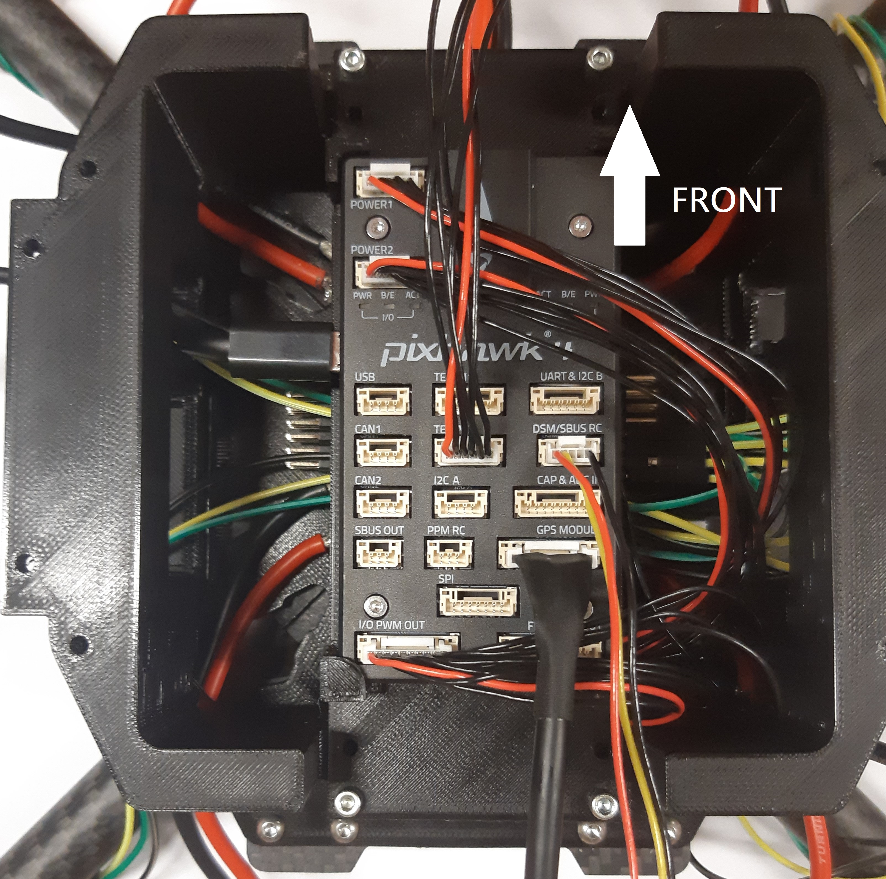
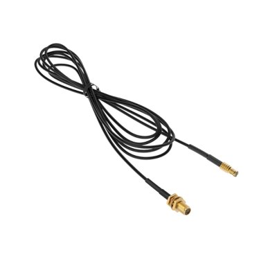
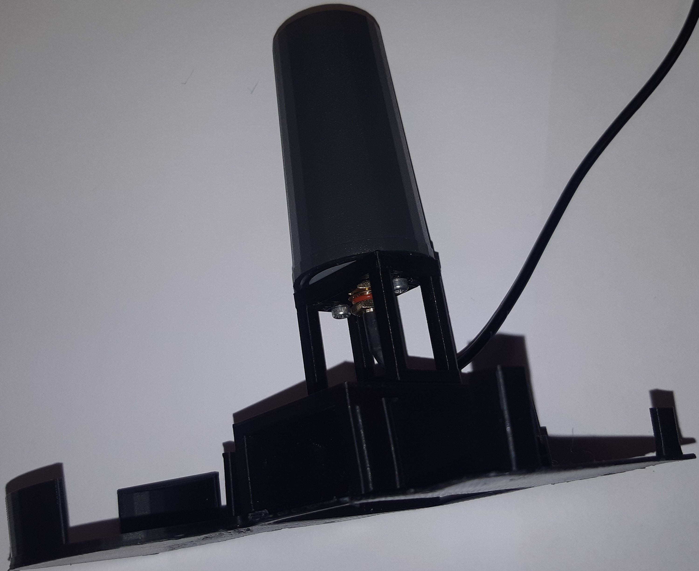
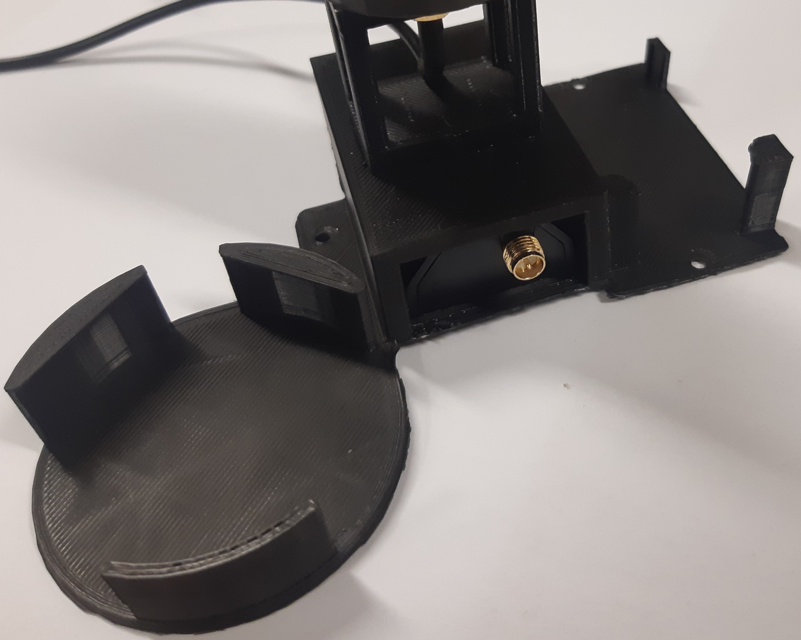
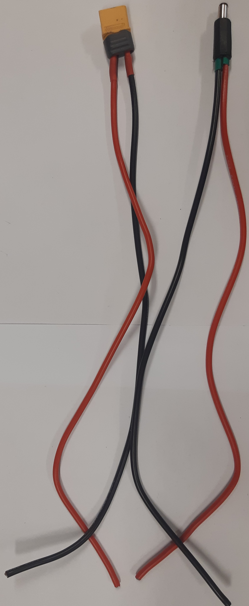
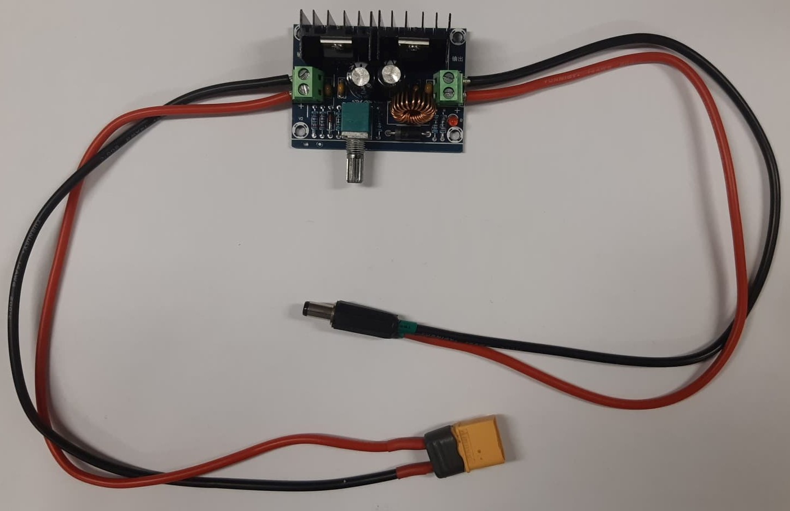
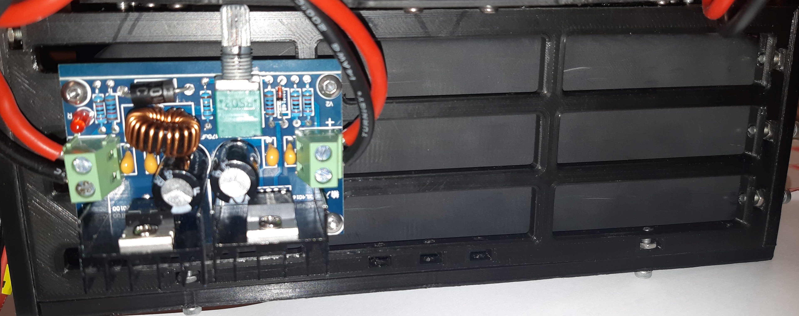

Building the Hardware
=====================
This chapter explains which components are to be ordered and and how to build a custom UAV from its different components.
We provide details for the development of two distinct UAV versions based on the frame size: an F450 and a T650 UAV.
Moreover, we provide the details of additional hardware modules that extends the functionality of the UAVs.
To know which UAV and additional hardware can be used for which type of experiments, please read 

.. admonition:: todo

   Bryan refer to other section(s).

.. admonition:: todo

   Bryan add for all componenets a link of where there can be ordered

F450 UAV
--------

.. admonition:: todo

   Bryan complete section(s).

T650 UAV
--------

Components
^^^^^^^^^^
This section lists all the components required to build the UAV.

Off-the-shelf
*************

* **Frame**: the body of the UAV, to which all other components are fixed.

  *Choice*: the Tarot Ironman 650 frame.

  .. figure:: _static/frame.jpg
     :width: 800
     :alt: alternate text
     :align: center

     Tarot Ironman 650 frame

  .. admonition:: note

     We do not use the feet of the frame but instead 3D print custom feet as to reserve more space for additional hardware (e.g., an encoder mechnism for payload transport) at the bottom part of the UAV.

* **Flight Controller (FC)**: the FC is an electronic board with sensors (e.g., accelerometer, gyroscope, barometer, GPS) required for controlling the attitude (and position) of the UAV.
  
  *Choice*: the Pixhawk 4 flight controller, which comes with its own GPS sensor and power distribution board.

  .. figure:: _static/PX4.jpg
     :width: 800
     :alt: alternate text
     :align: center

     Pixhawk 4 FC

* **Power Distribution Board (PDB)**: the PDB is the central board of the UAV where the power supplied of most of the the electrical components converge and are connected to the battery.

  *Choice*: PDB delivered with the Pixhawk 4.

  .. figure:: _static/PDB.jpg
     :width: 400
     :alt: alternate text
     :align: center

     Pixhawk 4 PDB

* **GPS**: retrieves the absolute (i.e., global) position of the UAV.

  *Choice*: the GPS from the Pixhawk 4.

  .. figure:: _static/gps.jpg
     :width: 400
     :alt: alternate text
     :align: center

     Pixhawk 4 GPS

* **Motors**: when a voltage is supplied these rotate their propellors at a desired speed command proportianal to the applied voltage.
  
  *Choice*: two pairs of the Tarot 4114 320KV Multi-Rotor brushless motors.

  .. figure:: _static/motor.jpg
     :width: 800
     :alt: alternate text
     :align: center

     Tarot 4114 320KV Multi-Rotor brushless motor
  
* **Propellers**: move the air due to the motor's motion and prdocue a thrust force that move the UAV.

  *Choice*: two pairs (CW and CCW) of the Tarot 15X5.5 Carbon Fiber Propeller TL2831

   .. figure:: _static/propeller.jpg
      :width: 800
      :alt: alternate text
      :align: center

      Tarot 15X5.5 Carbon Fiber Propeller TL2831

* **Electronic Speed Controllers (ESCs)**: are electronic circuits used to control the speed of the motors.

  *Choice*: for each motor a Turnigy MultiStar BLheli_32 ARM 51A Race Spec ESC 2~6S.

   .. figure:: _static/esc.jpg
      :width: 800
      :alt: alternate text
      :align: center

      Turnigy MultiStar BLheli_32 ARM 51A Race Spec ESC 2~6S

* **Battery**: the battery powers all electrical components on the UAV and is typically on of the heaviest components on the UAV. It is recommended to buy enough spare batteries.

  *Choice*: a Turnigy Graphene Professional 12000mAh 6S15C LiPo Pack.

   .. figure:: _static/battery.jpg
      :width: 800
      :alt: alternate text
      :align: center

      Turnigy Graphene Professional 12000mAh 6S15C LiPo Pack

* **RC Receiver (RCR)**: the RCR is a device that allows unidirectional wireless communication with the UAV. It receives and sends information from/to the RC transmitter that is located off-board the UAV.

  *Choice*: Hitec Optima SL

  .. figure:: _static/optima.jpg
     :width: 800
     :alt: alternate text
     :align: center

     Hitec Optima SL

* **RC Transmitter (RCT)**: the RCT is held by a human operator and teleoperates the UAV (i.e., it sends toggle and joystick commands to the UAV and receives some limited on-board information). This can be used to manually fly the UAV or as a safety control that overtakes autonomous flight if the operated sees somethings goes wrong.

  *Choice*: Hitec Flash 8

  .. figure:: _static/hitec.jpg
     :width: 800
     :alt: alternate text
     :align: center

     Hitec Flash 8

  .. admonition:: todo

     replace with higher quality image and make sure the picture gets cropped (as to delete the excessive grey borders)

* **Other**: 

   Electrical cables: 
      * 20 x this used for that
      * 10 x this used for that

   Electrical connectors: 
      * 3 x this used for that
      * 5 x this used for that
   
   Mechanical connectors (screw, bolts and nuts): 
      * 3 x this used for that
      * 5 x this used for that
   
   Other?:
      * 3 x this used for that
      * 5 x this used for that

  .. admonition:: todo

     add here all screws, nuts, and their sizes, and other things like tape, straps, jumper cables, soldering iron, cables (which type of cable thickness and flexible), connectors (all yellow connectors or metal connectors to power things) and explain for what these are used.
     Old text of Maxime I placed here: All the holes used to attach something directly on the frame are for M3 bolts and the other holes M2.5 bolts. Use M3x12mm and M2.5x12mm bolts.
     still to be done. I'll try to get clearer on the explanations.

.. admonition:: note

   The components listed above are all you need to build a UAV for manual flight. Optionally, if one wants to build a UAV for more advanced autonomous flight, one will need some of (your choice) the additional components listed below.

* **Companion computer**: the main computational unit on-board the UAV, used to compute most estimation, planning and control algorithms in real-time.

  *Choice*: the Intel NUC BXNUC10i7FNK2.

   .. figure:: _static/nuc.jpg
      :width: 800
      :alt: alternate text
      :align: center

      Intel NUC BXNUC10i7FNK2

* **FTDI cable**: the FTDI cable is a USB to Serial (TTL level) converter which allows for a simple way to connect TTL interface devices to USB. The I/O pins of this FTDI cable are configured to operate at 5V. It basically enables the Pixhawk and the companion computer to communicate.

  *Choice*: To check correct name

  .. admonition:: todo

     Bryan

  .. figure:: _static/ftdi.jpg
     :width: 800
     :alt: alternate text
     :align: center

     TODO ADD CORRECT NAME

* **DC-DC converter**: enables to provide the appropriate supply voltage to the companion computer which is typically in a different range of voltage/current/power as the battery.

  *Choice*: Wingoneer XL4016E1 (from `datasheet <https://www.alldatasheet.com/datasheet-pdf/pdf/1134370/XLSEMI/XL4016E1.html>`__  - input: 4-40V, output: 1.25-36V at max 8A, max power: 200W). Since the 6S LiPo battery (i.e., a Turnigy Graphene Professional 12000mAh 6S15C LiPo Pack) provides at most 25.2V and at least 18.0V and the Intel NUC companion computer needs a supply voltage between 12V and 19V and has a rated power supply of 19V/6.33A, the converter must be able to take 18V-25.2V in and deliver 19V/6.33A (or 121W). Buy it `here <https://www.amazon.fr/WINGONEER-R%C3%A9gulateur-convertisseur-Efficacit%C3%A9-Alimentation/dp/B071L34ZXB>`__.

  .. figure:: _static/converter.jpg
     :width: 800
     :alt: alternate text
     :align: center

     Wingoneer XL4016E1

* **Real-Time Kinematic (RTK) GPS**: RTK is a GPS-based positioning system that allows to get more precise (i.e., cm-precise) global (in XY and Z) position from Global Navigation Satellite System (GNSS) measurements. It is used additionality to the standard GPS senor on-board the UAV which typically only obtain m-level precision. The RTK system typically consists of a stationary ground "base" station that sends corrections to an RTK module on-board the UAV which is called the "rover". Both devices individually can get GNSS measurements with usual GPS precision. The RTK system computes the baseline, the difference between both measurements then gives the rover’s position relative to the base.

  *Choice*: the Emlid Reach M2 UAV Mapping Kit. It is composed of the Emlid Reach RS2 as the base and the Emlid Reach M2 attached to the UAV as the rover. To the latter is connected via a cable the Multi-band GNSS antenna.
 
   .. figure:: _static/rtk.jpg
      :width: 800
      :alt: alternate text
      :align: center

      Emlid Reach M2 UAV Mapping Kit

Custom-made
************
In this section all custom made parts to build the autonomous UAV are explained.

.. admonition:: todo

   see email: "Finalizing CAD files" 15 july.
   Once the final designs are finished of both your thesis, I will need the inventor files and all stl files of the UAV (also for the F450 from which you started). I will put them on a drive that people can download it. We cannot put it on github since too large files. 
   They are accessible here (TO DO).

We 3D print all these pieces with 20% infill:

* **Main piece (x 1)**: used to provide enough space for all the components. The PDB is fixed on its lower stage, the Pixhawk and its middle stage and the Intel NUC on its top stage. 

  .. figure:: _static/pb_stage.jpg
     :width: 800
     :alt: alternate text
     :align: center

     Main piece 

* **Pixhawk case (x 1)**: used to fix the Pixhawk on the Main piece.

  .. figure:: _static/pixhawk_case.jpg
     :width: 800
     :alt: alternate text
     :align: center

     Pixhawk case

* **NUC case and cover (x 1 per piece)**: the inside of the case is used to fix the Intel NUC. The side part of the case is used to fix the Emlid Reach M2. The case cover is used to atached multiple other components to the Upper case.

  .. figure:: _static/Nuc_cad.jpg
     :width: 800
     :alt: alternate text
     :align: center

     NUC case and cover

* **Upper case (x 1)**: used to fix the RC receiver, the Pixhawk GPS, and the RTK Multi-band GNSS antenna.

  .. figure:: _static/upper_part.jpg
     :width: 800
     :alt: alternate text
     :align: center
     
     Upper case

  When the Main piece, the Nuc case and cover, and the Upper case are assembled one gets:

  .. figure:: _static/Top.jpg
     :width: 800
     :alt: alternate text
     :align: center
     
     All the cases assembled

* **Motor top and bottom fixation (x 4 per piece)**: used to attach the motors to the frame and to fix the legs.

  .. figure:: _static/motor_fixation_top.jpg
     :width: 800
     :alt: alternate text
     :align: center
   
     Motor top fixation

  .. figure:: _static/motor_fix_bottom.jpg
     :width: 800
     :alt: alternate text
     :align: center
   
     Motor bottom fixation

  .. figure:: _static/motor_cad.jpg
     :width: 800
     :alt: alternate text
     :align: center

     Motor fixed to Motor top fixation

  .. figure:: _static/motor_on_arm_cad_1.jpg
     :width: 800
     :alt: alternate text
     :align: center

     Motor bottom fixation is used to connect frame to Motor top fixation

* **Leg (x 4)**: used to support the drone while on the ground.

  .. figure:: _static/leg.jpg
     :alt: alternate text
     :align: center
     :scale: 50
     
     Leg

* **Battery case with side (x 2), front (x 1) and core (x 1) piece**: used to attach the battery to the frame.

  .. admonition:: todo

     Why did the battery case design increase so much in complexity? Before there were less parts, now seems you need a lot more. What is main motivation?

  .. figure:: _static/battery_assembly.jpg
     :width: 800
     :alt: alternate text
     :align: center
     
     Battery case

  .. figure:: _static/bottom_battery.jpg
     :width: 800
     :alt: alternate text
     :align: center
     
     Bottom of the battery case

  .. figure:: _static/battery_front.jpg
     :width: 800
     :alt: alternate text
     :align: center
     
     Front of the battery case

  .. figure:: _static/sideR_battery.jpg
     :width: 800
     :alt: alternate text
     :align: center
     
     Right side of the battery case

  .. figure:: _static/sideL_battery.jpg
     :width: 800
     :alt: alternate text
     :align: center
     
     Left side of the battery case

Step-by-step assembly instructions
^^^^^^^^^^^^^^^^^^^^^^^^^^^^^^^^^^^

In this section you will learn how to fix all the components on their (custom-made) piece, assemble everything, and solder/connect every cable/connector to electronic components.

**Goal**: assemble the UAV that looks like in this CAD: 

   
   Fully assembled CAD of the T650 UAV

.. admonition:: todo

   in the picture above are missing several components. There is no NUC, battery, Reach M2, Antenna, GPS, ... A final assembly has ALL componenents (even screws and nuts). The only thing you cannot draw in CAD are the cables and connectors. If a user wants to build it, it helps to see how all componenets fit in the custom-made parts. So  compare your CAD with the fully assembled hardware prototype and make sure all componenets are also in CAD.

**Required tools**:

.. admonition:: todo

   list the tools needed during the assembly: e.g. soldering iron, screwdriver numbers...

**Tips**:

.. admonition:: note

   Every time you solder cables, put a piece of shrink tube beforehand on the cables and heat them on the soldering once it is done.

**Steps**

.. admonition:: todo

   When building the second drone you need to add the steps of "Connecting the NUC on the drone" in this section in a logical order. 
   This should not be a seperate section as you need to explain the build procedure of how to build the autonomous drone (as you design is made for that one).

1. Mount the frame as explained `in this tutorial <https://www.youtube.com/watch?v=Ddvgs200OaY&ab_channel=MultiCopterBuild>`__. You only need to attach the arms to the body and you can skip the assembly of the legs and the top part.

2. Drill the holes of all the 3D printed pieces to deal with imperfections due to shrinkage. Use a drill bit of size 2.5mm for every hole **NOT** directly touching the frame. For the holes used to fix the parts on the frame itself, use a 3mm drill bit.

.. admonition:: todo

   I have difficulties understandign what you mean with these 2 categories of parts. Can you give a list of parts (see names above) that need which drill size? 

  .. figure:: _static/material_motor.jpg
     :width: 800
     :alt: alternate text
     :align: center
     
     Material for steps 3, 4 and 6 to 9

3. Put the motor on the "Motor top fixation" piece (cables go through the elliptical hole), with the help of the screws provided with the motor. Repeat for all motors.

  .. figure:: _static/motor_top.jpg
     :width: 800
     :alt: alternate text
     :align: center
     
     Step 3

.. admonition:: todo

   Take picture on white background (use a clean white sheet of paper, you can find those at the printer up the stairs in front of you). Make sure there are no unnecessary things (noise) in the picture. In this case we do not need to see the soldering yet. Crop the image to what is actually useful. **these comments applies to all pictures below you take of the prototype**

4. Take 3 jumper wires (more or less 30cm) with at least one female connector, remove the other connector and solder them to the three signal cables from the ESC (blue, brown and orange). Try to keep the same colors for all the ESCs. Repeat for all ESCs.

  .. figure:: _static/esc_signal.jpg
     :width: 800
     :alt: alternate text
     :align: center

     Step 4 

5. Solder the three motor cables to the ESC in arbitrary order. Repeat for all ESCs.

  .. figure:: _static/motor_esc_soldering.jpg
     :width: 800
     :alt: alternate text
     :align: center

     Step 5 

  .. admonition:: note

     The ordering of the connectors will be corrected later in the calibration phase. Make sure you allow the space to resolder thse cables easily.

6. Fix the "Motor bottom fixation" piece to the frame's part (shown in next figure) with 4x M3 bolts (head on bottom).

  .. figure:: _static/step6.jpg
     :width: 800
     :alt: alternate text
     :align: center

      Step 6

7. Put 2 straps in it through the side windows. The loops will be done downward.

  .. figure:: _static/step7.jpg
     :width: 800
     :alt: alternate text
     :align: center

      Step 7

8. Fix the assembly to the end of an arm, using the bolts and parts (orange and blue) provided with the frame. With the help of a level, try to put it as horizontal as possible.

  .. figure:: _static/motorb_frame.jpg
     :width: 800
     :alt: alternate text
     :align: center

     Step 8

  .. admonition:: todo

     orange part is not clear on the picture. there is only blue.

9. Fix the "Motor top fixation" on the "Motor bottom fixation" with the help of 4x M2.5 bolts (holes on the corner of the parts). Repeat the last four steps for each motor.

  .. figure:: _static/motort_motorb.jpg
     :width: 800
     :alt: alternate text
     :align: center

     Step 9

10. You could now attach the propellors to the motors. However, for safety you should only do this when preparing for a real flight.

  .. admonition:: todo

     Take picture

11. Take four pairs of power supply cables (more or less 18cm long, thick red and black cables, a single pair per motor). Make sure that the four pairs can reach the ESCs starting from the middle of the frame. Solder all the pairs on the power distribution board (PDB). The position of each pair is shown in the picture below. As the UAV requires four motors but the PDB can supply up to eight motors, you can solder each red cable to both B+ connections available on each corner of the PDB. In each corner, where the red cables are, choose one of the two GND connection to solder the black cables.

  .. figure:: _static/material_step11.jpg
     :width: 800
     :alt: alternate text
     :align: center

     Material for step 11

  .. figure:: _static/pdb_soldering_2.jpg
     :width: 800
     :alt: alternate text
     :align: center

     Step 11

12. Fix the PDB to the "Main piece" by help of 4x M3 bolts (head on bottom), use the 4 holes in the middle of the "Main piece". As you can see in the picture below the holes are off-centered. Put the cables with the XT connector on the side with the biggest space (on the right in the picture below) and put them out of the piece thanks to the hole on that side (see second picture). In between the main piece and the PDB, put a nut on each bolt that serve as spacers.

  .. figure:: _static/main_piece_spacer.jpg
     :width: 800
     :alt: alternate text
     :align: center

     Step 12

  .. figure:: _static/pdb_mp_1.jpg
     :width: 800
     :alt: alternate text
     :align: center

     Step 12

13. Put the free end of each of the eight power supply cables outside the "main piece" with help of the holes in the corners.

  .. figure:: _static/pdb_mp_2.jpg
     :width: 800
     :alt: alternate text
     :align: center

     Step 13

14. Fix the "Main piece" on the upper plate of the frame, by help of 8x M3 bolts. Put the cables with the XT connector toward the front of your drone.

  .. figure:: _static/mp_frame_1_bis.jpg
     :width: 800
     :alt: alternate text
     :align: center

     Step 14

15. Connect the signal cables of the ESCs (by passing them through the windows of the "main piece") to the "FMU-PWM-out" port of the PDB. Use the pins labeled 1 to 4 (1 = front left, 2 = back right, 3 = front right, 4 = back left). Considering the colors of the wires from the ESC, connect the orange ones to the "S" pins, the blue ones to the "+" pins and the brown ones to the "-" pins (on top the orange wires, in the middle the blue cables and at the bottom the brown ones).

  .. figure:: _static/pin_number02.jpg
     :width: 800
     :alt: alternate text
     :align: center

     FMU-PWM-out pin labels (S,+,- and 1 to 8).

  .. figure:: _static/pwm_cable.jpg
     :width: 800
     :alt: alternate text
     :align: center

     Step 15

16. Solder the battery cables coming from the PDB to each pair coming from the ESCs (black on black, red on red). Don't forget to put beforhand a piece of shrink tube on the cables.

  .. figure:: _static/esc_pdb02.jpg
     :width: 800
     :alt: alternate text
     :align: center

     Step 16

  .. admonition:: todo

     add picture

     todo: caption

17. Put the Pixhawk in its case, connect the cables provided with the Pixhawk to the ports "FMU-PWM-in" (10 pins picoblade wire), "PWR1" and "PWR2" (6 pins picoblade wire for each) of the PDB. Connect the wires to the Pixhawk respectively to ports "I/O PWM OUT", "POWER1" and "POWER2".

  .. figure:: _static/px_case.jpg
     :width: 800
     :alt: alternate text
     :align: center

     Pixhawk in its case.

  .. figure:: _static/cables_px.jpg
     :width: 800
     :alt: alternate text
     :align: center

     Wires needed for step 17

  .. figure:: _static/pdb_px_connection.jpg
     :width: 800
     :alt: alternate text
     :align: center

     Step 17

     todo: caption

  .. admonition:: todo

     be more specific about which cables and how you attach them.

18.  Put the 3 pins wires (yellow, red and black) provided with the Pixhawk on its "DSM/SBUS RC" port (it will be used with the Optima, the RC receiver). Connect also the GPS to the Pixhawk using the "GPS MODULE" port. Finally, connect the USB-micro USB cable, provided with the Pixhawk, to the micro USB port on its side.

  .. figure:: _static/wires_optima.jpg
     :width: 800
     :alt: alternate text
     :align: center

     wire for step 18

  .. figure:: _static/usb_cable.jpg
     :width: 800
     :alt: alternate text
     :align: center

     USB cable provided with the Pixhawk

  .. figure:: _static/px_optima_gps.jpg
     :width: 800
     :alt: alternate text
     :align: center

     Step 18

  .. admonition:: todo

     Take picture
19. To exchange data between the NUC and the Pixhawk, the connection between them will be done via one of the USB ports of the NUC, through a FTDI board.
To realize the connection, you'll need an FTDI board, a 6 pins picoblade cable provided with the Pixhawk (that can go to the "TELEM2" port of the Pixhawk), 3 jumper wires of 20cm (Female-X), shrink tubes and non-conductive tape.

  .. figure:: _static/material_ftdi.jpg
     :width: 800
     :alt: alternate text
     :align: center

     Material needed for step 19.

Now follow these steps : 

* Cut the connector at one end of the picoblade cable; cut the connectors at one end of the jumper wires (keep the female connectors side).
* Prepare shrink tubes on the 3 useful wires (highlighted in green in picture below, cables 2,3 and 6 starting from red one, see documentation `here <http://www.holybro.com/manual/Pixhawk4-Pinouts.pdf>`__) and solder them to the jump wires. Heat the shrink tubes on the welds.
* Put some non-conductive tape at the end of each other wires from the picoblade wire (NOT highlighted in green) in order to avoid short circuit.

  .. figure:: _static/cables_soldered_ftdi_1.jpg
     :width: 800
     :alt: alternate text
     :align: center

     Wires soldered together.

* Put some non-conductive tape on top of the welds and the 3 non used wires, to stick everything together.

  .. figure:: _static/cables_soldered_ftdi_2.jpg
     :width: 800
     :alt: alternate text
     :align: center

     Wires taped together.

  .. figure:: _static/telem2_ports.jpg
     :width: 800
     :alt: alternate text
     :align: center

     Pixhawk "TELEM2" port pins information.

* With help of the picture above (or the documentation provided previously) and the labels on the FTDI board, connect them together as follow :
	* PX4 TX - FTDI RX
	* PX4 RX - FTDI TX
	* PX4 GND - FTDI GND
	
  .. figure:: _static/cables_soldered_ftdi_3.jpg
     :width: 800
     :alt: alternate text
     :align: center

     Final circuit step 19

If the connection is done properly you can plug the FTDI board in one of the USB entries of the NUC and the Telecom connector on the Telem2 port of the Pixhawk. When the NUC is powered on, a LED should light up.

20. Fix the Pixhawk case to the "main piece" by help of 4x M2.5 bolts, on the middle stage (use the holes on the edges of the Pixhawk case). The arrow on the Pixhawk must go toward the front of the drone. Try to have the Pixhawk as horizontal as possible in the drone.
Put the other side of the wires for the GPS and the Optima by the back of the drone. For the FTDI, do it by the front (as in the picture below).

   Step 20

  .. admonition:: todo

     Take picture

21. On top of the "main piece", fix the NUC case (using the holes outside the box) by help of 3x M2.5 bolts.

	Step 21

  .. admonition:: todo

     Take picture

22. Screw the sma cable provided with the Reach M2 to the GNSS antenna. Pass the wire through the hole on the top of the "upper case". Screw the antenna to the "upper case" with 2x M2.5 bolts.

   sma cable

   Step 22

23. Put the LoRa radio module of the Reach M2 in the "upper case", below the antenna. The terminal for its own antenna must be on the same side as the round shaped part of the "upper case".

   Step 23

24. Fix the "upper case" to the cover of the NUC case, by help of 3x M2.5 bolts (heads facing downard).

  .. figure:: _static/upper_ncover.jpg
     :width: 800
     :alt: alternate text
     :align: center

     Step 24

  .. admonition:: todo

     redo picture

     todo: caption

25. Put the Nuc in its case (with the power terminal toward the front of the drone) and fix the Nuc case cover to the Nuc case by help of 3x M2.5 bolts. 

  .. figure:: _static/ncover_nc.jpg
     :width: 800
     :alt: alternate text
     :align: center

     Step 25

  .. admonition:: todo

     Take picture

26. Connect the wires you previously connected to the Pixhawk (yellow, red and black) to the Optima, using its SL port. Facing the SL terminal, put the yellow wire to its left.

  .. figure:: _static/connection_optima.jpg
     :width: 800
     :alt: alternate text
     :align: center

     Step 26

27. Put the GPS, and the Optima (RC receiver) in their respectives cases in the "upper case". The arrow on the GPS must indicate the front of the drone. Screw the LoRa radio module antenna on the module.

  .. figure:: _static/optima_gps_upper.jpg
     :width: 800
     :alt: alternate text
     :align: center

     Step 27

  .. admonition:: todo

     Take picture

28. Use the straps on the motor fixation parts to fix the legs on each arm. Pass the straps through the rectangular holes on the legs and tighten well.

  .. figure:: _static/leg_motor_fixation.jpg
     :width: 800
     :alt: alternate text
     :align: center

     Step 28

  .. admonition:: todo

     Take picture

29. Normally, the NUC is supplied by a 19V battery through its charger. In reality it can work fine with a voltage going from 12-19V DC.
As the battery provides a DC voltage of 22.2V, a buck converter is needed to connect the NUC to it.
*Take : The Wingoneer XL4016E1 buck converter, a DC plug 11116 to connect the circuit to the NUC, an XT60 male plug to connect the circuit to the battery, 2 pairs of wires red and black, shrink tubes and non-conductive tape.

  .. figure:: _static/cables_converter.jpg
     :width: 800
     :alt: alternate text
     :align: center

     Wires and terminals needed for step 29

  .. figure:: _static/converter01.jpg
     :width: 800
     :alt: alternate text
     :align: center

     Wingoneer XL4016E1 with its input/output ports indicated

* Strip a pair of wires long enough to enter the denuded parts fully into the back connectors of the XT60 plug and solder them (+ and - are indicated on the yellow plastic part of the plug).
* Put some shrink tubes on the solderings and clips the grey plastic part of the XT60 on top of them.
* Unscrew with hands the 11116 plug to separate the metalic and plastic parts.
* Cut the narrow end of the plastic part and, if needed, increase a bit the size of the hole with a scalpel (see picture below). You must be able to pass the 2 wires through it.

.. figure:: _static/111160_cut.jpg
   :width: 800
   :alt: alternate text
   :align: center

   111160 plastic part before and after being cutted

* Solder the remaining pair of wires to the 11116 plug (+ and - ports shown on picture below).

.. figure:: _static/1116_signe.jpg
   :width: 800
   :alt: alternate text
   :align: center

   Polarity of the 111160 terminal

* Put some shrink tubes on the solderings.
* Screw back the metalic and plastic parts of the 11116 plug.

   Wires soldered

* Fix the free side of the wires to the screw connectors. The ones weld to the XT60 goes on the input side of the converter (input ports on the left of the converter when the potentiometer is directed toward you), the other (with 111160 terminal) to the output. The polarities of the I/O ports of the converter are indicated on it.

   Final converter circuit

* Connect the battery to the XT60 port. Using a voltmeter measure the output voltage of the converter and change it to reach 18.5V-19V more or less (by help of the potentiometer).

30. Fix the converter circuit to the right side of the battery using 4x M2.5 bolts. The potentiometer must face upward.

   Step 30

31. Assemble the battery case by assembling the sides to the main part of the case by using 5x M2.5 bolts on each side (do not use the 3 holes in the middle of the bottom of the battery case sides). No need to add the front part to it for now.

  .. figure:: _static/battery_case_assembly02.jpg
     :width: 800
     :alt: alternate text
     :align: center

     Step 31

  .. admonition:: todo

     Take picture

32. Fix the battery case to the bottom plate of the frame with 12x M3 bolts (heads facing downard).

  .. figure:: _static/battery_case_frame02.jpg
     :width: 800
     :alt: alternate text
     :align: center

     Step 32

  .. admonition:: todo

     Take picture

33. When needed, put the battery in its case (wires facing the wires hanging from the PDB) and add its front part (with 2x M2.5 bolts) to disable the movements of the battery.

  .. figure:: _static/battery_front_hw.jpg
     :width: 800
     :alt: alternate text
     :align: center

     Step 33

  .. admonition:: todo

     Take picture

34. Connect the XT60 ports of the PDB and the converter circuit to a XT60 splitter (2 females, 1 male ports). To power the drone, connect the XT60 port of the battery to the male port of the splitter.

  .. figure:: _static/splitter_connection.jpg
     :width: 800
     :alt: alternate text
     :align: center

     Step 34

35. With help of tape, fix the ESCs and their wires to the frame such that none of them are hanging.

  .. figure:: _static/esc_taped.jpg
     :width: 800
     :alt: alternate text
     :align: center

     Step 35

36. Put the Reach M2 to the small case on the side of the Nuc case (upside down).

  .. figure:: _static/m2_nc01.jpg
     :width: 800
     :alt: alternate text
     :align: center

     Step 36

37. Connect the Reach M2 to its LoRa radio module with the 6 pins picoblade cable provided with it. Use the "S2" port of the Reach M2.

  .. figure:: _static/m2_lora_connection01.jpg
     :width: 800
     :alt: alternate text
     :align: center

     Step 37

38. Connect the GNSS antenna to the Reach M2, using its "ant" port and the sma cable previously screwed to the antenna. 
  .. figure:: _static/m2_antenna_connection01.jpg
     :width: 800
     :alt: alternate text
     :align: center

     Step 38

  .. admonition:: todo

     redo picture

39. Connect the USB-micro USB cable provided with the Reach M2 to it and to a USB port of the Nuc. Connect the FTDI to another USB port of the Nuc and the output port (111160) of the converter circuit to its power port.

  .. figure:: _static/nuc_connections01.jpg
     :width: 800
     :alt: alternate text
     :align: center

     Step 39

40. Screw the propellers to the motors with the 2 screws provided with the motors. Pay attention to match the spinning direction between the motor and its propeller. Put the propellers only right before flying, always remove them when working on the drone or doing calibration steps !!!

  .. figure:: _static/propeller_spin_direction.jpg
     :width: 800
     :alt: alternate text
     :align: center

     Screws needed and propeller spinning direction

  .. figure:: _static/prop_motor.jpg
     :width: 800
     :alt: alternate text
     :align: center

     step 40

Your drone is built !

  .. figure:: _static/drone_complete02.jpg
     :width: 800
     :alt: alternate text
     :align: center

     Entire drone assembled.

     todo: caption

Cable-Suspended Payload Module
-------------------------------

.. admonition:: todo

   Raphael: write this section on the the hardware design and construction of the module similar as we explained it for the UAV above. Make sure to take clean pictures on a white background without noise and that they are cropped. (see my comments before for UAV)

This module is installed at the bottom of the UAV and allows to measure the state (position and velocity) of a cable-suspended load hanging below the UAV. 

.. admonition:: todo

   Raphael todo: integrate the next section better in the hardware building chapter using a similar structure as for UAV (see example given below). Give more pictures and explain better each step of the setup.
   
.. admonition:: todo

   Raphael todo: put captrions below each figure (see examples UAV). If there is 1 part from 3 views then tell this in caption as now maybe these are 3 different parts we cannot know. For each part tell how many we need e.g., x2, x1, x5. If a part consists out of different subparts also mention their names in the caption.

Components
^^^^^^^^^^
This section lists all the components required to build the Suspended Payload Module for a UAV.
This is currently only compatible with the T650 UAV.

Off-the-shelf
*************

* **Encoders x2**: Sensor used to measure the actual orientation of the cable, fit inside the universal joint.

  *Choice*: `EMS22A <https://www.bourns.com/docs/product-datasheets/EMS22A.pdf>`__ because of its absolute nature, making it suitable to measure an absolute angle. It has a good resolution and its plain shaft makes it lightweight and compact, which is perfect to fit in the joint.  

  .. figure:: _static/RotaryEncoderEMS22A.png
     :width: 400
     :alt: alternate text
     :align: center

     EMS22A encoder
   
  .. admonition:: todo

   give value of resolution 

* **Ball bearings x2**: To avoid friction losses in the joint and support the weight of the payload, to preserve the encoder shaft.

  *Choice*: `RS PRO Deep Groove Ball Bearing - Plain Race Type, 15mm I.D, 24mm O.D <https://benl.rs-online.com/web/p/ball-bearings/6190159>`__

  .. figure:: _static/BearingAlone.png
     :width: 400
     :alt: alternate text
     :align: center

* **Collar clamp screw x2**: To fix the shaft of the encoders to axis of the joint.

   *Choice*: `Huco Shaft Collar One Piece Clamp Screw, Bore 4mm, OD 16mm, W 9mm, Steel <https://benl.rs-online.com/web/p/shaft-collars/6918027>`__

  .. figure:: _static/CollarClamps.png
     :width: 400
     :alt: alternate text
     :align: center

* **Arduino**: To process the data coming from the sensors and communicate with the on-board computer.

   *Choice*: `Arduino Uno rev3 <https://store.arduino.cc/products/arduino-uno-rev3>`__

* **Stripboard**: to solder the electronic circuit between each components. I don't have the exact reference (no indication in thesis or old tutorial, no brand on the stripboard itself)

   *Suggested choice*: `Single-Sided Stripboard 50x100mm <https://uk.rs-online.com/web/p/stripboards/2189160>`__ 
    Very small area reaquired, might take any other stribord even a smaller one.

* **Hex socket cap screw**

   *Choice*: `M2.5 x 12 mm <https://benl.rs-online.com/web/p/socket-screws/4838130>`__

Optional: 

* **Force sensor**: To deduce if the cable is well taut. Not used in the current design.

   *Choice*: `FSR04CE <https://www.mouser.be/datasheet/2/303/res_fsr-1590094.pdf>`__

  .. figure:: _static/ForceSensor.png
     :width: 400
     :alt: alternate text
     :align: center
   
  .. admonition:: todo

     Bryan: make the force sensor work 

* **Resistor**: To do a pull down circuit for measuring the output of the force sensor.

   *Choice*: Needs to be 10k Ohms.
   
  .. admonition:: todo

     Bryan: make the force sensor work 

Custom-made
************
All the following parts need to be 3D printed with PLA and infill of 10 to 15%. 

  .. admonition:: todo

     Bryan: LINK TO CAD FILES (not uploaded yet)

* **Center piece**: on which every other parts will be attached to. Must fit the colar clamps and the bearings. Split into two parts to make assembly and printing possible. 

  .. figure:: _static/centerPiecepart1front.png
     :width: 400
     :alt: alternate text
     :align: center

  .. figure:: _static/Centerpiecepart1back.png
     :width: 400
     :alt: alternate text
     :align: center

  .. figure:: _static/Centerpiecepart2front.png
     :width: 400
     :alt: alternate text
     :align: center

  .. figure:: _static/Centerpiecepart2back.png
     :width: 400
     :alt: alternate text
     :align: center

* **Upper arms**: Will be attached to the battery by its support. Must fit an encoder.

  .. figure:: _static/UpperArm1Back.png
     :width: 100
     :alt: alternate text
     :align: center

  .. figure:: _static/UpperArm1Front.png
     :width: 100
     :alt: alternate text
     :align: center

  .. figure:: _static/UpperArm2.png
     :width: 100
     :alt: alternate text
     :align: center

* **Lower arms**: Same purpose as upper arm. 

   Note that this part is printed in two separated parts, then assembled with a bolt. This was done to ease the printing process and to allow a clean mounting and unmounting of this part.

   .. figure:: _static/LowerArmFull.png
     :width: 300
     :alt: alternate text
     :align: center

* **Attachment for the cable**: Must fit on the lower arm (And on the force sensor if there is one).

   .. figure:: _static/AttachmentCable.png
     :width: 100
     :alt: alternate text
     :align: center

* **Support attached to the battery case**: Link the battery of the UAV to the upper arm of the encoder module.

   .. figure:: _static/AttachmentBatteryCase.png
     :width: 300
     :alt: alternate text
     :align: center

* **Arduino plate**: Support to screw the arduino and the stripboard on the side of the battery case.

   .. figure:: _static/AttachmentArduino.png
     :width: 300
     :alt: alternate text
     :align: center

   
   .. admonition:: todo

     Raphael: make sure the arduino and electronics board are put in a casing that you attach to UAV. Make sure the cables cannot be pulled out eaily as there will be vibrations, shocks,.. It is very dangerous to leave it open as this is too close to ground and like that cables can be pulled out when landing or taking off or when manually changing batteries. 

Step-by-step assembly instructions
^^^^^^^^^^^^^^^^^^^^^^^^^^^^^^^^^^
Once everypart is ready, one can proceed with the assembly of the encoder system (mechanical and electronic).

Electronic circuit
******************
First, the electronic components can be assembled. This will require a soldring station as everything will be connected via the stripboard.
On the following figure, one can see the correct circuit to reproduce. 

.. figure:: _static/ElectronicCircuit.png
   :width: 800
   :alt: alternate text
   :align: center

.. note::
  It is better to use flexible cables (REF ??? I used the one that are at the lab on big rolls) to do the circuit as rigid ones might disconnect more easily in case they are pulled a bit.

5 cables are needed per encoders. 2 are for the power (V+ and ground) and 3 are for the signal. To solder these correctly, put a small amount of tin on both the pin of the encoder and the cable. Then put the cable on the pin and heat up the two with the soldering iron. Both preapplied tin layers should melt easilly and fuse togheter on the pin. Once the shape of the weld is looking regular and well spreaded over the pin, just take out the iron and wait.
Don't hesitate to redo some of the weldings if they don't look strong enough, as it is very important that the cables stay in place. Also, the welds must not touch each other of course.
Once all the cables are welded to the encoder, cables from the same encoder can be attached togheter with tape to keep a readable circuit and avoid mistakes. 

Mechanical assembly 
*******************

.. admonition:: todo

   Raphael : When building the 2nd encoder, will do pictures of intermediate steps. 

.. admonition:: todo

   Raphael: Make sure the following is desicussed in the tutorial. So you have 2 encoders which I guess cannot mechanically rotate indefinetely (there is some limit?). So how do you fix the encoder such that this limit will never be reached during operation. Then how do you calibrate it such that when the load hangs perfectly down, the angle are 0. Also how/where do you ensure that an increase/decrease of encoder rqw angle is tranformed in the correct sign of angle according to the model used in your thesis. I assume should be somewhere in arduino code. So all this needs to be explained (maybe not all here, but where it actually is the good place to explain). Also discuss if you have 2 drones with bar how you will manage this (do you have to do extra things?).

* **Center piece**  Press fit the collard inside the hollow part of the center piece. When those are in place, connect the two part of the central piece and secure it using two bolts.

* **Add the bearings** also by doing press fit. Less tension needed as the arm will naturally keep them in place.

* **Assemble the lower arms** using bolt and adding already the attachment piece for the cable. 

* **Connect the support to the battery** 

* **Attach the upper arm to the center piece of the jont and to the support of the battery**.

* **Add the encoders** at the correct location on each arms

* **Screw the arduino on its support plate and screw the plate on the battery case**

  

