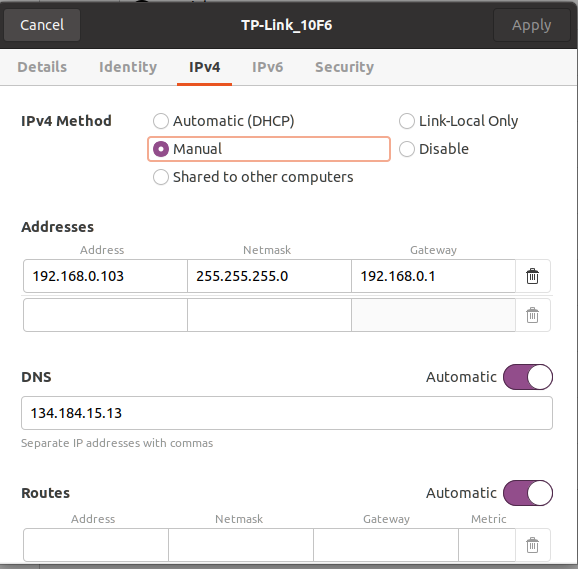

Configuration for Autonomous Flight
=================================================
.. admonition:: todo

  Update this chapter as you indicate yourself it is not completed yet. 
  I will most probably have several comments on this part, but I first need the time to check all the tutorial steps on the other f450 nucs. Will do it next week. In the meantime it is best Raphael and Maxime try the whole field exp procedure at pleinlaan (without actually flying) and let me know up to where it works. Which nodes crash and what do you see in the mrs_uav_status window when putting the UAV in the start of the trajectory you designed. Is the position stable for a long time, show by someone walking around with the UAV and if the position changes are realistic. E.g. walking the world x axis or pure y axis and checking those values. Make a movie of the status window.

.. admonition:: todo

  The motor paramters etc need to be set correctly and needs to be explained as this requires some changes in ctu code. It is s now explained in the main readme of UAVswarm brubotics.

.. admonition:: todo

  We need to think how most of the manual changes in the code of ctu or the config of the nucs can be automated upon install or by explicitly lqunching q configuration script where we can give some paramters to (eg nuc id). For example we automatically install the extra ctu packages, but we dont alwaya want to change the baudrate manually.

.. admonition:: todo

  We need to think how most of the manual changes in the code of ctu or the config of the nucs can be automated upon install or by explicitly launching q configuration script where we can give some paramters to (eg nuc id). For example we automatically install the extra ctu packages, but we dont alwaya want to change the baudrate manually.

.. admonition:: todo

  All configs required in a test should be mentioned here and what must or can be changed.

Configure the default system
-------------------------------

Prerequisite
^^^^^^^^^^^^^

* A fully assembled UAV with an on-board computer (e.g., intel NUC) is available and has succeeded the manual flgiht test;
* The on-board computer runs Ubuntu 20.04 LTS Desktop;
* The ctu_mrs and UAVswarm_brubotics system have been installed as explained in `this README <https://github.com/mrs-brubotics/UAVswarm_brubotics/blob/master/README.md#installation>`__;
* You are able to run simulation scripts from CTU and/or brubotics workspace (e.g. ~/mrs_workspace/src/simulation/example_tmux_scripts/one_UAV_pendulum*) and the brubotics workspace (*~/workspace/src/UAVswarm_brubotics/ros_packages/testing_brubotics/tmux_scripts/Raphael/0_One_UAV_f450_BruboticsDampingController*)
 

Connection between the on-board computer and the Pixhawk
^^^^^^^^^^^^^^^^^^^^^^^^^^^^^^^^^^^^^^^^^^^^^^^^^^^^^^^^^^^^

The following steps will enable a connection between the NUC and the PixHawk 4 via the FTDI board or tll cable (i.e., USB to serial device). Moreover we will configure the NUC such that it recognises the PixHawk 4 automatically whenever it is connected to it (using always the same usb ports).

These steps will be based on `this tutorial <https://ctu-mrs.github.io/docs/hardware/px4_configuration.html>`__.

* Connect a mouse, keyboard and the PixHawk 4 to the Intel NUC (**Use the FTDI board (TLL cable)** and **not the standard USB cable** of the PixHawk). There are 3 USB connections on the NUC and you can choose where to put each device, but then not change this order after configuration is done. In our case, the Pixhawk was connected through the front USB port of the NUC (where the power switch is located).
  
* Once the device is powered on (by the wall power supply or by the battery) and you are logged in, open a terminal and go to 
  
  .. code-block:: shell

    cd ~/../../dev
    
  If you type "ls" you will get a list of every connection that is made between the NUC and other devices or modules;

* Find which device name is associated to the PixHawk 4. You can do this by first plugging in the PixHawk 4, running "ls" inside the /dev folder, unplugging the PixHawk 4, running "ls" again and comparing both results to see which device is missing. Only look at the "tty" names, others are not for the PixHawk 4. It can be 'ttyUSB0' for the front USB of the NUC.

.. note:: 
	"serial" might be also be seen in the list when doing the "ls" command with pixhawk plugged in. But it is not the name we are looking for (needs to start with tty), so you can ignore it.

* Once the name of the device is found run the following command in the /dev folder but replace '/dev/ttyUSB0' by the device name associated to your PixHawk 4:
  
.. code-block:: shell 

   udevadm info -p $(udevadm info -q path -n /dev/ttyUSB0) | grep 'SERIAL_SHORT\|VENDOR_ID\|MODEL_ID'

* You should get similar result (likely with different numbers):

.. figure:: _static/PixHawkPortDevLs.png
   :width: 800
   :alt: alternate text
   :align: center  

.. code-block:: shell

	E: ID_MODEL_ID=6001
	E: ID_SERIAL_SHORT=A50285BI
	E: ID_VENDOR_ID=0403

* In another terminal, go to 

 .. code-block:: shell

    cd ~/../../etc/udev/rules.d/
    
 and create a new file called "99-usb-serial.rules" by using the following command in the terminal (but skip this command if the file is already there):

.. code-block:: shell

	sudo touch 99-usb-serial.rules

* Edit the file with

  .. code-block:: shell

    sudo nano 99-usb-serial.rules
  
  and paste the following line into the file, while changing the values according 
  to what you obtained at the previous step: replace idVendor, idProduct (i.e.,model) and serial with your values, and change the OWNER name to the user name of your ubuntu session (or you can leave user on "mrs"). Make sure the quotation
  marks are present in the file, if they are not present the connection will not work!

.. code-block:: shell 

	SUBSYSTEM=="tty", ATTRS{idVendor}=="0403", ATTRS{idProduct}=="6001", ATTRS{serial}=="A50285BI", SYMLINK+="pixhawk",OWNER="mrs",MODE="0666"
  
* Go back to /dev. Unplug the PixHawk 4 and plug it back into the NUC, when you list all the devices available, you should see "pixhawk" now. If you do not, try to reboot the NUC, this should normally solve the issue.

* Now you should be able to run mavros in a new terminal:

.. code-block:: shell

	roslaunch mrs_uav_general mavros_uav.launch

If you have no processes that died and a long list of blacklisted and loaded items, then the setup is successfull. On the FTDI board you should now see a blue ligh blinking on its TX channel.

.. figure:: _static/CorrectlySetupMavlink.png
   :width: 800
   :alt: alternate text
   :align: center

.. admonition:: todo

  Why do you have 2* arduino in there? I woudl say there si only one required? Make sure you indicate which arduino belongs to which nuc.
  Make sure there is a section under the payload module with arduino where you refer to this section

You have to repeat this procedure for the Arduino's and the RTK GPS M2reach module. 
Always make sure to use the same USB port when doing this. 
On the NUC3 the file contains:

.. code-block:: shell
  
  SUBSYSTEM=="tty", ATTRS{idVendor}=="10c4", ATTRS{idProduct}=="ea60", ATTRS{serial}=="0001", SYMLINK+="pixhawk",OWNER="mrs",MODE="0666"
  SUBSYSTEM=="tty", ATTRS{idVendor}=="2341", ATTRS{idProduct}=="0043", ATTRS{serial}=="85937313737351503252", SYMLINK+="arduino",OWNER="vub",MODE="0666"
  SUBSYSTEM=="tty", ATTRS{idVendor}=="3032", ATTRS{idProduct}=="0013", ATTRS{serial}=="8243EDAF73DFD683", SYMLINK+="rtk",OWNER="mrs",MODE="0666"
  SUBSYSTEM=="tty", ATTRS{idVendor}=="2341", ATTRS{idProduct}=="0043", ATTRS{serial}=="7593231393835130E061", SYMLINK+="arduino",OWNER="vub",MODE="0666"

Automatic SSH configuration on boot
^^^^^^^^^^^^^^^^^^^^^^^^^^^^^^^^^^^^^

Another problem that needs to be solved is the ssh service of the NUC. As a safety measure, this service is disabled each time the NUC reboots. So this means we would need to enable it again before each flight, otherwise it would not be possible to remotely login into the NUC and start the shell script for the experiment. When opening an new terminal and typing 

.. code-block:: shell

  sudo systemctl status ssh

and you get the same results as in

.. figure:: _static/SSHCouldnotbefound.png
   :width: 800
   :alt: alternate text
   :align: center

You first have to do:

.. code-block:: shell

  sudo apt-get install ssh

If get the same result as the following pictures **after** rebooting the nuc and running the same command, you can skip the next parts as this means the SSH is already launched automatically.

  

But if you get the same result as below: 

this issue is solved by creating a shell script that will start the ssh service automatically when the NUC is turned on.
Here is the procedure to follow to correct this: 

* Follow the steps of How to install SSH server in Ubuntu (only the top parts before step 1) of `this link <https://www.cyberciti.biz/faq/ubuntu-linux-install-openssh-server/>`__.

* Create a new file in */etc/* using:

.. code-block:: shell
  
  sudo touch /etc/rc.local

* Go inside this file

.. code-block:: shell

  sudo nano /etc/rc.local

* Paste the following in that file: 

.. code-block:: shell
  
  #!/bin/sh
  sudo systemctl ssh start
  exit 0

.. note::

  If it does not work it may be due to the second line. Change it to "sudo service ssh start".

* Make the script executable by running:

.. code-block:: shell

  sudo chmod +x /etc/rc.local

* Reboot to see if it worked. Now when you open a terminal and type:

.. code-block:: shell
  
  sudo systemctl status ssh

You should now get the same result as on the following figure:

Before we will shh into the NUC from another ground station device, we will setup the WiFi.

Wireless connection between base station device and on-board NUCs
^^^^^^^^^^^^^^^^^^^^^^^^^^^^^^^^^^^^^^^^^^^^^^^^^^^^^^^^^^^^^^^^^^^^

To be able to remotely control the NUC by SSHing into it from a base/ground-station computer, one needs to configure the WiFi router.

Connect to internet with the router
***************************************

The first essential thing is to have internet access when a machine is connected to the router via Wifi.
To do so, one must follow these steps:

* Power on the router and plug an Ethernet cable in the router’s Internet port.
* Connect your device to the router’s Wi-Fi network. Use the 2.4Gz band only as the 5Gz band gives problems later on with the RTK GPS. The password of the wifi is written at the back of the router.
* Go on the router’s website http://192.168.0.1 (username and psw: "admin" or "admin1" for the new router). Make sure there is no https but just http.
* Go to Quick Setup, Wireless Router, Static Ip and fill in all required information of your network.
 
 
.. admonition:: todo

  maybe info below should be put in info for internal collaborators to which we refer here

If you are at VUB, building Z, R&MM lab, here are the settings you have to put to connect to the network:

If you are at VUB, Pleinlaan 9, -1, here are the settings (of Bryan Convens) you have to put to connect to the network:  

.. admonition:: todo

  test ethernet connection at Pleinlaan (see email helpdesk) and add settings

You should now have internet over the router's wifi with your on-board computers and ground station computer. If it is not the case check if the ethernet port of the wall is working fine (or just test another one).

Now check that all devices are set to connect automatically to the routers network (check the box in the details tab of the network). Each UAV will need to connect automatically to this network (and not to any other available networks) when it reboots.

Configure the static IP of each connected device
****************************************************

Once every PC can access internet on router rename all IP addresses as follows and set Netmask to 255.255.255.0.
The IP of the ground station must be 192.168.0.100, while the IP of the NUC's must be 192.168.0.10X, with X being the one digit number of the NUC.

* Go to WiFi settings, connect to the routers network
* select the router network and under "Details" you find the IPv4 address and the Hardware address corresponds to the MAC address. 
* To change the IP, you go to the IPv4 tab, set to Manual instead of Automatic, and set the IP address and netmask to the value described above. 

   IPv4 of nuc3

Note that the DNS server is on automatic but with a certain value. It works without the automatic switch, but if no number is put you might lose internet. 

.. admonition:: todo

  test the above

Then check via ifconfig if the ip adress is set now correctly. You can find back the device IP address and MAC address on Ubuntu by typing "ifconfig" and get as output the **inet (IPv4)** and the **ether (Mac address)**, but make sure you are connected to the router's network:

.. figure:: _static/ifconfigCorrectIP.png
   :width: 800
   :alt: alternate text
   :align: center

The last one is the information corresponding to the NUC, as you can see by its IP address that corresponds to what we just configured (meaning that it is configured correctly). If for some reason the IP address is not the new configured one, just disconnect and reconnect to the router's wifi and it should be fine.

You can also very that this information can be found in the details tab of the network settings.

.. admonition:: todo

  add picture of same device as above

In order to ensure that each WiFi-enabled device connects always with the same IP address to the router's network, one also needs to link the MAC address of that device to its chosen static IP. This can be done in the router's configuration website. To do so, go to the IP & MAC Binding tab:

and search for the IP of the UAV's on-board computer as well as for the ground station computer. Check that the MAC adress associated with the IP of each device is coherent with what ifconfig was returning.
If this is not, as some NUC can be used for a while as a UAV's on-board computer and then be used for ground station, meaning that the ground station IP will be used with another MAC address, one can click on edit and enter the correct one or delete and just enter a new one: 

.. admonition:: note

  The latest list of MAC & IP bindings can be found `here <https://docs.google.com/spreadsheets/d/1OeYaRcWuatpoextDXPVYNa4SpufYrAW9z_JnPSXWZe0/edit?usp=sharing>`__.

.. admonition:: todo

  check if we can add multiple deives with same ip but dofferent MAC? E.g. 2 ground station devices. Deos ti still work?

Normally you should still be able to access internet (always check), but also you should be able to PING and SSH between the devices.
For example for nuc3:

.. code-block:: shell
  
  ssh  ping 192.168.0.103

.. figure:: _static/pingNUC6toNUC3.png
   :width: 800
   :alt: alternate text
   :align: center

   ping to nuc3

.. code-block:: shell
  
  ssh  nuc3@192.168.0.103

   ssh into nuc3

.. admonition:: note

  If SHH returns the warning "REMOTE HOST IDENTIFICATION HAS CHANGED!", consider editing or delting the /.ssh/known_hosts file as explained `here <https://kinsta.com/knowledgebase/warning-remote-host-identification-has-changed/>`__.

Once you have SSHed in the on-board computer from the ground station computer, you can navigate to a test folder and launch any script, for example a simulation script and verify if it works:

To exit the device you SSHed into, type the following in the terminal:

.. code-block:: shell
  
  exit shh

Configure the RTK system
--------------------------

The Real-Time Kinematic (RTK) GPS system is composed of the Emlid Reach RS2 as the ’base’ an the Emlid Reach M2 attached to the UAV as the ’rover’. To the latter is connected the Multi-band GNSS antenna. The RTK is a GPS-based positioning system that allows to get cm-precise XYZ position from Global
Navigation Satellite System (GNSS) measurements. The base and rover setup will help to get the RTK precision. Simply explained, the RTK system consists of the base (i.e., Reach RS2), the device that does not move, and the rover (i.e., Reach M2), the device attached to the UAV. Both devices individually can get
GNSS measurements with usual GPS precision. The RTK system computes the baseline, the difference between both measurements, which gives the rover’s position relative to the base.

.. admonition:: note

  Regularly reinstall the ReachView3 app on your phone. This can be a cause of not finding the WiFi hotspot of the reach device.

.. admonition:: note

  Regularly update the firmware version of both the Reach RS2 and Reach M2 devices.
  In order to find newest available firmware version, make sure you connected the reach device to the router with internet access, otherwise it will always tell it is up to date with the latest firmware although it is not the case.
  The current firmware versions are:
    * Reach RS2: v27
    * Reach M2 uav1:
    * Reach M2 uav2:
    * Reach M2 uav3:
    * Reach M2 uav4:
    * Reach M2 uav5: v27

.. admonition:: todo

  fill in above list

.. note::

  If there is (another) router powered on that was previously already configured and to which the reach RS2 or reach M2 is automatically connected on boot to the router's network, you have to power off the router first to see the Wi-Fi hotspot of the emlid device.

Basic Reach RS2 base configuration
^^^^^^^^^^^^^^^^^^^^^^^^^^^^^^^^^^^^^

It is advised to read everything in the `manufacturer's tutorial on the Reach RS2 <https://docs.emlid.com/reachrs2/>`__. It contains a `QuickStart procedure <https://docs.emlid.com/reachrs2/quickstart>`__ that should be followed for the setup on the actual Reach RS2 hardware. Follow these Sections:

* `Getting started with Reach RS2: <https://emlid.com/reachrs2/rs2/>`__ First connect the router via ethernet cable to the internet. On your smartphone, download the `ReachView3 App <https://play.google.com/store/apps/details?id=com.emlid.reachview3>`__ , available on iOS and Android; and connect your device to the WiFi Hotspot of the Reach RS2 *reach\_m2\_xx* and password *emlidreach*. Connect your phone to the Reach RS2 Wi-Fi hotspot and in the ReachView3 app, then connect the Reach RS2 to your router (on the ReachView3 app go to Settings, Wi-Fi, and connect to the router, enter the router's password that you find on the bottom of the router). You will be disconnected on your phone, since the Reach RS2 is now connected to the router. Now connect also your smartphone to the same router that had internet access. In the ReachView3 app (Settings, General, Device and hotspot name) change the default name *reachRS2* to *reachRS2-base*.

* `First setup: <https://docs.emlid.com/reachrs2/quickstart/first-setup>`__ When the router is connected to internet, the Reach RS2 firmware can be updated. The router can now be disconnected from the internet. When restarting Reach RS2, it now connects automatically to the router and the bars moving in the Reach Panel show Reach RS2 is ready for work.

* `Base and Rover setup <https://docs.emlid.com/reachrs2/quickstart/base-rover-setup>`__ (cannot be executed since we do not use two Reach RS2 and only one for the base).

* `Connecting Reach to Internet via Wi-Fi <https://docs.emlid.com/reachrs2/quickstart/connecting-to-wifi>`__.

* `Working with NTRIP service <https://docs.emlid.com/reachrs2/rtk-quickstart/ntrip-workflow>`__ (only follow Update Reach, and Provide Reach with a clear sky view Section).

The Reach RS2 device is now initialized and ready for custom set-up.

Basic Reach M2 rover configuration
^^^^^^^^^^^^^^^^^^^^^^^^^^^^^^^^^^^^^

It is advised to read everything in the `manufacturer's tutorial on the Reach M2 <https://docs.emlid.com/reachm2/>`__. It contains a `QuickStart procedure <https://docs.emlid.com/reach/quickstart>`__ that should be followed for the setup on the actual Reach M2 hardware. Follow these Sections:

* `First setup <https://docs.emlid.com/reachm2/quickstart/first-setup>`__ Follow the same steps as for the Reach RS2 (connection to internet via router, update its firmware).

* `Base and Rover setup <https://docs.emlid.com/reach/before-you-start/first-setup>`__  In the ReachView3 app, change the default name *reach* to *reachM2-rover-id*, where *id* is the id of the on-board computer (e.g. *id*=3 for nuc3). This is to ensure all Reach M2 devices in the multi-robot system have different names when connected to the Wi-Fi network of the router. In the ReachView3 app, select the device and open the Reach Panel. 

* `Connecting Reach to Internet via Wi-Fi <https://docs.emlid.com/reachrs2/quickstart/connecting-to-wifi>`__ .

* `Working with NTRIP service <https://docs.emlid.com/reachrs2/rtk-quickstart/ntrip-workflow>`__ (only follow Update Reach, and Provide Reach with a clear sky view Section).

The Reach M2 device is now initialized and ready for custom set-up.

Configure the IP & MAC binding of all reach devices
^^^^^^^^^^^^^^^^^^^^^^^^^^^^^^^^^^^^^^^^^^^^^^^^^^^^^^

Log in to the `router's confuration page <http://192.168.0.1/>`__ and update the following settings by binding the MAC address with a chosen static IP for each reach base and rover device:

* In the DHCP tab, Address Reservation, add or edit the MAC and IP and enable all. If you would enter the same IP for different devices (with different MAC) an error code will be returned.
* In the IP & MAC Binding tab, Binding Settings, add or edit the MAC and IP and enable all. If you would enter the same IP for different devices (with different MAC) an error code will be returned.

.. admonition:: note

  The latest list of MAC & IP bindings can be found `here <https://docs.google.com/spreadsheets/d/1OeYaRcWuatpoextDXPVYNa4SpufYrAW9z_JnPSXWZe0/edit?usp=sharing>`__.

.. admonition:: note

  In order to identify the MAC address of a device, connect the device to the router's network. Then under DHCP, DHCP Clients List, take a look at which MAC disappears when you power off the device or at least disconnect it from the network. Use this tab to check wether the device that has a unique MAC has the correct IP address.

.. admonition:: note

  Make sure that all on-board computers ONLY automatically connect to the network of the configured router(s) and disable automatic connections to ANY other known networks (see Details tab of the network settings). On the ground station it does not matter to which the device automatically connects, as long as the user manually connects to the network of the router he/she wants to use.

Now that all reach devices are known to the router's network always with the same static IP, we advice now to save bookmarks on the ground station machine for all reach devices so they can be accessed quickly. Then in the browser go to `http://192.168.0.200 <http://192.168.0.200>`__ for the base and `http://192.168.0.203 <http://192.168.0.203>`__ for rover 3 (again without an s in http!).

Specific Reach RS2 & M2 settings
^^^^^^^^^^^^^^^^^^^^^^^^^^^^^^^^^^^^^^^^^

In the pictures below the settings of both reach devices are detailed. All the latter settings can also be seen in the pictures contained in `this issue on RTK setup of the MRS UAV system <https://github.com/ctu-mrs/mrs_uav_system/issues/77>`__, but these are outdated as they were taken with an older firmware version. More info about `RTK settings <https://docs.emlid.com/reachrs/reach-panel/rtk-settings/>`__ can be found in the link. 

We advise to enable these settings via the ground station machine that is connected to the router's WiFi network. 

For the Reach RS2 **base** setup use the following settings: 

* In RTK settings tab, change the RTK positioning mode from the default Kinematic to Static;
* In RTK settings tab, select all GNSS; 
* In RTK settings tab, increase the update rate from 1Hz to maximum of 10Hz (will even not always work at 10Hz). 

For the Reach M2 **rover** setup use the following settings:

* The only point to emphasize here is, when configuring the Reach M2 rover, be sure to choose in *Position output* tab, "USB-To-PC" and format of messages as "NMEA". If you do not, the system will not be able to read to messages. Select output 1 serial, Device USB-to-PC and then format NMEA. Output 2 should be sett to off 
  
  
You should obtain a ReachView tab in the browser (or in the app) like this (do not mind the "no connection" message), the grey bars represents the GPS data from the base. 

   EMLID ReachView - Reach M2 (rover) with base correction from Reach RS2 
   

Here are the correct parameters for the *Base*:

   Base mode tab

   Correction input tab

   Position output tab TODO!!!!!!!!!!!!!!!!!!!!!!!!!

.. admonition:: todo

  As there is some confusion of the baadrate required in rober and base: try the settings of the tutorial (base 115200 and rover 9600) which should be how you received base and rover and the settings how the base is currently configured(base 9600 rover 9600). Indicate here what works and what not. Also indicate if both would work. 

   RTK settings tab

   Status tab

.. admonition:: todo

  Make new picture of status tab when on the field with good reception (fix)

Here are the correct settings for each *Rover*:

   Base mode tab
   

   Correction input tab

   Position output tab

   RTK settings tab

   Status tab

.. admonition:: todo

  Make new picture of status tab when on the field with good reception (fix)

Connection between the on-board computer and the Reach M2
^^^^^^^^^^^^^^^^^^^^^^^^^^^^^^^^^^^^^^^^^^^^^^^^^^^^^^^^^^^^
Follow the same steps as explained under *Connection between the on-board computer and the Pixhawk* to connect each Reach M2 with its on-board computer. When replugging the reach M2, wait sufficiently long before calling the udevadm info command. It could be "ttyACM0". Call these modules "rtk" under SYMLINK. Note that when you did not update firmware of reach M2 module yet, the udevadm command does not return ID_SERIAL_SHORT. So update first the firmware as explained before!

Example of a good configuration of the Reach devices before an experiment
^^^^^^^^^^^^^^^^^^^^^^^^^^^^^^^^^^^^^^^^^^^^^^^^^^^^^^^^^^^^^^^^^^^^^^^^^^^^

.. admonition:: todo

  show via text and pictures before you launch a simple autonomoustest, how it should look like. better to move this after the paramter configs as that should be done first.

Additional tips when using reach devices
^^^^^^^^^^^^^^^^^^^^^^^^^^^^^^^^^^^^^^^^^^^

* Due to a damaged antenna cable which was not well connected (the gold pin did not come far enough out), the reach M2 was sometimes not accessible up to a point that even the ReachView 3 app did not show its WiFi hotspot anymore. Although it was visible under WiFi of phone or router, it could not be seen in the app. We saw the green LED was always blinking once a second and nnever got solid green. We replaced the cable and it worked fine again. But note that for it to make the hotspot you need good satelite visiblity (go outside!), otherwise in the app it is not visible! Some additional info can be found on `the LED status <https://docs.emlid.com/reach/led-status/>`__, on `hotspot not visible in the app <https://community.emlid.com/t/reach-m2-unable-to-access-reach-view-hot-spot-as-well/20015>`__, on `Reach M2 not found in the app <https://community.emlid.com/t/m2-does-not-open-reachview-2-26/24872/13>`__, and on `reach rs green status light blinks <https://community.emlid.com/t/reach-rs-green-status-light-continually-blinks/20536/5>`__.
* In case very strange situations occur you could consider firmware reflashing of the reach device as explained in `this link <https://docs.emlid.com/reachm2/tutorials/firmware-reflashing>`__. 
* The mac address of the reach modules is not written somewhere on the device itself but shows up under the router's DHPC setting together with its IP address. Some guide to finding mac address can be found `here <ttps://quasiengineer.dev/tech/guides/three-simple-ways-to-find-mac-address/>`__.
* Only as a last resolution to unsolved issues, one could reset the router configration back to default. Note that you will ahve to configure all IP & MAC binding again.
* Rebooting a reach device via the app helps if the IP address is not corresponding to the MAC address. It is only configured correctly if you see for the connected devices a Lease time "permanent" without giving a time in minutes and seconds it was connected before.

Configure the Nimbro network
-------------------------------

.. admonition:: todo

  TODO

Configure the CTU MRS and brubotics sytems
------------------------------------------------
This section will cover the different files and parameters that must be configured prior to launching a test on hardware. Might be good to print this and the next section "Autonomous flight procedure" to have it easilly available on site, and to check each point before lauching any test (i.e., as a check list before takeoff).
Before doing anything, check that all the workspaces build correctly and that the code are up to date. Additionnal advices can be found `here <https://ctu-mrs.github.io/docs/system/preparing_for_a_real-world_experiment.html>`__, in MRS tutorial. Always refer to this tutorial when something seems unclear and update this one with the additionnal informations you needed.

Adapt MRS code
^^^^^^^^^^^^^^

Several things have to be modified in the default code from MRS to work with the hardware presented here. Except indication, all the files are in packages from MRS, located in *~/mrs_workspace/src/uav_core/ros_packages*

* **Configuration file for the RTK** Go to the `config file <https://github.com/ctu-mrs/mrs_uav_odometry/blob/master/config/uav/rtk.yaml>`__ of the rtk and change "altitude_estimator: "HEIGHT" to "altitude_estimator:
  "RTK"; 

.. admonition:: todo

  Looks like RTK was already in the available parameters, so this step might be useless. but to be sure it started with the RTK I changed it anyway.

* **In case an error regarding the baudrate is experience when launching RTK node** (normally MRS solved the issue): Go to the `launch file <https://github.com/ctu-mrs/mrs_serial/blob/master/launch/rtk.launch>`__ (you can find it here : *~/workspace/src/mrs_serial*)of the rtk and modify your baudrate according to the baudrate of the reach m2
  (and NOT reachS2) that you’ve set up in previous section "Config RTK". Sometimes even when this baudrate is specified
  and correct you can obtain an error when launching the rtk launch file. This error says that your
  baudrate is unsupported and gives you a random number. If you want to bypass this error you will
  have to impose your baudrate in the `nmea_parser.cpp <https://github.com/ctu-mrs/mrs_serial/blob/master/src/nmea_parser.cpp>`__ file and add this line after the parameters are
  loaded; [I did not had this issue]RB

    .. figure:: _static/BaudrateRTK.png
      :width: 600
      :alt: alternate text
      :align: center

* **Bashrc configuration** : 

  * The name of the UAV has to be changed. This variable defines the UAV’s namespace, all the ROS nodes of the MRS UAV System will run under the namespace /$UAV_NAME/node_name. The UAV_NAME should match the /etc/hostname of the onboard computer.
    In our case this is looks like "nuc3-NUC10i7FNK". This should be changed in the *~/.basrc* in home folder of the nuc. Then it must be changed as well in `config file <https://github.com/ctu-mrs/mrs_uav_general/blob/master/config/uav_names.yaml>`__ of the uav names. Delete all the names present in the robot_names list and 
    put the names of all the UAVs you are using. For more informations about the bashrc file and its parameters, checkout this part of the `tutorial <https://ctu-mrs.github.io/docs/system/bashrc_configuration.html#what-is-basrc>`__ of MRS.
  
  * The mass of the UAV must also be changed to fit the one of your UAV. 
  
  * Same comment for the type of UAV and odometry type. 
  
  Here is the correct looking section of the Bashrc file :

  .. figure:: _static/BashrcConfigAutonomous.png
    :width: 800
    :alt: alternate text
    :align: center

  When modifying the bashrc file, you need to execute the following command before launching some scripts : 

  .. code-block:: shell

    source ~/.bashrc

  Otherwise you could get an error related to an invalid ns (i.e. namespace). This is because the namespace used in our launch script is the UAV_NAME defined in this bashrc file. 
  So if it is not sourced correctly, it cannot be found by ROS. 

.. admonition:: todo

  Bryan : Do you prefer to use uav1(2,3,..) as name and change hostname of the nuc (as they need to be the same). Or should we use the current default hostname of the nuc (nuc3-NUC10i7FNK) straight away ? 
  Looks cleaner to use uav1 but dont know if it can create other problems to change the PC name. (By changing it in etc/hostname).
  Update : I tried to keep the hostname of the PC (nuc3-NUC10i7FNK) as UAVNAME, but it displayed an error when launching scripts, because of the "-". So I changed it to uav1 and it seemed to work eventhought this is not the same as the hostname. 
  If it's working I guess I don't have to change the hostname of the PC ?

.. note:: 

  Before launching any script, double check that every .bashrc file is correct for every UAV. 
  In addition to that, a precise planning of each test that are going to be made must be done BEFORE the test day. 
  Each different test folder must be prepared, the code reviewed and ready. 
  Simulations must work perfectly as well before doing hardware test. This is essential to not waste time on site changing parameters and trying to debug software issues. 

* **Shell script to lauch a test:** Create your custom tmux shell script in your test folder or use the simple `just_flying.sh <https://github.com/ctu-mrs/uav_core/blob/master/tmux_scripts/just_flying.sh>`__ script from MRS as a start. This is the equivalent of the Session file for the simulation part.
  You'll put there all the nodes that you need to launch to perform your test, as well as the custom configs related (e.g. lauching your controller with the correct parameters). As in simulation you'll also devide all nodes i
  Add the following line for the RTK GPS:

    .. code-block:: shell 
      
      'rtk' 'WaitForRos; roslaunch mrs\_serial rtk.launch'
      

  In Bryan folder here is the line that there is for the launch of the rtk.

    .. code-block:: shell 

      'rtk_serial' 'waitForRos; roslaunch mrs_serial rtk.launch baudrate:=9600'

  .. admonition:: todo

    I guess it solves the issue with the baudrate without having to manually modify it as explained above ?

  .. admonition:: todo
    
    When launching the shell script on Sunday, I got an error about a missing RTK.yaml config file. Turns out this was named rtk.yaml and not RTK.yaml. 
    Its location was : "~/mrs_workspace/src/uav_core/ros_packages/mrs_uav_odometry/config/uav$ ". By copy pasting and renaming one of the two copy to RTK.yaml it seemd to work. I don't know why it's not coherent with the other scripts as it seems it's only in the MRS files/workspace.

  Indicate the name of the project, e.g "One_UAV_validation_encoder" and also indicate the MAIN_DIR where the bag files of the test will be saved.
  
  .. figure:: _static/ShellScriptNAmeAndMainDir.png
    :width: 500
    :alt: alternate text
    :align: center

* **Modifying the shell script for load controller/tracker:** As the controllers need additionnal parameters to work, these need to be exported as well. 
  * The following lines has to be added before the "input" section of the shell script :

  .. code-block:: shell

      # following commands will be executed first in each window
      pre_input="export LOAD_MASS=0.0954; export CABLE_LENGTH=0.75; export LOAD_GAIN_SWITCH=false; mkdir -p $MAIN_DIR/$PROJECT_NAME"

    The mass of the load, the cable length and the LOAD_gain switch  are set here (true means that the controller will be the load damping controller, false will be the the regular se3copy controller).
    Make sure to only put environmental variables that will be changed often between tests there, and keep the standard ones that will remains identical (e.g. Name, mass of uav, type of odometry, etc) in the bashrc where they should not be modified often.  
    Make sure to not touch the end of the shell script, after the "DO NO MODIFY BELOW" comment. This should be already well configured.

  * Add also this line among the other nodes to launch the code of the Arduino via its launch file.

  .. code-block:: shell
 
    'encoder' 'waitForRos; roslaunch testing_brubotics arduino.launch
    '

* **Add trajectory**: In order to ask a trajectory to the UAV (e.g. a step in all 3 directions), one must create a txt file with the trajectory encoded in it. 
  This can be done by adding the following lines in the input of the tmux session (Always change the name of the folders accordingly to your folders and files):

  .. code-block:: shell

      'goto_start' 'WaitForRos; roslaunch testing_brubotics load_trajectory.launch file:=tmux_scripts/load_transportation/1_one_UAV_validation_encoder/trajectories/movement1_uav1.txt; rosservice call /'"$UAV_NAME"'/control_manager/goto_trajectory_start
    '
      'start_challenge' 'waitForRos; history -s rosservice call /'"$UAV_NAME"'/control_manager/start_trajectory_tracking
    '
  
  As "history -s" is present, you'll have to navigate to the correct tmux tab to launch this trajectory when needed. To generate these .txt files, follow the next section.

When your shell script is ready, try to launch it (remotely to test as well the network) without making the UAV take-off (not toggle the take off switch of the transmitter) to see if no error is displayed. Errors can easilly happens if indentation and spaces are not consistent, so this must be checked several times to ensure that no problem will occur during a real take-off.

* **Custom configurations** In your folder where the just_flying.sh template is pasted, create a folder custom_configs where you will put your yaml files to overwrite
  the parameters from the differents launch files. The yaml files you need are :

    * `world_hardware.yaml <https://github.com/ctu-mrs/mrs_uav_general/blob/master/config/worlds/world_simulation.yaml>`__ : add the actual lat-long coordinates of the BASE in the utm_origin_lat-long
      part. This will ensure the right computation of the baseline. Be as precise as you can on the lat
      long value. This has to be done everytime you move the RTK base, and to be double checked everytime before making the UAV take off, as it might be dangerous. 

    * `rtk_republisher.yaml <https://github.com/ctu-mrs/mrs_uav_odometry/blob/master/config/rtk_republisher.yaml>`__ : not necessary but if you plan to use all the topics related to the rtk (that's what they said in the overleaf), the
      offset x-y should be the latlong coordinates of the base CONVERTED in UTM coordinates (what does it change to use directly the UTM values of the StatusTab of the base ? instead of converting the x y value back to this ?). 
      Useless ? Not done in Bryan's folder. I did not do it on sunday, maybe it caused issues with the position. I'll try to add it thuesday?

    * Odometry.yalm should contain all the changes made to your odometry parameters (w.r.t the default values set by MRS here `mrs_uav_odometry/config <https://github.com/ctu-mrs/mrs_uav_odometry/blob/master/config/>`__ and 
      more particularly in *default_config.yaml* where you can choose the estimator you want. 

      .. code-block:: xml

        lateral_estimator = 'RTK'
        altitude_estimator = 'RTK'
        altitude :
        use_rtk_altitude = true
      
      You can also play with the Q and R matrices of the altitude and latitude estimator. For more
      information about the Kalman filter, read the `Wikipedia page <https://en.wikipedia.org/wiki/Kalman_filter>`__. But here, remember than if you
      want in the odometry to put the emphasis more on the RTK measurements, just reduce the value
      of the R of the height_rtk and pos_rtk. Add the following lines on your odometry.yaml :
      
      .. code-block:: xml
      
        altitude :
        R:
        height_rtk: [0.01]
        lateral :
        R:
        pos_rtk: [0.01]
      
      To go further, you can also disable the fusing operation by disabling the fusion of the vel_baro
      measurement in the altitude_estimator.yaml but this is unsafe.

    * `uav_manager.yaml <https://github.com/ctu-mrs/mrs_uav_general/blob/master/config/default/uav_manager>`__ : To set up the takeoff height as desired and put the `max_thrust <https://github.com/ctu-mrs/mrs_uav_general/blob/master/config/default/uav_manager#L71>`__ to 1 to avoid
      most of undesired elandings.

      .. figure:: _static/ExampleUavManagerConfig.png
        :width: 800
        :alt: alternate text
        :align: center

      Be sure to allow the overwriting by adding in your custom scripts the config and link it to the right
      custom config file :

    * Make sure that the config files you make are loaded in the start shell script, and overwrite the default parameters.

      .. code-block:: shell

          'Control' 'waitForRos;
          roslaunch controllers_brubotics controllers_brubotics.launch custom_config_se3_copy_controller:=custom_configs/gains/hardware/se3_copy.yaml custom_config_se3_brubotics_controller:=custom_configs/gains/hardware/se3_brubotics.yaml;
          roslaunch trackers_brubotics trackers_brubotics.launch custom_config_dergbryan_tracker:=custom_configs/gains/dergbryan.yaml;
          roslaunch mrs_uav_general core.launch WORLD_FILE:=custom_configs/world_hardware.yaml config_control_manager:=custom_configs/control_manager.yaml config_uav_manager:=custom_configs/uav_manager.yaml config_odometry:=custom_configs/odometry.yaml config_constraint_manager:=custom_configs/constraint_manager.yaml config_se3_controller:=custom_configs/gains/hardware/se3.yaml config_motor_params:=custom_configs/motor_params_hardware.yaml
        '
      
      As some parameters are not the same in the simulation and the hardware tests, put the custom configs files in another folder than the one used for simulation, and double check that you load the correct one in both situations. 

.. admonition:: todo

  (Comment that was in the overleaf : [For the moment, the offset in Z is weird and the current solution is to
  add an 66.75 offset in the odometry.cpp.] See if it will be necessary to do the same this year or if we do not have this issue.)

How to generate trajectory files
^^^^^^^^^^^^^^^^^^^^^^^^^^^^^^^^
In this subsection, the procedure to follow in order to generate the correct trajectory text file for hardware test will be presented.
Note that you must create a new trajectory adapted to each test you do and double check that it is coherent with the UAV's position and the topology of your terrain. (You don't want the UAV to go unstable if the start of the trajectory is 9m away from the actual position of your UAV.)

`This MRS package <https://github.com/ctu-mrs/mrs_uav_trajectory_generation>`__ provides a method for generation a time-parametrized trajectory out of a path (a sequence of waypoints). The resulting trajectory satisfies the current dynamics constraints of the UAV and completes the path in minimum possible time. The maximum deviation of the resulting trajectory from the supplied path is a user-configurable parameter.

We did not do it yet. Not sure where to specify waypoints. I guess just need to run the `launch file <https://github.com/ctu-mrs/mrs_uav_trajectory_generation/blob/master/launch/trajectory_generation.launch>`__ of the package, after having checked in the `config file <https://github.com/ctu-mrs/mrs_uav_trajectory_generation/blob/master/config/default.yaml>`__ if the parameters are okay. (what param should I put ? )

.. admonition:: todo

  following part is redundant with what is written in the next part "Autonomous flight procedure". Delete it as soon as the part is validated and complete. 

With this all done, follow those steps when your UAV is outside: 

* First wait for the RTK FIX. You can see it in the EMLID ReachView of the Reach M2. Just access
  it by typing its IP address on your browser
  Figure 4.36: Look at the RTK Status at the top right corner in the EMLID ReachView App on your
  browser (possible in the app also)

* Launch the .sh script

* Wait for the convergence to the current altitude of the UAV. It takes more or less 10 seconds

* Arm the UAV with the C switch (down position) and put it the the desired flight mode with the A
  switch (UP = manual, Middle = ALTCTL, DOWN = POSCTL) MAXIME : This is not how we defined the switch : Need to be adapted in " autonomous flight procedure" section

* Put the UAV in offboard mode with the B switch (down position). The UAV will takeoff automatically.

* Now you can send it to a setpoint with a rosservice command or through the status tab
  Note that each battery can withstand more or less 2 flights. So prepare well your experiment. Make
  sure the batteries are at 16.8V (fully charged for 4S) before you start to fly. When the battery voltage is
  close to 14 V, it is better to not take off in order to avoid damage to the batteries. This can be changed
  in the px4_config.yaml BUT you definitely shouldn’t change this value.

Cable-Suspended Payload Module
------------------------------

.. admonition:: todo

   Raphael: Explain all you need to configure the module. Done

Arduino setup
^^^^^^^^^^^^^^^

Configure the NUC to recognize the Arduino port
^^^^^^^^^^^^^^^^^^^^^^^^^^^^^^^^^^^^^^^^^^^^^^^^^^^^^^^^
To be sure that the Arduino is recognized by the NUC everytime it is plugged in, one must do the following steps :

Once the Arduino is correctly connected to the computer using the lower USB port at the back of the nuc, it will show up as something similar to /dev/ttyUSB0. 
To find what port is used type the following command and use this name for the next command in the terminal : 

.. code-block:: shell

  ls -l /dev/ttyACM*

This should give the port to which the Arduino Uno is connected. Replace in the next
command the correct port and paste it in the terminal : 

.. code-block:: shell

  udevadm info -p $(udevadm info -q path -n /dev/ttyACM0) | grep 'SERIAL_SHORT\|VENDOR_ID\|MODEL_ID'

This should return the an information similar to what can be seen here under (Values might be different): 

.. code-block:: shell 

    E: ID_MODEL_ID=0043
    E: ID_SERIAL_SHORT=757363033363518031F0
    E: ID_VENDOR_ID=2341

Then create a new file (or edit it if you already done this part for the Pixhawk or for the RTK Gps) in /etc/udev/rules.d/ and call it 99-usb-serial.rules. Paste the fol-
lowing line in this text document and change it with the information obtained by using
previous command : 

.. code-block:: shell 

  SUBSYSTEM=="tty", ATTRS{idVendor}=="2341", ATTRS{idProduct}=="0043", ATTRS{serial}=="757363033363518031F0", SYMLINK+="arduino",
  OWNER="vub",MODE="0666"

To validate that this link has been done correctly, connect the arduino to its USB port and go to the folder /dev then type ls in a terminal opened there. It should display "Arduino" in the list of device.

In the mrs serial package a new launch file should be created for example arduino.launch
with the correct baudrate and port:

.. code-block:: xml

  <launch>

    <arg name="UAV_NAME" default="$(optenv UAV_NAME uav)" />
    <arg name="name" default="" />
    <arg name="portname" default="/dev/arduino" />  <!-- INPUT : Put the correct port for the Arduino -->
    <arg name="baudrate" default="9600" /> <!-- INPUT : Put the correct baudrate for the Arduino, should be 9600 if using the same script -->
    <!-- "/dev/arduino" baudrate: 9600 19200 38400 57600 115200 230400 460800 500000 576000 921600-->
    <arg name="profiler" default="$(optenv PROFILER false)" />

    <arg name="swap_garmins" default="$(optenv SWAP_GARMINS false)" />

    <!-- will it run using GNU debugger? -->
    <arg name="DEBUG" default="false" />
    <arg unless="$(arg DEBUG)" name="launch_prefix_debug" value=""/>
    <arg     if="$(arg DEBUG)" name="launch_prefix_debug" value="debug_roslaunch"/>

    <!-- will it run as standalone nodelet or using a nodelet manager? -->
    <arg name="standalone" default="true" />
    <arg name="manager" default="$(arg UAV_NAME)_bacaprotocol_manager" />
    <arg name="n_threads" default="8" />
    <arg unless="$(arg standalone)" name="nodelet" value="load"/>
    <arg     if="$(arg standalone)" name="nodelet" value="standalone"/>
    <arg unless="$(arg standalone)" name="nodelet_manager" value="$(arg manager)"/>
    <arg     if="$(arg standalone)" name="nodelet_manager" value=""/>

    <group ns="$(arg UAV_NAME)">

      <!-- launch the nodelet -->
      <node pkg="nodelet" type="nodelet" name="serial" args="$(arg nodelet) baca_protocol/BacaProtocol $(arg nodelet_manager)" launch-prefix="$(arg launch_prefix_debug)" output="screen">

        <param name="uav_name" type="string" value="$(arg UAV_NAME)"/>

        <rosparam file="$(find mrs_serial)/config/mrs_serial.yaml" />

        <param name="enable_profiler" type="bool" value="$(arg profiler)" />
        <param name="portname" value="$(arg portname)"/>
        <param name="baudrate" value="$(arg baudrate)"/>
        <param name="use_timeout" value="false"/>

        <param name="swap_garmins" value="$(arg swap_garmins)"/>

        <!-- Publishers -->
        <remap from="~range" to="/$(arg UAV_NAME)/garmin/range" />
        <remap from="~range_up" to="/$(arg UAV_NAME)/garmin/range_up" />
        <remap from="~profiler" to="profiler" />
        <remap from="~baca_protocol_out" to="~received_message" />

          <!-- Subscribers -->
        <remap from="~baca_protocol_in" to="~send_message" />
        <remap from="~raw_in" to="~send_raw_message" />

      </node>

    </group>

  </launch>

Note that arduino is now the name used to identify the port at which we connect it. (instead of ttyACM0)
It is then possible to do roslaunch and subscribe to the topic in a new terminal using the following two commands : 

.. code-block:: shell

  roslaunch mrs_serial arduino.launch
  rostopic echo /uav1/serial/received_message

This can, as usual be automated in a shell script file.

BACA Protocol in Arduino code
^^^^^^^^^^^^^^^^^^^^^^^^^^^^^^^

To use the encoder among the ROS framework, one has to use the `BACA protocol <https://github.com/ctu-mrs/mrs_serial>`__ to send the relevant data via the USB port of the arduino, to the NUC.
The following function is implemented in the Arduino to correctly transform the data and send it to ROS.
Then a node will be able to subscribe to a specific topic to read this data flow, and use it for measuring the load's position.
Here is the full function used :

.. code-block:: arduino

  //communication with ROS
  void send_data(int16_t data, int16_t message_id) {
    uint8_t checksum = 0;
    uint8_t payload_size = 3;

    byte bytes[2];
    //split 16 bit integer to two 8 bit integers
    bytes[0] = (data >> 8) & 0xFF;
    bytes[1] = data & 0xFF;

    //message start
    Serial.write('b');
    checksum += 'b';

    //payload size
    Serial.write(payload_size);
    checksum += payload_size;

    //payload
    Serial.write(message_id); // message_id
    checksum += message_id;

    Serial.write(bytes[0]);
    checksum += bytes[0];

    Serial.write(bytes[1]);
    checksum += bytes[1];

    //checksum
    Serial.write(checksum);
  }

The message is defined as below:

.. code-block:: cpp

  ['b'][payload_size][payload_0(=message_id)][payload_1]...[payload_n][checksum]

Between each brackets, there is one eight bit value. The message starts with the
character "b". Then the size of the message is defined in the next eight bit value. This
represents how long the transferred data is. The message id is then next, to differentiate
the various sensors. Finally the last byte is the checksum. This is calculated as follows:

.. code-block:: arduino

  uint8_t checksum = 'b' + payload_size + payload0 + payload1 + payload_n

This checksum is calculated and put to the end of the message. ROS calculates this checksum again
and compares to see if it is the same. In case there is a difference, the data was not
transferred correctly and the message is discarded. 

To enable the communication with ROS, one must change the first line of the code to switch from "MATLAB communication" to "Ros communication"

.. code-block:: arduino

  bool Communication_Matlab = false; //set to true if communicating with Matlab and false to comminicate with ROS

Here are the steps to reproduce to validate the good working of the encoder system :

* **Create a new testing folder** that will be used to this purpose, similar to TODO add link to my folder once fully validated.

* **Test the launch file** of the node receiving the messages from the arduino. To do so, add this line in the session.yalm related to your simulations :

  .. code-block:: yaml

    - encoder:
        layout: tiled
        panes:
          - waitForControl; history -s roslaunch testing_brubotics arduino.launch

  Then launch a simulation and navigate to the encoder tab, to monitor if the node is launching properly.
  Here is what should be monitored, indicating that the messages are well received, with very few checksum errors as expected.

  .. figure:: _static/ArduinoLaunchOk.png
    :width: 800
    :alt: alternate text
    :align: center
  
* **Create shell file for hardware test** : As the data coming from the arduino is only the angle, but also some reference number (to identify which encoder angle it is) and a the value of the checksum is received, 
  one must process these messages. This is done in the controller's callback that is called everytime a new message comes from the serial port. 
  In order to monitor that the received message is accurately giving the good position, and validate the position of the load (computed mathematically) and the physical joint at once, it is therefore better to do this doing a hovering test directly.
  And to do so, a shell script must be created, as presented earlier in section ??? above.

  .. code-block:: shell

    # following commands will be executed first in each window
    pre_input="export LOAD_MASS=0.5; export CABLE_LENGTH=1.065; export LOAD_GAIN_SWITCH=false; mkdir -p $MAIN_DIR/$PROJECT_NAME"
    # DO NOT PUT SPACES IN THE NAMES
    input=(
      'Roscore' 'roscore
    '
      'Rosbag' 'waitForRos; rosrun mrs_uav_general record.sh
    '
      'Sensors' 'waitForRos; roslaunch mrs_uav_general sensors.launch
    '
      'Status' 'waitForRos; roslaunch mrs_uav_status status.launch
    '
      'Control' 'waitForRos;
      roslaunch controllers_brubotics controllers_brubotics.launch custom_config_se3_copy_controller:=custom_configs/gains/hardware/se3_copy.yaml custom_config_se3_brubotics_controller:=custom_configs/gains/hardware/se3_brubotics.yaml;
      roslaunch trackers_brubotics trackers_brubotics.launch custom_config_dergbryan_tracker:=custom_configs/gains/dergbryan.yaml;
      roslaunch mrs_uav_general core.launch WORLD_FILE:=custom_configs/world_hardware.yaml config_control_manager:=custom_configs/control_manager.yaml config_uav_manager:=custom_configs/uav_manager.yaml config_odometry:=custom_configs/odometry.yaml config_constraint_manager:=custom_configs/constraint_manager.yaml config_se3_controller:=custom_configs/gains/hardware/se3.yaml config_motor_params:=custom_configs/motor_params_hardware.yaml
    '
      'AutoStart' 'waitForRos; roslaunch mrs_uav_general automatic_start.launch
    '
      'slow_odom' 'waitForRos; rostopic echo /'"$UAV_NAME"'/odometry/slow_odom
    '
      'odom_diag' 'waitForRos; rostopic echo /'"$UAV_NAME"'/odometry/diagnostics
    '
      'mavros_diag' 'waitForRos; rostopic echo /'"$UAV_NAME"'/mavros_interface/diagnostics
    '
      'rtk_serial' 'waitForRos; roslaunch mrs_serial rtk.launch baudrate:=9600
    '
    #   'load_trajectory' 'waitForRos; history -s roslaunch testing_brubotics trajectory_bryan.launch file:=tmux_scripts/bryan/regulation_control_predictions_one_UAV_rtk/trajectories/'"$STEP_SIZE"'
    # '
    #   'goto_trajectory_start' 'waitForRos; history -s rosservice call /'"$UAV_NAME"'/control_manager/goto_trajectory_start
    # '
    #   'start_trajectory_tracking' 'waitForRos; history -s rosservice call /'"$UAV_NAME"'/control_manager/start_trajectory_tracking
    # '
      'kernel_log' 'tail -f /var/log/kern.log -n 100
    '
      'encoder' 'waitForRos; roslaunch testing_brubotics arduino.launch
    '
    )

  Note that the trajectory related lines have been commented as the UAV will only be hovering while validating this part.
  The data will be logged in the folder you gave (by default bag_files) above, and then you can proceed with the standard procedure to generate matlab plots.
  The function allowing to plot these values can be found `here <https://github.com/mrs-brubotics/testing_brubotics/blob/master/generic_matlab_plots/add_your_custom_plot_functions_here/ThesisB/plot_encoder_validation.m>`__

.. admonition:: todo

  In the controller and trackers code, one can subscribe to the topic : "/*UAVNAME$/serial/received_message" to get the data coming from the BACA protocol. 
  This has not been tested more yet, a test will probably be made at VUB asap. I think the folder *https://github.com/mrs-brubotics/testing_brubotics/tree/master/tmux_scripts/load_transportation/1_one_UAV_validation_encoder*
  was made for this by last year students, but it is probably already flying. There is probably a way to launch the BACA protocol without having to fly the UAV (even with the standard non-damping controller). 

  record.sh how do we chosse which topic? MRS says it's easier to exclude topics rather than specifying which to record but Where to do that ? Is it not better do ask a similar command as in the session-sim.yml ? With all the topics listed?

Raphael : Remaining parts to transpose are "4.14.4 Modifying the MRS code", "4.15 Making the UAV take off and fly", "4.16 Set up the Nimbro parameters according to MRS" 
maybe the part about take off and fly is redundant with the Hardware.rst written already in this tutorial. Check before doing it.
Done except Nimbro as I'll do it when working on two UAVs. 

