Configuration for Manual Flight  
=====================================

.. admonition:: todo

  Each of the figures below need a caption

Batteries and safety
-------------------------------------

test

LiPo batteries are usually used for drones as it provides the best energy-to-weight ratio. 
The battery has a voltage that is the product of the number of cells and the cell voltage (assumed to be equal for each cell).
A LiPo has 3.7V nominal per cell if it is depleted and 4.2 V if it is fully charged. Two important characteristics are defining a battery: its capacity expressed in mAh and its C-rating. 

* The capacity is a measure for the amount of electrical charge that is stored inside the battery. In this case it is expressed in mAh and not in Coulomb, but there is explicitly a link between both units. 1 mAh is equivalent to 3.6 Coulombs.
* The C-rating gives knowledge about the maximum current that the battery can draw while ensuring safe operations (not overheating). The units of this quantity are 1/hour.

A drawback of these batteries is their chance to catch fire. To use them correctly, please read `this link <https://www.cnydrones.org/lipo-batteries-and-safety-for-beginners/>`__ to understand them and follow these guidelines.

Charging:
^^^^^^^^^^^
Computing the charging current: Firstly check the warning notice, that should have come with your battery, for an indication of the maximum rate of charge, expressed in xC, where x is a number (corresponding to x times the capacity of the battery). If the information is not provided, consider a maximal 1C rate. For our 6S batteries (i.e., `these <https://hobbyking.com/en_us/turnigy-graphene-professional-12000mah-6s-15c-lipo-pack-w-xt90.html?___store=en_us>`__ ), as the maximum rate given by the manufacturer is 1C and the capacity is 12000 mAh, the maximal charging current will then be 1C*12Ah = 12A. However, the charger has a maximal output wattage that may not be able to handle such a current. Our charger is rated 80W so, considering the maximal voltage of the battery (6S LiPo so 4.2*6 = 25.2V), the maximal current that the charger will be able to provide at that voltage is 80/25.2 = 3.17A. In conclusion, the battery can take a current of 12A for charging but the charger can only provide 3.17A for this battery so you will have to set the current to 3.17A or less as to not overpower the charger. For more information, please check `this documentation <http://www.tjinguytech.com/charging-how-tos/wattage-for-charging>`__ and `this documentation <https://www.rcgroups.com/forums/showthread.php?3092219-Lipo-22-2v-recommended-charging-settings>`__.

* Put the red/black plug connectors in the battery charger. For the main lead beware of the polarity! Red on red, black on black; 
* Power on the battery charger;
* Set the mode to Lipo CHARGE;
* Set the voltage to 14.8V (for a 4S battery) or 22.2V (for a 6S battery) and the current to 1A or 2A respectively. The higher the current value the faster the battery will charge, but this will decrease the lifetime of the battery, so this trade-off must be considered.
* Place the battery in the fireproof bag. This is absolutely required as a safety issue since LiPo batteries can catch fire. Never put the charger in the bag as when taking out the charger from the bag the red/black plug connectors might get pulled out of the charger and amke contact resulting in a short circuit! 
* Connect the battery to the charger. First, for the balance lead connect (back of the charger) it to its appropriate place (4S/6S). Then mating the male and female XT60/XT90 connectors. 
* Check the voltage and current settings again;
* Press start until it beeps. Then press start again.
* When pressing on the status arrows you can view the individual cell voltages. They should be almost equal (i.e., balanced).
* The charger will beep when the battery is charged.
* Click on the stop botton;
* The battery can now be disconnected by unmating the XT60/XT90 connectors.
		   
.. admonition:: warning

   Never leave a battery charging without having an eye on it! The risk of it catching fire is existing and you should be ready to intervene if required. 
   
.. admonition:: note
   
   With a battery voltage monitor (connected to the balance leads of the battery) you can check if the LiPo battery is charged and it will notify you via beeping when the voltage is too low. This is useful on the field to quickly chekc the voltage or put it on the flying UAV.

.. admonition:: todo
   
   add pic of battery voltage monitor
   
.. admonition:: note

   Make sure enough, preferably all, batteries are charged before doing hardware experiments. When hardware experiments are finished and batteries are drained, recahrge them asap as too low storage voltages is bad for the battery health. 

.. admonition:: note

   For optimal battery health it is recommended to store them (for longer periods fo time, like multiple weeks or months) at a lower capacity than fully charged. Use the LiPo STORAGE mode which will discharge the abttery up to a safe storage level.
  
.. admonition:: note
  
  If you charge the LiPo battery and you get the low voltage error on the screen, then you should charge it under NiMH for a couple of minutes on a current below 0.7A (`source <https://www.youtube.com/watch?v=clsBhxOo34Q>`__). Use the blue charger to go back to a voltage around 12-13V (for 4S) and then you can use LiPo mode of whatever charger (blue or black you prefer). Upon arrival of new batteries many of them can have the low voltage error. Always tell this to the suppliers since it si not good! They should send new battries!}

Binding the RC transmitter with the RC receiver
-------------------------------------------------
In this section, you will learn how to bind the RC receiver (i.e., Hitec Optima SL) with the transmitter (i.e., Hitec Flash 8).

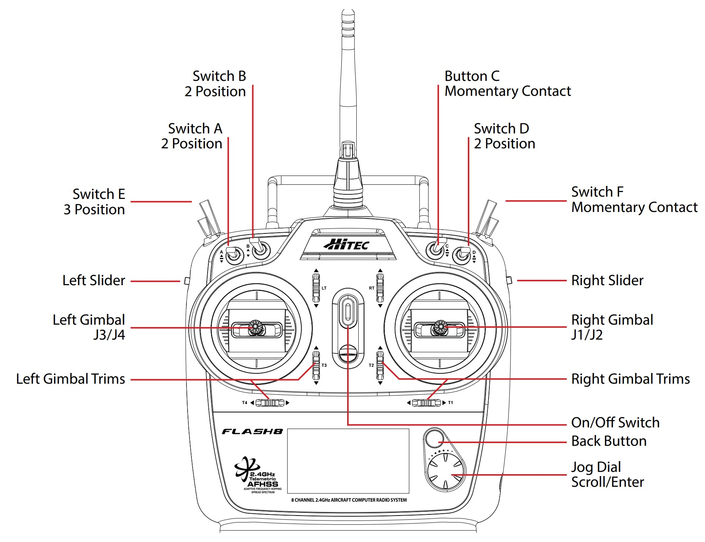
   
   Hitec Flash 8 RC transmitter

The button "Jog Dial Scroll/Enter" in the picture above will be referenced as "scroller" throughout the section.

Take the UAV and detach all propellors.
To bind both RC devices, follow these steps (which come from `this video <https://www.youtube.com/watch?v=SzZXjZMq_po>`__):

* Connect the SL port of the Optima SL (horizontal port below) with the DSM/SBUS RC port of the Pixhawk. The orientation of the cables (from left to right: yellow, red, black) needs to be respected or the Optima SL will not turn on.

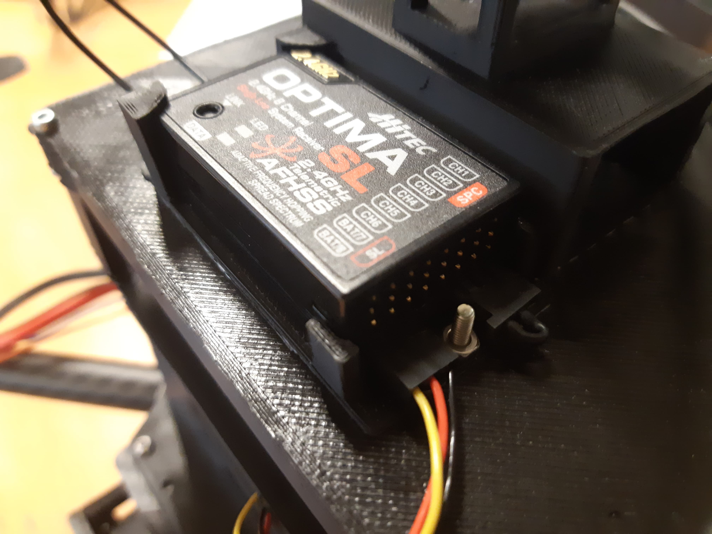

* (Optional) Connect one of the 4 ESCs signal cables to channel 1 of the
  Optima SL. This is not required but can help in order to know if the binding was successful.

  .. admonition:: todo

     Bryan: test this as never tried

* Turn on the Hitec Flash 8 (On/Off switch, see picture above).

* Select not ready to transmit.

* Press and hold both buttons on the bottom right of the Flash 8 (back button and the scroller). A new menu with a ’System.List’ will
  open.

* Use the scroller to go to "Spectra" and press OK.

* Make sure the receiver is set on "Opti&Mini".

* Scroll on ’Binding’ and select "Optima".

* Select that you want to bind the transmitter and receiver.

* Make sure the receiver is first turned off (pull the pixhawk usb cable out of your computer). When the receiver is powered off press the link button of the receiver, with s small tool (e.g., inbus key) and now turn  it on (insert the pixhawk usb cable in your computer). When the receiver is turned on, release the link button.

* The screen on the transmitter should automatically go from "Press and hold the link button..." to "Reboot RX check all functions...". When this happens, turn the power from the receiver off and turn it back on.

* Press "finish". Normally you should see the battery voltage of the receiver on the lower part of the main screen of the transmitter (more or less 5V if you are using the Pixhawk (4.7V)). It oscillates at a high frequency. When you would power off the receiver, the value is frozen, turn on again and it oscillates. This means it is working.

* (Optional, if you attached ESCs to Optima SL) WITH THE PROPELLERS DETACHED FROM THE MOTORS AND THE BATTERY CONNECTED, raise the throttle stick of the transmitter. If the motor starts spinning, then the binding process is successful. Keep in the mind that the RC calibration is not done yet, so it is possible that the motor will only start spinning at 50% throttle or more.

.. admonition:: todo

     Bryan: test this as never tried

* (Important) Now that the RC binding is tested and working a last step needs to be performed in order to set up the RC transmitter correctly. The Hitec Flash 8 proposes three different modes depending on the model of your UAV: ACRO, GLID and HELI. 
  * Press and hold both buttons (back button and scroller) of the Flash 8. A new menu with a ’System.List’ will open;
  * Go to "MDL Type";
  * Make sure you have the Airplane (ACRO) mode on, with 1 wing (1 AILE) and normal tail (see picture below). The Airplane (ACRO) mode is the only mode correct for this UAV, as it is also able to control quadcopters;
  * Go back to the main menu (by pressing back button).;
  * If you press and hold a bit on only the scroller, Acro.List opens;
  * Scroll all the way down till "monitor" and you will have a screen with all the different channels;
  * When you move (i.e., make circles) the joysticks and with the Airplane (ACRO) mode previously selected, you will see that each joystick affects only two channels.
  * If you do not do this the RC calibration, then QGroundControl will be messed up and your UAV will most likely crash or flip when you take off.

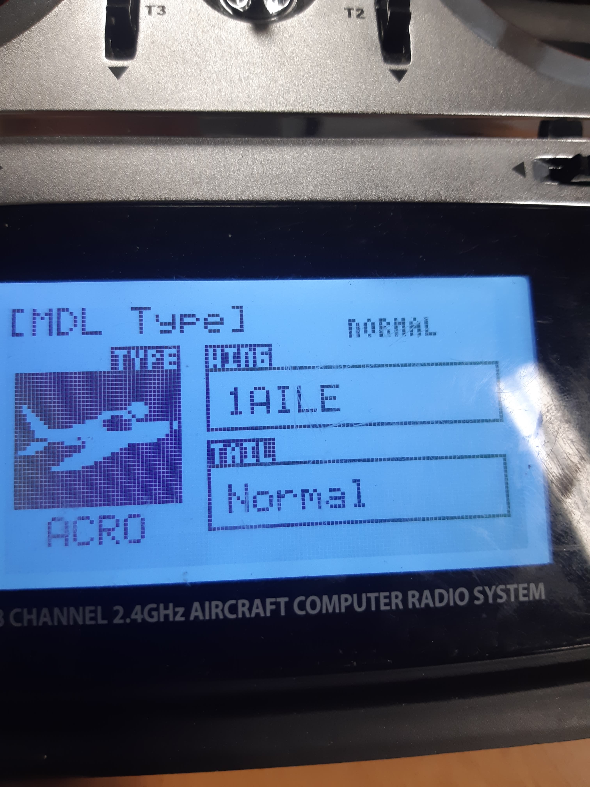

* In the main menu, scroll to the most top left name. You should give your model a new name. Select the letter you want to change and select the new replacement letter. Please do not overwrite existing models as they can be used by others. Whenever you change MDL Type, the name is lost.
  

Pixhawk configuration via QGroundControl
------------------------------------------

In this section, you will learn how to set up the software in order to:

* Calibrate the Pixhawk, ESCs and transmitter

* Define the role of each channel of the transmitter

* Configure the safety modes

Pixhawk SD card setup
^^^^^^^^^^^^^^^^^^^^^^^

You should first setup the SD card of the pixhawk otherwise the communication between the pixhawk and the NUC will not be made (i.e., no blue light on the FTDI connector, see "Configuration for Autonomous Flight". Although for some tty modules the light is less/more bright.). For the setup see section "SD card setup" of `this tutorial <https://ctu-mrs.github.io/docs/hardware/px4_configuration.html#sd-card-setup>`__. Insert the SD card with its connectors facing up.

.. admonition:: note

  The etc folder does not get removed when flashing new firmware. So this step should only be done once. Currently the extras.txt file one the Pixhawk SD cards are up to date with the following commits:

  * Pixhawk of F450 with nuc1: 
  * Pixhawk of F450 with nuc2: 
  * Pixhawk of F450 with nuc3: 
  * Pixhawk of F450 with nuc4: 
  * Pixhawk of F450 with nuc5: `check this commit <https://github.com/ctu-mrs/uav_core/commit/826c77c2c942b273a3e8b19ff5a062edfd23d294>`__;
  * Pixhawk of T650 with nuc2: 
  * Pixhawk of T650 with nuc3: `check this commit <https://github.com/ctu-mrs/uav_core/commit/826c77c2c942b273a3e8b19ff5a062edfd23d294>`__;

.. admonition:: todo

  fill in the above list for your pixhawk, uav type and nuc id

Installation of QGroundControl
^^^^^^^^^^^^^^^^^^^^^^^^^^^^^^^^

* We advise to take the ground station PC on which you will install QGroundControl next. This can be a Windows (tested and works) or an Ubuntu (recommended) machine. However, this can be installed on any machine, it is not mandatory to install it on the on-board UAV computers.
* Install QGroundControl on that machine. On Ubuntu make sure you follow `the steps for Ubuntu Linux <https://docs.qgroundcontrol.com/master/en/getting_started/download_and_install.html#ubuntu>`__ , cd to ~/Downloads and copy the lines in the terminal. You can then place the QGroundControl installer icon in a folder were you store later also logs files etc. Always open it from the chosen installation path or by double clicking on the app.
* Use QGroundControl to update the PixHawk firmware using `this tweaked firmware <https://ctu-mrs.github.io/docs/hardware/px4_firmware.html>`__. If you get a build error, try to refer to the "General Build Errors" of `this link <https://docs.px4.io/master/en/dev_setup/building_px4.html>`__ and follow the steps of `this video <https://docs.px4.io/master/en/dev_setup/dev_env_linux_ubuntu.html>`__. You can directly do it for the px4 firmware of CTU which slighly adapted the default px4 fimware. It is important that, as explained in the video, you install the ubuntu.sh such that you have everything. Also, when you have already build (make) beforehand, delete the build folder as it might give problems if the previous one was not built well. Always do this when rebuilding.

.. admonition:: note
  
  Fill in the version(s) of QGroundControl installed on your machines. You can do this by opening QGroundControl, clicking on the icon on the top left and the version number is displayed below.

  Ground station machines with QGroundControl:

  * Lenovo laptop Bryan: v4.2.3 (used), Development HEAD:78cf9bbe6 2021-05-06 10:49:59 -0700;
  * nuc6: TODO;

  The QGroundControl version and the `ctu-mrs/px4_firmware version <https://github.com/ctu-mrs/px4_firmware>`__ used to upgrade the firmware on each pixhawk:

  * Pixhawk of F450 with nuc1: 
  * Pixhawk of F450 with nuc2: 
  * Pixhawk of F450 with nuc3: 
  * Pixhawk of F450 with nuc4: 
  * Pixhawk of F450 with nuc5: GQC v4.2.3 used for `px4_firmware 7c37433 <https://github.com/ctu-mrs/px4_firmware/commit/7c374335db9ae7479f7fe2587a8e64fb9f0df3d5>`__;
  * Pixhawk of T650 with nuc2: QGC v4.2.4
  * Pixhawk of T650 with nuc3: QGC v4.2.3 used for `px4_firmware 7c37433 <https://github.com/ctu-mrs/px4_firmware/commit/7c374335db9ae7479f7fe2587a8e64fb9f0df3d5>`__;

  Make sure all UAVs are configured with the same px4 firmware versions.

.. admonition:: todo

  fill in the lists above.

* in QGroundControl, select vehicle setup, firmware, plug and unplug pixhawk,Flight Stack PX4 Pro some version, check Advanced Settings, choose custom firmware file, click OK, and select in the build folder the .px4 file. Wait untill the upgrade is complete and then you will go to summary tab automatically while the pixhawk reboots. Once the gps is connected, you will hear a beep.

Calibrations
^^^^^^^^^^^^^^

.. admonition:: note

  You can slide  vertically by left clicking and scrolling.

* In the Airframe tab, set the airframe type to quadrotor x, "Generic Quadrotor". 

* Make sure that the Pixhawk is firmly installed in the UAV frame, does not move relative to the UAV, and is leveled (i.e., parallel with the ground) as good as possible.

* In the "sensors" tab, calibrate the compass, gyroscope, accelerometer and level horizon. To do so, follow the steps asked by QGroundControl. 

.. admonition:: note

  It is adviced use a long usb cable to connect the pixhawk to the nuc and ensure there is leveled ground and enough space to move the UAV.
  Make sure to keep the front of the UAV (i.e., in the front direction of the pixhawk which is typically indicated on the UAV by the red legs, arms or tape) as shown by QGroundControl.

* Power on your transmitter, select yes for ready to transmit, and assign the channels on the transmitter (i.e., press both back button and scroller and select ’Channels’) such that each channel is paired with the correct function, according to the next figures taken from `this tutorial <https://ctu-mrs.github.io/docs/hardware/px4_configuration.html#sw-setup>`__. You always want to joystick channels without a return spring to be assigned to the throttle and yaw, the other two with a return spring to the roll and pitch. For example, for channel 5, click on it, select "AUX1" in the menu then scroll clockwise and select "B" there.

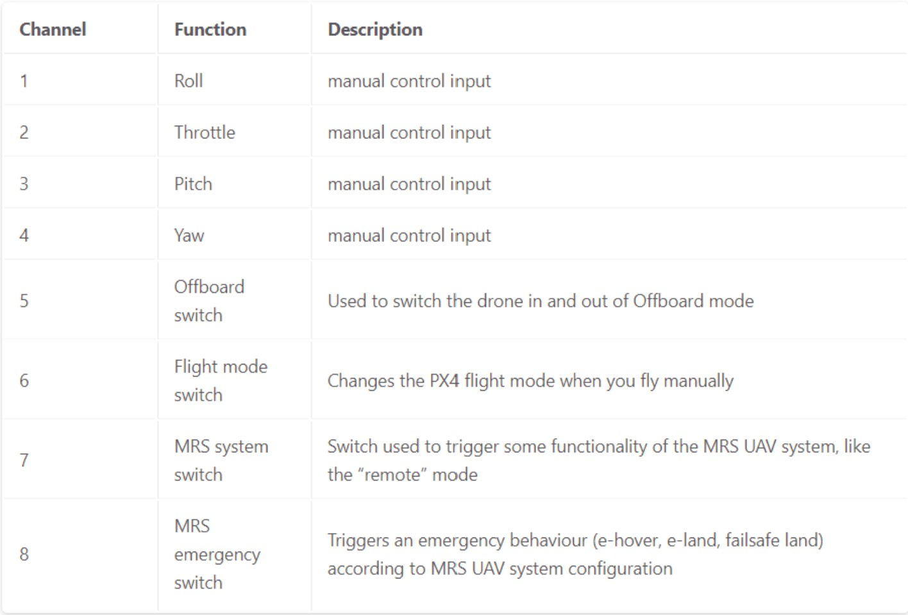

   Table summarizing the required channels to functions assignments

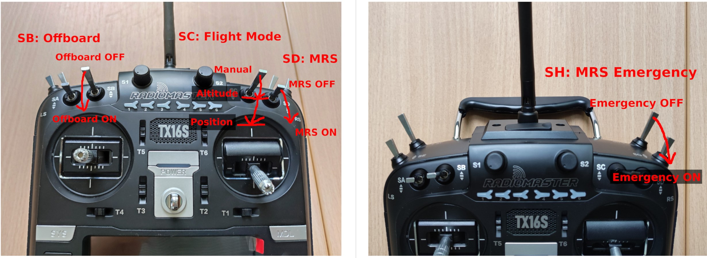

   Transmitter channels and there functions. The HitecFlash 8 looks similar, but the two joysticks are inverted and the emergency switch is on the other side. 

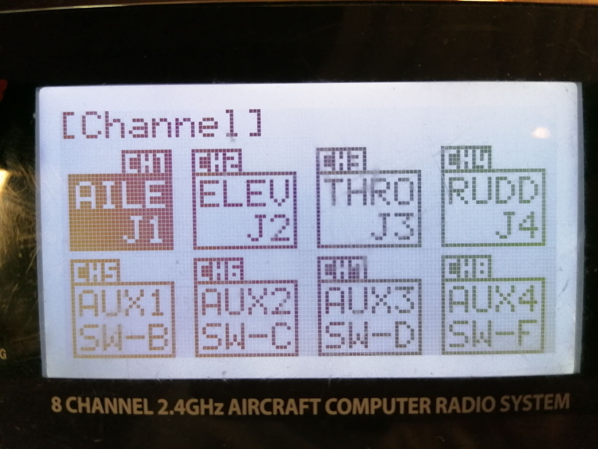

   channels to functions assignments on Hitec Flash 8 transmitter 

* In the "Radio" section, calibrate your transmitter with the Calibrate button in QGroundControl in Mode 2 (not mode 1). You need to use mode 2 for this transmitter since the throttle and yaw are on the left stick. If the transmitter is correctly binded with the receiver and the receiver correctly connected with the Pixhawk, you should see the channel monitor on the left, with the channels moving while playing with the joysticks and switches, see next figure.
  Make sure that each joystick toggle the right motion (left joystick : up-down = thrust and left-right = yaw; right joystick : up-down = pitch and left-right = roll).

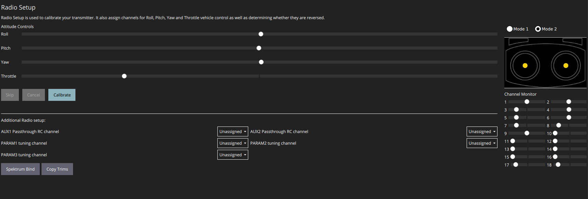

* Setup the flight modes as in the next figure. Play with the joysticks and switches and see if it moves the right channels on QGroundControl. Same remark as before for the appearance of the channel monitor.

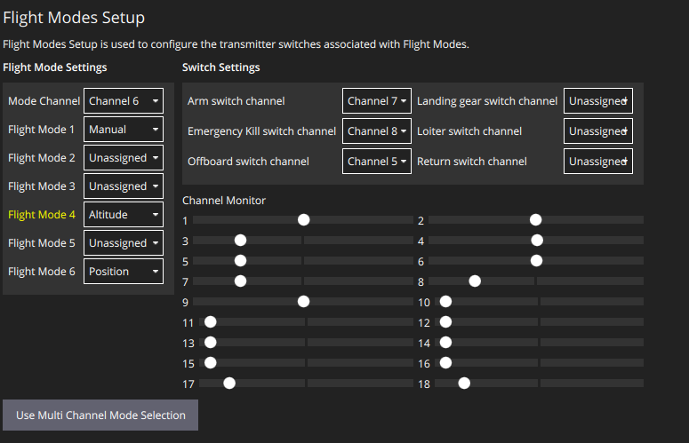

* In the "Power" section set the number of cells of your battery (e.g., 6 for the T650 UAV, 4 for the F450 UAV). Set the empty voltage to 3.7V (= nominal 6*3.7V=22.2V for 6s) and 4.20V as full voltage (= 25.2V for fully charged 6S battery).

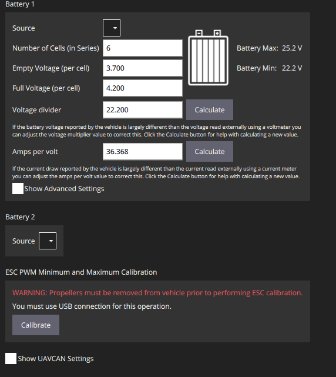

* Calibrate your ESCs in the "Power" section. The "Power" icon may stay red, but this can be ignored. Make sure the battery is charged and correctly placed on the UAV. Begin with the battery disconnected and connect it when asked by QGroundControl.

* In the "Motors" section, test the motors. Make sure the propellers are NOT attached to the motors. Make sure the GPS is connected to the Pixhawk and click the switch button on the GPS module or the motors will not start spinning. If you encounter problems, try the steps explained `here <https://discuss.px4.io/t/motor-test-command-denied/19168/16>`__. Check if the motor order and spinning direction are the same than in next figure (refer to number on motor and not the A,B,C,D). To easily check the spinning direction, attach some tape on the rotation axes of the motors. For motors spinning in the wrong direction, swap 2 phases of the motors (i.e.,cables between the motor and its ESC).

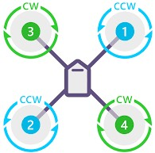

   Motor order in clockwise direction: 1, 4, 2 and 3

Safety setup
^^^^^^^^^^^^^

In "Safety" section, configure the following failsafe actions: 

* Low Battery Failsafe Trigger, select "Warning".

* RC Loss Failsafe Trigger, select "Land mode".

* Return to Launch Settings, select "Land immediately" then in "climb to attitude of", write 1.5m.

* Leave other values in default.

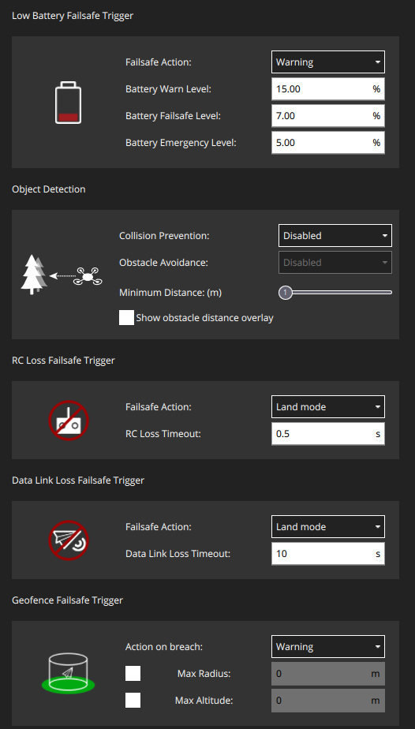

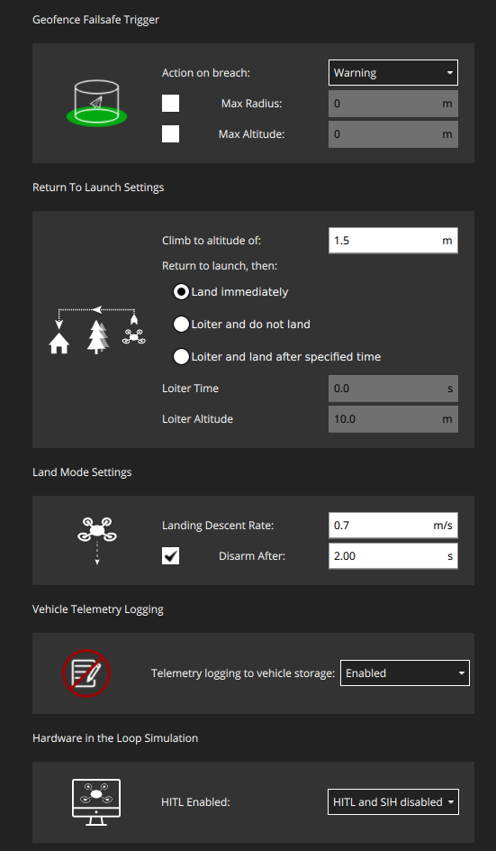

The last thing to do is to setup the RC loss failsafe. This failsafe is activated when the UAV is flying manually and the RC signal is lost, which is detected by the PixHawk.

* Turn the RC transmitter and receiver on.

* Push the RC transmitter’s throttle stick to the lowest level.

* Press the button on the RC receiver until the red LED turns off. Then release the button. The red
  and blue LEDs will start flashing for a while. This will save the current RC configuration as the
  output which the RC receiver produces when RC signal is lost.

* Go to the ’Parameters’ section of QGroundControl, Radio Calibration
  sub tab, and set parameter ’RC_MAP_FAILSAFE’ to ’Channel2’ and ’RC_FAILS_THR’ to ’950us’.

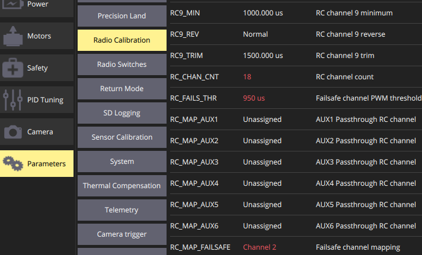

* Restart the PixHawk. Now when you turn off the RC transmitter, QGroundControl should report "manual control lost" and when you turn your RC back on, either it reports "manual control regained" or not. In both case you should however see it is working again (for example by playing with the joysticks and check if the channel monitor moves in radio).

In the "Summary" section, you should see the same parameters as the next figure:

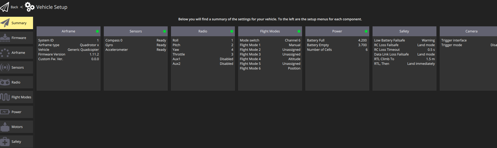

Now you can attach the propellers to the UAV. You are now ready to manually teleoperate the UAV via the transmitter!
