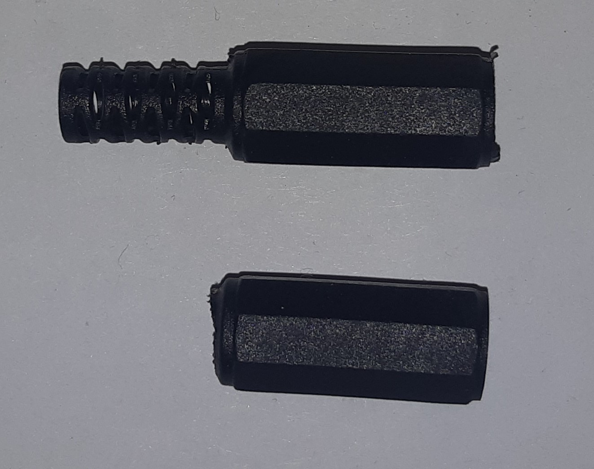
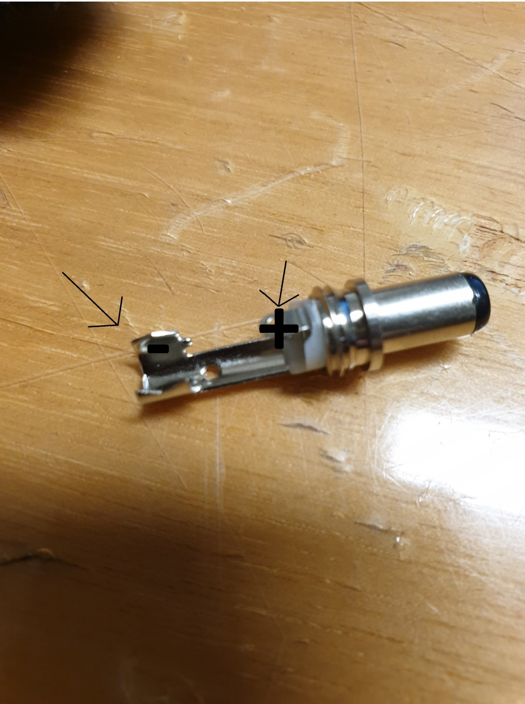
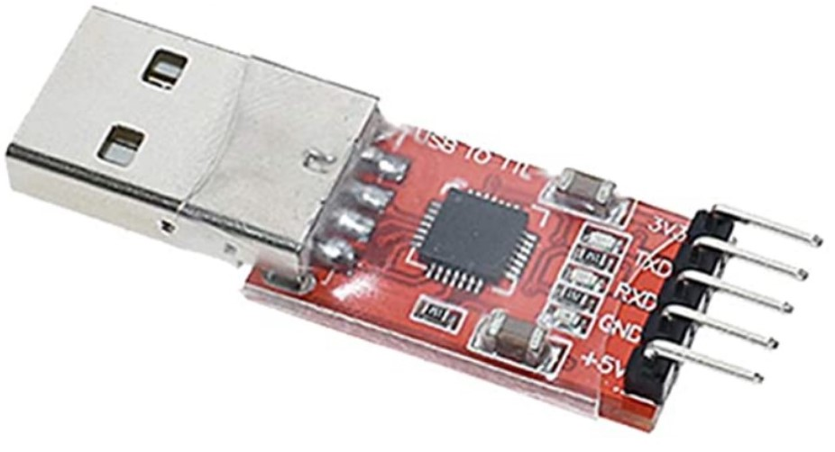
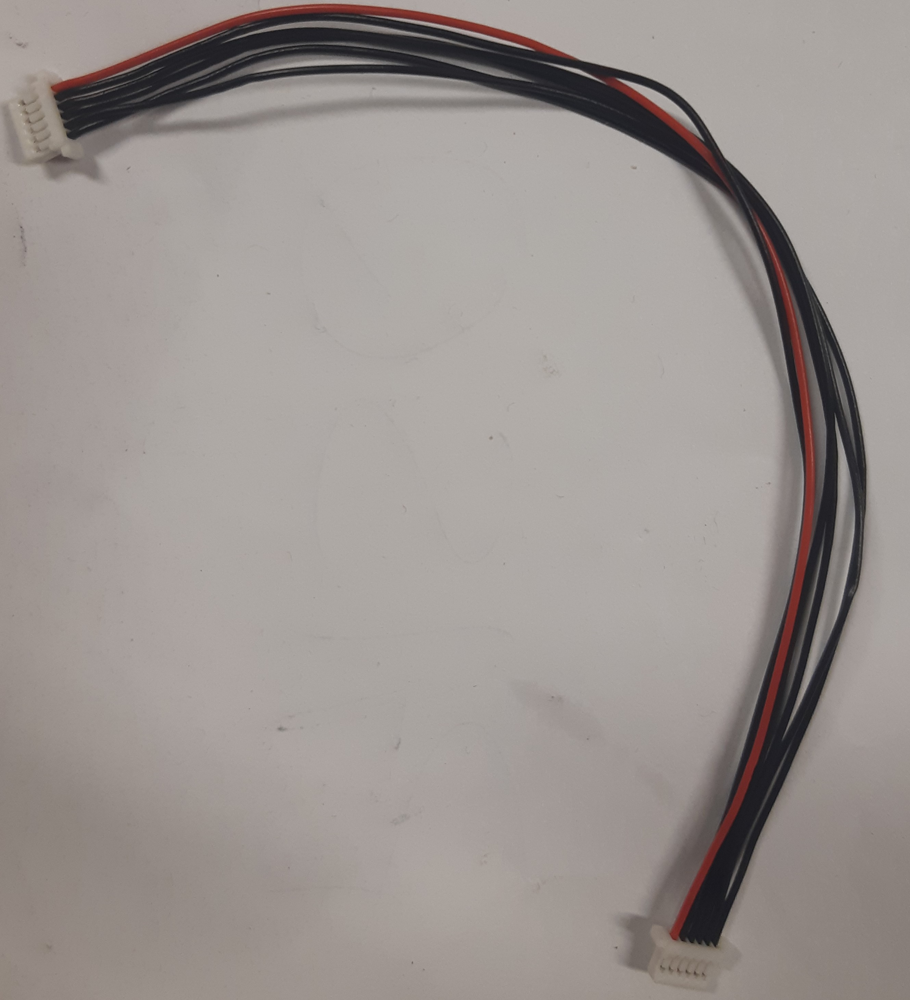
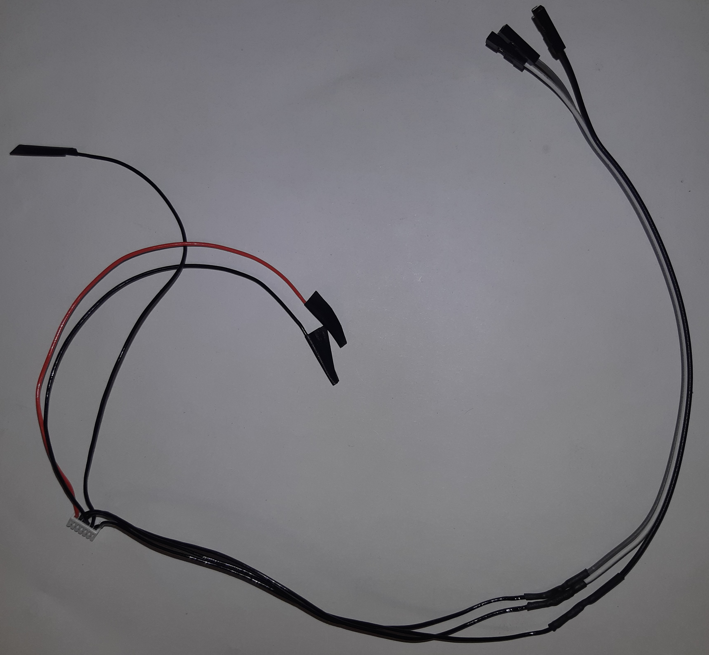
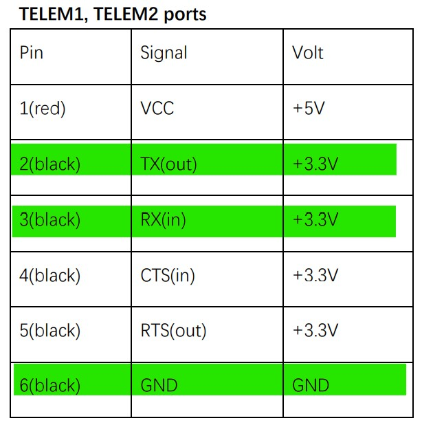

Connecting the NUC on the drone
===================================

In this part of the tutorial, you'll learn how to :
* Power the NUC through the battery
* Link the NUC and the Pixhawk

Power the NUC through the battery :
-----------------------------------

Normally, the NUC is supplied by a 19V battery through its charger. In reality it can work fine with a voltage going from 12-19V DC.
As the battery provides a DC voltage of 22.2V, a buck converter is needed to connect the NUC to it.
To realize the circuit, you'll need :
* Wingoneer XL4016E1 buck converter, that can take as input 22.2V and provides as output 19V and at least 6.33A.
* A DC plug 11116, to connect the circuit to the NUC.
* An XT60 male plug, to connect the circuit to the battery.
* 2 pairs of wires red and black.
* Shrink tubes and non-conductive tape.
* An XT60 splitter (1 male, 2 females).
* A voltmeter.

Now follow these steps :

* Strip a pair of wires long enough to enter the denuded parts fully into the back connectors of the XT60 plug and solder them (+ and - are indicated on the yellow plastic part of the plug).
* Put some shrink tubes on the solderings and clips the grey plastic part of the XT60 on top of them.
* Fix the other side of the wires to the screw connectors at the input side of the buck converter (input ports on the left of the converter when the potentiometer is directed toward you). 
* Unscrew with hands the 11116 plug to separate the metalic and plastic parts.
* Cut the narrow end of the plastic part and, if needed, increase a bit the size of the hole with a scalpel (see picture below). You must be able to pass the 2 wires through it.

* Solder the remaining pair of wires to the 11116 plug (+ and - ports shown on picture below).

* Put some shrink tubes on the solderings.
* Screw back the metalic and plastic parts of the 11116 plug.
* Fix the other side of the wire to the output ports of the buck converter (+ and - indicated on the ports).
* Plug the XT60 connector to the battery and measure the output voltage at the output ports of the buck converter with the voltmeter.
* Change the output voltage to reach 18.5V-19V more or less (by help of the potentiometer).

//PICTURE ENDING CIRCUIT//

Once it's done, put the buck converter in its case on the drone (TO BE DONE !!! + picture), connect the battery to the XT60 splitter and use one of it's output to connect the XT60 plug from the buck circuit.
Connect the 11116 plug to the NUC when you need to alimentate it.
The remaining output of the XT60 splitter is used to alimentate the power distribution board.

Link the NUC and the Pixhawk :
------------------------------ 

To exchange data between the NUC and the Pixhawk, the connection between them will be done via one of the USB ports of the NUC, through a FTDI board.
To realize the connection, you'll need : 
* A FTDI board (see picture below). 

* A 6 pins picoblade cable provided with the Pixhawk (see picture below).

* 3 jumper wires of different colors (if possible still stick together).
* Shrink tubes and non-conductive tape.

Now follow these steps : 

* Cut the connector at one end of the picoblade cable; cut the connectors at one end of the jumper wires.
* Prepare shrink tubes on the 3 useful wires (highlighted in green in picture below, cables 2,3 and 6 starting from red one, see documentation `here <http://www.holybro.com/manual/Pixhawk4-Pinouts.pdf>`__) and solder them to the jump wires. Heat the shrink tubes on the solderings.
* Put some non-conductive tape at the end of each other wires from the picoblade wire (NOT highlighted in green) in order to avoid short circuit.
* Put some non-conductive tape on top of the solderings and the 3 non used wires, to stick everything together.

* With help of the picture above (or the documentation provided previously) and the labels on the FTDI board, connect them together as follow :
	* PX4 TX - FTDI RX
	* PX4 RX - FTDI TX
	* PX4 GND - FTDI GND

If the connection is done properly you can plug the FTDI board in one of the USB entries of the NUC and the Telecom connector on the Telem2 port of the Pixhawk. When the NUC is powered on, a LED should light up.

