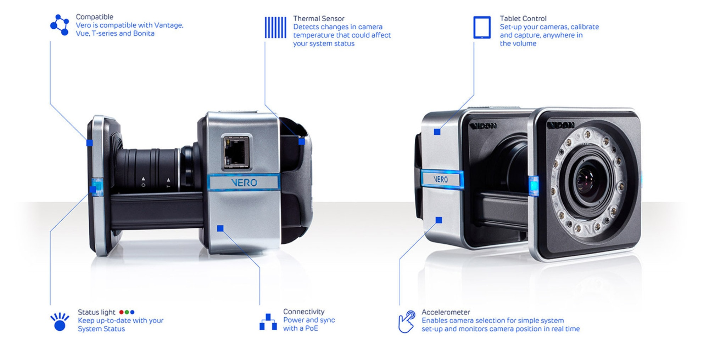
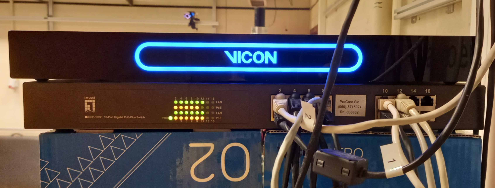
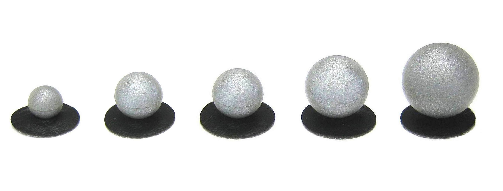
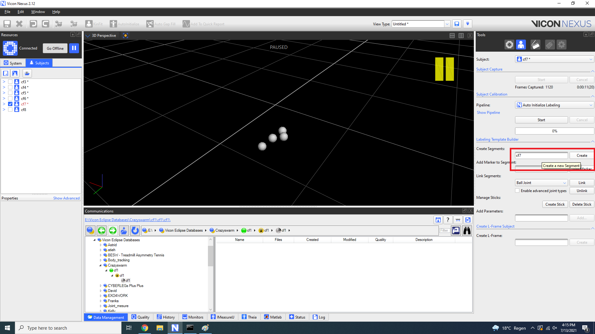
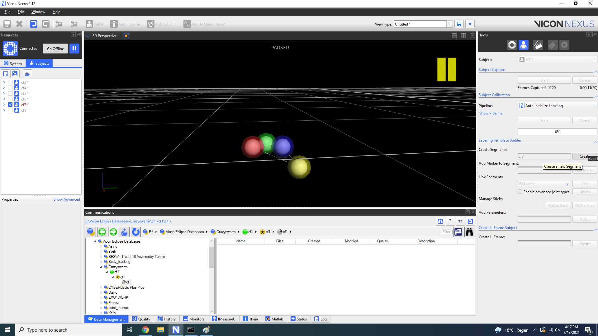

6. Crazyswarm
=============

.. role:: raw-html(raw)
    :format: html

*This chapter will move on to another documentation.*

6.1 Installation
----------------

To install Crazyswarm, follow `these steps <https://crazyswarm.readthedocs.io/en/latest/installation.html>`__. We use Ubuntu 20.04, Pyhton 3.7 and ROS Noetic.
Please refer to the *Physical Robots and Simulation* part. Don't forget to replace what is between brackets in the commands.

To switch between Python2 and Python3 on Ubuntu 20.04, please ckeck `this website <https://www.fosslinux.com/39384/switching-between-python-2-and-3-versions-on-ubuntu-20-04.htm>`__.

At the third step, you might get this error: 

.. code-block:: shell

    E: Unable to locate package gcc-arm-embedded
    
To solve this issue, you just have to remove ``gcc-arm-embedded`` from the command.

To install the Crazyflie Client, we recommend you to do it with the *Ubuntu Software application*.

6.2 Configuration
-----------------

Now, configuration is needed before flying. You should refer to this `user guide <https://www.bitcraze.io/documentation/repository/crazyflie-clients-python/master/userguides/userguide_client/>`__
to `update the firmware <https://www.bitcraze.io/documentation/repository/crazyflie-clients-python/master/userguides/userguide_client/#firmware-upgrade>`__ (it
is also good for you if you read `this <https://crazyswarm.readthedocs.io/en/latest/configuration.html#>`__).

If you can't connect to the CF, you probably need to run this command:

.. code-block:: shell

    cd crazyswarm/crazyflie-lib-python/examples
    python3 write-eeprom.py

You could get this error as a result:

.. code-block:: shell

    Scanning interfaces for Crazyflies...
    Cannot find a Crazyradio Dongle
    Crazyflies found:
    No Crazyflies found, cannot run example
    Traceback (most recent call last):
      File "write-eeprom.py", line 148, in <module>
         while le.is_connected:
    NameError: name 'le' is not defined

If so, set the USB permissions as described `here <https://www.bitcraze.io/documentation/repository/crazyflie-lib-python/master/installation/usb_permissions/>`__.

.. code-block:: shell

    cd crazyswarm/crazyflie-lib-python/examples
    python3 write-eeprom.py

6.3 Vicon
---------

Vicon is a developer of motion capture products and services for the life science, entertainment, and engineering industries. Motion capture (mocap) is the
process of recording the movement of objects or people. The technology originated in the life science market for gait analysis but is now used widely by VFX
studios, sports therapists, neuroscientists, and for validation and control of computer vision and robotics.
More information about Vicon can be found on `Vicon website <https://www.vicon.com>`__.

6.3.1 Working principle
^^^^^^^^^^^^^^^^^^^^^^^

The Vicon motion capture system is a passive optical system. This technique uses retroreflective markers that are tracked by the infrared cameras by reflecting
the light that is generated near the cameras’ lens. The camera’s threshold can be adjusted so only the bright reflective markers will be sampled, ignoring
skin and fabric.

The set of infrared cameras are placed around the to-be-captured area and are more or less pointing to the center of this area as depicted in Fig. 6.1. The
goal is that the markers in the captured volume can be seen by as many cameras as possible. We need at least two cameras to know the position of one marker,
but it is recommended to use as many cameras as possible, because the more cameras can capture a marker, the higher the accuracy of that marker’s position and
the lower the possibility the position of that marker is lost. If we only use markers on the floor (i.e. in a 2D plane) without people or objects around so
that the markers can never be occluded, we can use only 3 cameras and have good results. In more difficult situations with markers evolving in 3D, people or
objects hiding one of the cameras, the number of cameras needed can increase quickly.

In the R&MM lab we are using 10 cameras. This is ok for the experiments we have executed. For experiments where full coverage around the to-be-captured subject
is required, more cameras will be needed.

.. figure:: _static/Vicon_working_principle.png
   :alt: alternate text
   :align: center

   Fig. 6.1: Vicon Working principle

More information can be found `here <https://www.vicon.com/what-is-motion-capture>`__.

6.3.2 Hardware
^^^^^^^^^^^^^^

6.3.2.1 Cameras

At the R&MM lab there are ten Vero v2.2 cameras with a resolution of 1280*1024 pixels and a frame rate of 250fps. The higher the resolution of the camera, the
preciser the positioning of the markers and the more details you can obtain from the markers which is interesting when using very small markers placed close to
each other. The higher the frame rate, the easier to track the quick movements of the markers, which is also needed to use position of markers in a feedback
loop with high sampling time.

The placement of the cameras really depends on the experiment we want to carry out. In the lab the cameras can be placed onto the walls and on a tripods. In
the future it could be useful to have all of them on tripod to be able to change their places easily and quickly.

   Fig. 6.2: Vicon cameras

6.3.2.2 Sync box

As can be seen in Fig. 2.1, all cameras and the PC are connected to the synch box in order to get data coming from cameras and sending this to the PC. The sync
box provides a single communication point between the cameras and the (Vicon) PC. If you’re not integrating third-party equipment like reference video or force
plates into your system, this could be as simple as a POE switch. The real difference with the various sync boxes offered by manufacturers comes when you need
to integrate fully synchronized third-party devices or require time-code. Vicon’s Lock+ sync box offer many features such as Timecode, Genlock, VESA and
synchronized triggering of your third-party devices.

More information can be found `here <https://www.vicon.com/products/vicon-devices/lock-sync-box>`__.

   Fig. 6.3: Cameras connected to the synch box

6.3.2.3 Active wand

Before using Vicon we need to calibrate the Vicon system in order that the cameras know their location relative to each other.

Before starting with the calibration, we first have to mask all reflective elements (e.g. the cameras themselves, maybe clothes or shoes with that reflect
infrared light) in the Vicon room, so no reflective markers that you will use may be visible for the cameras. To start the calibration, press start in the
*Calibrate Camera* menu. Thereafter, start waving the wand in the room. The system will acquire many frames and after having captured more than 2000 frames for
each camera the calibration is finished. There are two operating modes for different light condition. This means you can calibrate your motion capture cameras
whether you are inside or outside in the brilliant sunshine. To optimize the process, the active wand automatically synchronizes itself by the use of a
photo-diode.

The precision and repeatability of your data is dependent on your system calibration. The LEDs on Vicon’s Active Wand are machined placed and precision
engineered to give you a more precise overall calibration. The Active Wand calibrates both optical and video cameras while accounting for sensor edge
distortion at the same time, to ensure synchronized overlay across your entire volume. Notice that better results will be obtained when the active wand is
visible to as many cameras as possible during the waving process. The more cameras see the waving movement of the active wand at a certain time, the better
they can compute the position relative to each other.

More information can be found `here <https://www.vicon.com/products/vicon-devices/calibration>`__.

.. figure:: _static/Active_wand.png
   :alt: alternate text
   :align: center

   Fig. 6.4: Active Wand

6.3.2.4 Reflective Markers

The reflective markers are placed on objects or on the body in order to detect their position. In order to detect pose (i.e position and orientation) of a
rigid object we need at least 3 markers. The position of the markers w.r.t. each other needs to be asymmetrical, in other words you may not form an equilateral
triangle.

   Fig. 6.5: Markers

6.3.2.5 Computer

The computer gives us the possibility to drive the Vicon system, calibrate, organize data capture, set parameters. Since the capture and display of motion
capture data is a highly demanding task for a PC and the real-time data processing asks a lot of the processor, the recommended specifications of the computer
are:
* Dell Precision XL Tower 5820

* Intel Xeon Processor W-2123 (3.6GHz, 3.9GHz Turbo, 4C, 8.25M Cache)

* 16GB (2x8GB) 2666MHz DDR4 RDIMM ECC

* 2 x 2TB 3.5inch Serial ATA (7,200 Rpm) Hard Drive

* Non RAID

* 8x Slimline DVD+/-RW Drive

* 2 GB NVIDIA Quadro P600

* Windows 10 Pro English

* INTEL ETHERNET i350 T4 SERVER ADAPTER RJ45 PCI−E – to connect Vicon System

More information can be found `here <https://www.vicon.com/faqs/operating-systems-and-pc-specification/what-is-the-recommended-pc-specification-to-run-my-vicon-tracker-system>`__.

6.3.3 Software
^^^^^^^^^^^^^^

Vicon offers several software packages, each of them for `different applications <https://www.vicon.com/products/software>`__.
Two of them are explained beheight: 400
:width: 400
`Tracker <https://www.vicon.com/products/software/tracker>`__ is designed for engineering applications. It can be used for robot tracking, human factors
engineering, design method optimization, virtual engineering, and previsualization to virtual reality. It looks better to use for the experiments we execute,
but we were also able to use Nexus.

.. figure:: _static/Tracker.png
   :alt: alternate text
   :align: center

   Fig. 6.7: Tracker

6.3.3 Calibration of the Vicon System
^^^^^^^^^^^^^^^^^^^^^^^^^^^^^^^^^^^^^

The *Mask cameras* function is used to make camera don’t care about area where infrared signal is not significant. Because vicon can believed there are markers
in this area but it is not the case. So when we use this function we have to be sure no markers are in the vision field of cameras. 

Then, check that the cameras look in the direction where your Crazyflies will move. When it is good, you can *Start* to *Aim Cameras*.

In order to calibrate the cameras, press *Start* in the *Calibrate Cameras* menu and wave with the active wand in the to-be-captured area, i.e. where you want to
detect reflection markers. You should draw "∞" forms. In *Show Advances*, you must have at least *Refinement frames: 2000*. Cameras are blinking during this
process and are all turned green when the process is finished.

In order to set the origin of the Vicon system, click *Start* in the *Set Volume Origin* menu. We usually use the active wand, but there are also others methods in
advanced options. Leave the active wand where you want (make sure it is in the camera view of all cameras) and press *Set the origin*. Now your Vicon system is
ready to use. To calibrate the system we can also adjust the focal of cameras.
During using of the Vicon sometimes cameras blink red, it means the camera pose has changed. Most of the time it is only due to vibration so it do not affect
the capture.

.. figure:: _static/System_preparation_menu.png
   :alt: alternate text
   :align: center

   Fig. 6.8: Example of system preparation menu

?. Creating an object
^^^^^^^^^^^^^^^^^^^^^

To create an object on Vicon Nexus, first create a subject like this:

   Fig. 6.9: Creating a subject

Then create segments:

   Fig. 6.10: Creating segments

Select the markers of the CF:

   Fig. 6.11: Selecting markers

Then click on *create*:

   Fig. 6.12: Creating the object

Normally the object has been created and it looks like this:

   Fig. 6.13: Object