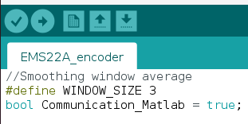
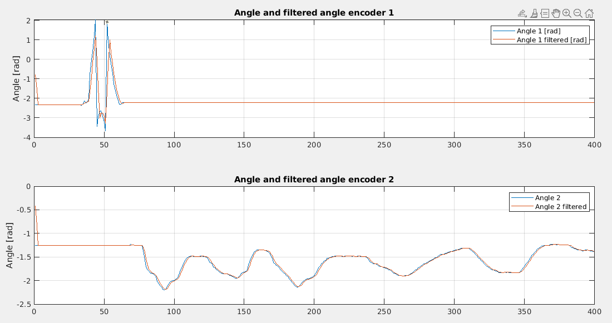

?.? Validation of the encoder
=============================

In this part, the steps needed to validate the good working of the encoder will be explained.

Real-time graphs using only matlab
----------------------------------

The first step is to plot in real time the data coming from the Arduino using a matlab script (without having to deal with the BACA protocol used for communication with the ROS frame work. This will be the next step).

Prerequist
^^^^^^^^^^

To do so, you need to install the Arduino IDE following `this <https://docs.arduino.cc/software/ide-v1/tutorials/Linux>`__ link.
If an error is displayed running the installation script, you might need to run sudo ./install.sh instead of just ./install.sh
If the error keeps popping, it might be that the script cannot create the Arduino folder in /usr/local/bin. To do so, execute the following code 

.. code-block:: shell

  cd /usr/local/bin
  sudo mkdir arduino

Then go back to the installation folder and reexecute the installation script. 
Now you should find the Arduino shortcut in the Applications of Ubuntu.

Performing the test
^^^^^^^^^^^^^^^^^^^
Once you installed the IDE, you can upload the script you want throught it. 
The script that must be compiled on the arduino can be found here : *~/workspace/src/droneswarm_brubotics/ros_packages/testing_brubotics/tmux_scripts/Raphael/arduino/EMS22A_encoder/EMS22A_encoder.ino*. 
You can then click on the "V" to check the syntax, and then on the arrow on the right to upload it. See the following figure:

If no error are displayed, the correct code is now running on your arduino.

To plot in real time the data coming from the Arduino, you must be sure that the *Communication_Matlab* variable is set on *true*. If not, change it and upload it again.
Now you can close the Arduino IDE and open Matlab.

Open the scripts located in */home/nuc3/git/droneswarm_brubotics/.gitman/testing_brubotics/tmux_scripts/Raphael/arduino/matlab*.

* *Test.m* is the file you must run to open the correct port and plot the data. 

* *ReadSineWaveData.m* is a function that is plotting the data that is being received from the Arduino. It is called each time we receive a new packet. You can change the duration
  of the test by changing the value here : *src.UserData.Count > 400*. By default only one of the encoder will be plotted live. You can uncomment the part of the second encoder to have both at the same time if needed.

* *post_pocessing* is a script that can be used when the test is finish to produce nice graphs.

The data that is being plotted is the angle of each encoder and the angular velocity associated. 
Here is an example of the kind of graph that you might be able to generate with the scripts (here using *post_processing.m*):

  