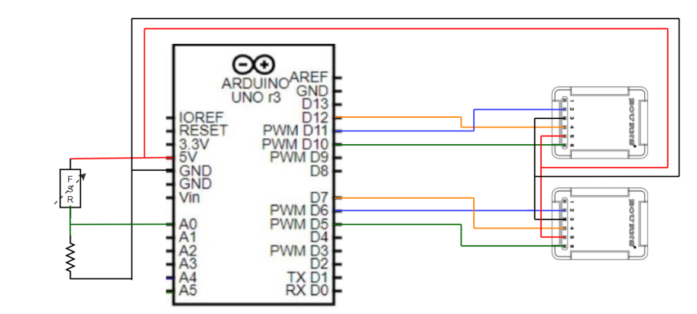

18 Validation of the encoder
=============================

In this part, the steps needed to validate the good working of the encoder will be explained.

18.1 Encoders and material needed
-------------------------------
Inorder to measure the position of the load attached to the drone, we must use encoders to measure the angle of ball joint. Based on this information, the position of the payload in the inertial and word frame can be computed easilly (with the other states measured elsewhere of course).
The encoders are the `EMS22A <https://www.bourns.com/docs/product-datasheets/EMS22A.pdf>`__ and their data is read using 
an `Arduino Uno <https://benl.rs-online.com/web/p/arduino/7697409?cm_mmc=BE-PLA-DS3A-_-google-_-PLA_BE_NL_Raspberry_Pi_%26_Arduino_%26_Development_Tools_Whoop-_-(BE:Whoop!)+Arduino-_-7697409&matchtype=&pla-341920527054&gclid=Cj0KCQjwgYSTBhDKARIsAB8KukvAlQU51p7JJ5_edjdlsALUf8YW28bD243x1uw75FKns0QKy6QeSckaAlJREALw_wcB&gclsrc=aw.ds>`__
These encoders are mounted in some spherical joint, ADD LINK TO CAD ONCE UPLOADED ON DRIVE/GITHUB . (not done yet as some modifications are possible in case issues are noticed during tests)

On the following figure, one can see the correct circuit to reproduce. 

.. note::
  It is better to use flexible cables to do the circuit as rigid ones might disconnect more easily in case they are pulled a bit.

18.2 Real-time graphs using only matlab
----------------------------------
The first step is to plot in real time the data coming from the Arduino using a matlab script (without having to deal with the BACA protocol used for communication with the ROS frame work. This will be the next step).

18.2.1 Prerequist
^^^^^^^^^^

To do so, you need to install the Arduino IDE following `this <https://docs.arduino.cc/software/ide-v1/tutorials/Linux>`__ link.
If an error is displayed running the installation script, you might need to run sudo ./install.sh instead of just ./install.sh
If the error keeps popping, it might be that the script cannot create the Arduino folder in /usr/local/bin. To do so, execute the following code 

.. code-block:: shell

  cd /usr/local/bin
  sudo mkdir arduino

Then go back to the installation folder and reexecute the installation script. 
Now you should find the Arduino shortcut in the Applications of Ubuntu.

18.2.2 Performing the test on matlab
^^^^^^^^^^^^^^^^^^^^^^^^^^^^^
Once you installed the IDE, you can upload the script you want throught it. 
The script that must be compiled on the arduino can be found here : *~/workspace/src/droneswarm_brubotics/ros_packages/testing_brubotics/tmux_scripts/Raphael/arduino/EMS22A_encoder/EMS22A_encoder.ino*. 
You can then click on the "V" to check the syntax (in the IDE), and then on the arrow on the right to upload it. See the following figure:

If no error are displayed, the correct code is now running on your arduino. See next section for the explanation of this code.

To plot in real time the data coming from the Arduino, you must be sure that the *Communication_Matlab* variable is set on *true*. If not, change it and upload it again.
Now you can close the Arduino IDE and open Matlab.

Open the scripts located in */home/nuc3/git/droneswarm_brubotics/.gitman/testing_brubotics/tmux_scripts/Raphael/arduino/matlab*.

* *Test.m* is the file you must run to open the correct port and plot the data. 

* *ReadSineWaveData.m* is a function that is plotting the data that is being received from the Arduino. It is called each time we receive a new packet. You can change the duration
  of the test by changing the value here : *src.UserData.Count > 400*. By default only one of the encoder will be plotted live. You can uncomment the part of the second encoder to have both at the same time if needed.

* *post_pocessing* is a script that can be used when the test is finish to produce nice graphs.

The data that is being plotted is the angle of each encoder and the angular velocity associated. 
Here is an example of the kind of graph that you might be able to generate with the scripts (here using *post_processing.m*):

.. figure:: _static/ArduinoGraphExample.png
   :width: 800
   :alt: alternate text
   :align: center

18.2.3 Explaining the Arduino code 
^^^^^^^^^^^^^^^^^^^^^^^^^^^

.. code-block:: arduino 

  //Smoothing window average
  #define WINDOW_SIZE 3
  bool Communication_Matlab = false; //set to true if communicating with Matlab and false to comminicate with ROS

  int INDEX = 0;
  float VALUE = 0;
  float SUM = 0;
  float READINGS[WINDOW_SIZE];
  float AVERAGED = 0;

  int INDEX_2 = 0;
  float VALUE_2 = 0;
  float SUM_2 = 0;
  float READINGS_2[WINDOW_SIZE];
  float AVERAGED_2 = 0;

  int INDEX_3 = 0;
  float VALUE_3 = 0;
  float SUM_3 = 0;
  float READINGS_3[WINDOW_SIZE];
  float AVERAGED_3 = 0;

  int INDEX_4 = 0;
  float VALUE_4 = 0;
  float SUM_4 = 0;
  float READINGS_4[WINDOW_SIZE];
  float AVERAGED_4 = 0;

  const int PIN_CS = 5;
  const int PIN_CLOCK = 6;
  const int PIN_DATA = 7;

  const int PIN_CS_2 = 2;
  const int PIN_CLOCK_2 = 3;
  const int PIN_DATA_2 = 4;

  float oldpos;
  float newpos;
  float angle;   
  float ang_velocity;

  float oldpos_2;
  float newpos_2;
  float angle_2;
  float ang_velocity_2;

  volatile int start =0;
  volatile int dt = 0;

  float offset;
  float offset_2;

  int i = 0;

  void setup() {
    Serial.begin(9600);
    pinMode(PIN_CS, OUTPUT);
    pinMode(PIN_CLOCK, OUTPUT);
    pinMode(PIN_DATA, INPUT);
    pinMode(PIN_CS_2, OUTPUT);
    pinMode(PIN_CLOCK_2, OUTPUT);
    pinMode(PIN_DATA_2, INPUT);

    digitalWrite(PIN_CLOCK, HIGH);
    digitalWrite(PIN_CS, LOW);
    digitalWrite(PIN_CLOCK_2, HIGH);
    digitalWrite(PIN_CS_2, LOW);
    
    oldpos = 0;
    newpos = 0;
    ang_velocity = 0;
    oldpos_2 = 0;
    newpos_2 = 0;
    ang_velocity_2 = 0;

    offset = -144.66;
    offset_2 = -93.67;

    //find_offset();
  
    //get the start time
    start = millis();
  }

  //byte stream[16];
  void loop() {
    // Encoder number 1
    digitalWrite(PIN_CS, HIGH);
    digitalWrite(PIN_CS, LOW);
    int pos = 0;
    for (int i=0; i<10; i++) {
      digitalWrite(PIN_CLOCK, LOW);
      digitalWrite(PIN_CLOCK, HIGH);
    
      byte b = digitalRead(PIN_DATA) == HIGH ? 1 : 0;
      pos += b * pow(2, 10-(i+1));
    }
    for (int i=0; i<6; i++) {
      digitalWrite(PIN_CLOCK, LOW);
      digitalWrite(PIN_CLOCK, HIGH);
    }
    digitalWrite(PIN_CLOCK, LOW);
    digitalWrite(PIN_CLOCK, HIGH);
    
    //convert pos [0, 1024] to angle [-180, 180] degrees
    angle = pos + offset;
    angle = (angle - 512)*(360.0/1024);
    angle = (angle * 71) / 4068.0; //convert to radians and remove offset
    // Serial.print(angle);

    //average 
    SUM = SUM - READINGS[INDEX];       // Remove the oldest entry from the sum
    VALUE = angle;        // Read the next sensor value
    READINGS[INDEX] = VALUE;           // Add the newest reading to the window
    SUM = SUM + VALUE;                 // Add the newest reading to the sum
    INDEX = (INDEX+1) % WINDOW_SIZE;   // Increment the index, and wrap to 0 if it exceeds the window size

    AVERAGED = SUM / WINDOW_SIZE;      // Divide the sum of the window by the window size for the result

    // Encoder number 2
    digitalWrite(PIN_CS_2, HIGH);
    digitalWrite(PIN_CS_2, LOW);
    pos = 0;
    for (int i=0; i<10; i++) {
      digitalWrite(PIN_CLOCK_2, LOW);
      digitalWrite(PIN_CLOCK_2, HIGH);
    
      byte b = digitalRead(PIN_DATA_2) == HIGH ? 1 : 0;
      pos += b * pow(2, 10-(i+1));
    }
    for (int i=0; i<6; i++) {
      digitalWrite(PIN_CLOCK_2, LOW);
      digitalWrite(PIN_CLOCK_2, HIGH);
    }
    digitalWrite(PIN_CLOCK_2, LOW);
    digitalWrite(PIN_CLOCK_2, HIGH);
    
    //convert pos [0, 1024] to angle [-180, 180] degrees
    angle_2 = pos + offset_2;
    angle_2 = (angle_2 - 512)*(360.0/1024); //angle in degrees
    angle_2 = (angle_2 * 71) / 4068.0; //convert to radians and remove offset

    //average encoder 2
    SUM_2 = SUM_2 - READINGS_2[INDEX_2];       // Remove the oldest entry from the sum
    VALUE_2 = angle_2;        // Read the next sensor value
    READINGS_2[INDEX_2] = VALUE_2;           // Add the newest reading to the window
    SUM_2 = SUM_2 + VALUE_2;                 // Add the newest reading to the sum
    INDEX_2 = (INDEX_2+1) % WINDOW_SIZE;   // Increment the index, and wrap to 0 if it exceeds the window size

    AVERAGED_2 = SUM_2 / WINDOW_SIZE;      // Divide the sum of the window by the window size for the result

    if (Communication_Matlab){
      Serial.print(angle);
      Serial.print(";");
      Serial.print(AVERAGED);
      Serial.print(";");
      Serial.print(angle_2);
      Serial.print(";");
      Serial.print(AVERAGED_2);
      Serial.print(";");
    }else{
      send_data(angle*1000, 0X18);
      send_data(angle_2*1000, 0X19);
    }
    
    angular_velocity(angle, angle_2);
    delay(10);
  }

  void find_offset(){
    // take the average of the first 300 data encoder 1
    for (int i = 0; i <= 300; i++){
      // Encoder number 1
      digitalWrite(PIN_CS, HIGH);
      digitalWrite(PIN_CS, LOW);
      int pos = 0;
      for (int i=0; i<10; i++) {
        digitalWrite(PIN_CLOCK, LOW);
        digitalWrite(PIN_CLOCK, HIGH);
      
        byte b = digitalRead(PIN_DATA) == HIGH ? 1 : 0;
        pos += b * pow(2, 10-(i+1));
      }
      for (int i=0; i<6; i++) {
        digitalWrite(PIN_CLOCK, LOW);
        digitalWrite(PIN_CLOCK, HIGH);
      }
      digitalWrite(PIN_CLOCK, LOW);
      digitalWrite(PIN_CLOCK, HIGH);
      offset = offset + pos;
    }
    offset = offset / 300.0;
    offset = 512.0 - offset;

    // take the average of the second 300 data encoder 1
    for (int i = 0; i <= 300; i++){
      // Encoder number 1
      digitalWrite(PIN_CS_2, HIGH);
      digitalWrite(PIN_CS_2, LOW);
      int pos = 0;
      for (int i=0; i<10; i++) {
        digitalWrite(PIN_CLOCK_2, LOW);
        digitalWrite(PIN_CLOCK_2, HIGH);
      
        byte b = digitalRead(PIN_DATA_2) == HIGH ? 1 : 0;
        pos += b * pow(2, 10-(i+1));
      }
      for (int i=0; i<6; i++) {
        digitalWrite(PIN_CLOCK_2, LOW);
        digitalWrite(PIN_CLOCK_2, HIGH);
      }
      digitalWrite(PIN_CLOCK_2, LOW);
      digitalWrite(PIN_CLOCK_2, HIGH);
      offset_2 = offset_2 + pos;
    }
    offset_2 = offset_2 / 300.0;
    offset_2 = 512.0 - offset_2;
    Serial.println(offset);
    Serial.println(offset_2);
  }

  void angular_velocity(float data, float data_2){
    oldpos = newpos;
    newpos = data;
    
    oldpos_2 = newpos_2;
    newpos_2 = data_2;
    // Find the time
    long fin = millis();
    dt =(fin - start);
    start = fin;   // sets up start for the next interrupt
    
    //calculate angular velocity
    ang_velocity = 1000 * (newpos - oldpos)/dt; // [degree/ sec]
    ang_velocity_2 = 1000 * (newpos_2 - oldpos_2)/dt; // [degree/ sec]

    //average velocity 1
    SUM_3 = SUM_3 - READINGS_3[INDEX_3];       // Remove the oldest entry from the sum
    VALUE_3 = ang_velocity;        // Read the next sensor value
    READINGS_3[INDEX_3] = VALUE_3;           // Add the newest reading to the window
    SUM_3 = SUM_3 + VALUE_3;                 // Add the newest reading to the sum
    INDEX_3 = (INDEX_3+1) % WINDOW_SIZE;   // Increment the index, and wrap to 0 if it exceeds the window size

    AVERAGED_3 = SUM_3 / WINDOW_SIZE;      // Divide the sum of the window by the window size for the result

    //average velocity 2
    SUM_4 = SUM_4 - READINGS_4[INDEX_3];       // Remove the oldest entry from the sum
    VALUE_4 = ang_velocity_2;        // Read the next sensor value
    READINGS_4[INDEX_4] = VALUE_4;           // Add the newest reading to the window
    SUM_4 = SUM_4 + VALUE_4;                 // Add the newest reading to the sum
    INDEX_4 = (INDEX_4+1) % WINDOW_SIZE;   // Increment the index, and wrap to 0 if it exceeds the window size

    AVERAGED_4 = SUM_4 / WINDOW_SIZE;      // Divide the sum of the window by the window size for the result

    if(Communication_Matlab){
    Serial.print(ang_velocity);
    Serial.print(";");
    Serial.print(AVERAGED_3);
    Serial.print(";");
    Serial.print(ang_velocity_2);
    Serial.print(";");
    Serial.println(AVERAGED_4);
    }else{
      send_data(AVERAGED_3*1000, 0X20);
      send_data(AVERAGED_4*1000, 0X21);
    }
  }

The code begin by defining all the variables and the correct pin used to read informations from the two encoders. 
It will not be commented more as it is a common procedure in Arduino codes for reading and converting values coming from encoders.

Before trusting the data, one must also add the offset to the calculated values of each encoders. This can be done by measuring the angle when the load is vertical and then use this value as the ofset.

18.3 Communication with ROS
----------------------

18.3.1 Configure the NUC to recognize the Arduino port
^^^^^^^^^^^^^^^^^^^^^^^^^^^^^^^^^^^^^^^^^^^^^^^
To be sure that the Arduino is recognized by the NUC everytime it is plugged in, one must do the following steps :

Once the Arduino is correctly connected to the computer using the USB port, it will show up as something similar to /dev/ttyUSB0. 
To find what port is used type the following command and use this name for the next command in the terminal : 

.. code-block:: shell

  ls -l /dev/ttyACM*

This should give the port to which the Arduino Uno is connected. Replace in the next
command the correct port and paste it in the terminal : 

.. code-block:: shell

  udevadm info -p $(udevadm info -q path -n /dev/ttyACM0) | grep 'SERIAL_SHORT\|VENDOR_ID\|MODEL_ID'

This should return the an information similar to what can be seen here under (Values might be different): 

.. code-block:: shell 

    E: ID_MODEL_ID=0043
    E: ID_SERIAL_SHORT=757363033363518031F0
    E: ID_VENDOR_ID=2341

Then create a new file (or edit it if you already done this part for the Pixhawk or for the RTK Gps) in /etc/udev/rules.d/ and call it 99-usb-serial.rules. Paste the fol-
lowing line in this text document and change it with the information obtained by using
previous command : 

.. code-block:: shell 

  SUBSYSTEM=="tty", ATTRS{idVendor}=="2341", ATTRS{idProduct}=="0043", ATTRS{serial}=="757363033363518031F0", SYMLINK+="arduino",
  OWNER="vub",MODE="0666"

In the mrs serial package a new launch file should be created for example arduino.launch
with the correct baudrate and port:

.. code-block:: xml

  <launch>

    <arg name="UAV_NAME" default="$(optenv UAV_NAME uav)" />
    <arg name="name" default="" />
    <arg name="portname" default="/dev/ttyACM0" />  <!-- INPUT : Put the correct port for the Arduino -->
    <arg name="baudrate" default="9600" /> <!-- INPUT : Put the correct baudrate for the Arduino, should be 9600 if using the same script -->
    <!-- "/dev/arduino" baudrate: 9600 19200 38400 57600 115200 230400 460800 500000 576000 921600-->
    <arg name="profiler" default="$(optenv PROFILER false)" />

    <arg name="swap_garmins" default="$(optenv SWAP_GARMINS false)" />

    <!-- will it run using GNU debugger? -->
    <arg name="DEBUG" default="false" />
    <arg unless="$(arg DEBUG)" name="launch_prefix_debug" value=""/>
    <arg     if="$(arg DEBUG)" name="launch_prefix_debug" value="debug_roslaunch"/>

    <!-- will it run as standalone nodelet or using a nodelet manager? -->
    <arg name="standalone" default="true" />
    <arg name="manager" default="$(arg UAV_NAME)_bacaprotocol_manager" />
    <arg name="n_threads" default="8" />
    <arg unless="$(arg standalone)" name="nodelet" value="load"/>
    <arg     if="$(arg standalone)" name="nodelet" value="standalone"/>
    <arg unless="$(arg standalone)" name="nodelet_manager" value="$(arg manager)"/>
    <arg     if="$(arg standalone)" name="nodelet_manager" value=""/>

    <group ns="$(arg UAV_NAME)">

      <!-- launch the nodelet -->
      <node pkg="nodelet" type="nodelet" name="serial" args="$(arg nodelet) baca_protocol/BacaProtocol $(arg nodelet_manager)" launch-prefix="$(arg launch_prefix_debug)" output="screen">

        <param name="uav_name" type="string" value="$(arg UAV_NAME)"/>

        <rosparam file="$(find mrs_serial)/config/mrs_serial.yaml" />

        <param name="enable_profiler" type="bool" value="$(arg profiler)" />
        <param name="portname" value="$(arg portname)"/>
        <param name="baudrate" value="$(arg baudrate)"/>
        <param name="use_timeout" value="false"/>

        <param name="swap_garmins" value="$(arg swap_garmins)"/>

        <!-- Publishers -->
        <remap from="~range" to="/$(arg UAV_NAME)/garmin/range" />
        <remap from="~range_up" to="/$(arg UAV_NAME)/garmin/range_up" />
        <remap from="~profiler" to="profiler" />
        <remap from="~baca_protocol_out" to="~received_message" />

          <!-- Subscribers -->
        <remap from="~baca_protocol_in" to="~send_message" />
        <remap from="~raw_in" to="~send_raw_message" />

      </node>

    </group>

  </launch>

It is then possible to do roslaunch and subscribe to the topic in a new terminal using the following two commands : 

.. code-block:: shell

  roslaunch mrs_serial arduino.launch
  rostopic echo /uav1/serial/received_message

This can, as usual be automated in a session.yml file.

18.3.2 BACA Protocol in Arduino code
^^^^^^^^^^^^^^^^^^^^^^^^^^^^^

To use the encoder among the ROS framework, one has to use the `BACA protocol <https://github.com/ctu-mrs/mrs_serial>`__ to send the relevant data via the USB port of the arduino, to the NUC.
The following function is implemented in the Arduino to correctly transform the data and send it to ROS.
Then a node will be able to subscribe to a specific topic to read this data flow, and use it for measuring the load's position.
Here is the full function used :

.. code-block:: arduino

  //communication with ROS
  void send_data(int16_t data, int16_t message_id) {
    uint8_t checksum = 0;
    uint8_t payload_size = 3;

    byte bytes[2];
    //split 16 bit integer to two 8 bit integers
    bytes[0] = (data >> 8) & 0xFF;
    bytes[1] = data & 0xFF;

    //message start
    Serial.write('b');
    checksum += 'b';

    //payload size
    Serial.write(payload_size);
    checksum += payload_size;

    //payload
    Serial.write(message_id); // message_id
    checksum += message_id;

    Serial.write(bytes[0]);
    checksum += bytes[0];

    Serial.write(bytes[1]);
    checksum += bytes[1];

    //checksum
    Serial.write(checksum);
  }

The message is defined as below:

.. code-block:: cpp

  ['b'][payload_size][payload_0(=message_id)][payload_1]...[payload_n][checksum]

Between each brackets, there is one eight bit value. The message starts with the
character "b". Then the size of the message is defined in the next eight bit value. This
represents how long the transferred data is. The message id is then next, to differentiate
the various sensors. Finally the last byte is the checksum. This is calculated as follows:

.. code-block:: arduino

  uint8_t checksum = 'b' + payload_size + payload0 + payload1 + payload_n

This checksum is calculated and put to the end of the message. ROS calculates this checksum again
and compares to see if it is the same. In case there is a difference, the data was not
transferred correctly and the message is discarded. 

To enable the communication with ROS, one must change the first line of the code to switch from "MATLAB communication" to "Ros communication"

.. code-block:: arduino

  bool Communication_Matlab = false; //set to true if communicating with Matlab and false to comminicate with ROS

This has not been tested more yet, a test will probably be made at VUB asap. I think the folder *https://github.com/mrs-brubotics/testing_brubotics/tree/master/tmux_scripts/load_transportation/1_one_drone_validation_encoder*
was made for this by last year students, but it is probably already flying. There is probably a way to launch the BACA protocol without having to fly the drone (even with the standard non-damping controller). 
 
Raphael : Remaining parts to transpose are "4.14.4 Modifying the MRS code", "4.15 Making the drone take off and fly", "4.16 Set up the Nimbro parameters according to MRS" 
maybe the part about take off and fly is redundant with the Hardware.rst written already in this tutorial. Check before doing it.