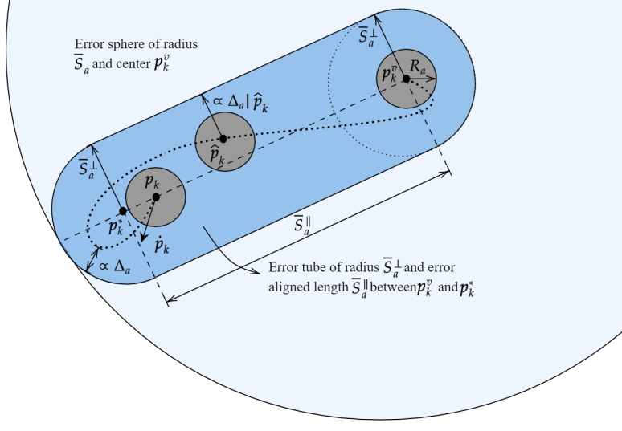

5. Introduction to visualization
================================

In this chapter, we will introduce you to the visualization on `RViz <http://wiki.ros.org/rviz>`__.
It is a great tool for ROS, used by many to debug codes or to have some nice visualization of your simulations.

5.1 The beginning
-----------------

First, especially if you have never runned any simulation using RViz, we recommand you to try some `CTU MRS simulation examples <https://github.com/ctu-mrs/simulation/tree/master/example_tmux_scripts>`__.
Let's try this `basic simulation <https://github.com/ctu-mrs/simulation/tree/master/example_tmux_scripts/one_drone_gps>`__
by running these commands:

.. code-block:: shell

   cd ~/mrs_workspace/src/simulation/example_tmux_scripts/one_drone_gps
   ./start.sh

The RViz window will open after Gazebo and it should look like this:

   Figure 5.1: RViz window with CTU visualization

In this default visualization, you can see the UAV model with its frame.
You can also use the 2D Nav Goal button to choose a position and a heading to go for the UAV. Thus, you will see the UAV trajectory.

.. figure:: _static/navgoal_button.png
   :width: 400
   :alt: alternate text
   :align: center

   Figure 5.2: Navigation goal button

Next, you can run some simulations which use dedicated plugins for one specific task.
You will need to use these commands to see `all of them <https://github.com/ctu-mrs/mrs_uav_testing/tree/master/tmux>`__:

.. code-block:: shell

   cd ~/mrs_workspace/src/uav_core/ros_packages/mrs_uav_testing/tmux
   ls

Choose the one you want to test by running:

.. code-block:: shell

   cd "name_of_the_simulation"
   ./start.sh

The `test_bumper simulation <https://github.com/ctu-mrs/mrs_uav_testing/tree/master/tmux/test_bumper>`__
is an example of an advanced visualization task that you can do on RViz. It is made by a plugin created from scratch.
It represents a weighty work to create this type of visualization but it shows you the diversity of possibilities.

5.2 How RViz works ?
--------------------

To run a simulation, you will use the ``start.sh`` file wich will ask to the ``session.yml`` file what ``.launch`` file is going to be ran. 
A ``.yml`` looks like this:

.. code-block:: yaml

   # mrs_workspace/src/simulation/example_tmux_scripts/one_drone_gps/session.yml
   name: simulation
   root: ./
   startup_window: status
   pre_window: export UAV_NAME=uav1; export RUN_TYPE=simulation; export UAV_TYPE=t650; export WORLD_NAME=simulation; export SENSORS="garmin_down"
   windows:
     - roscore:
       layout: tiled
       panes:
         - roscore
     - gazebo:
       layout: tiled
       panes:
         - waitForRos; roslaunch mrs_simulation simulation.launch world_name:=grass_plane gui:=true
         - waitForOdometry; gz camera -c gzclient_camera -f uav1; history -s gz camera -c gzclient_camera -f uav1
     - status:
       layout: tiled
       panes:
         - waitForSimulation; roslaunch mrs_uav_status status.launch
     - spawn:
       layout: tiled
       panes:
       - waitForSimulation; rosservice call /mrs_drone_spawner/spawn "1 $UAV_TYPE --enable-rangefinder"
     - control:
       layout: tiled
       panes:
         - waitForOdometry; roslaunch mrs_uav_general core.launch
     - takeoff:
       layout: tiled
       panes:
         - waitForSimulation; roslaunch mrs_uav_general automatic_start.launch
         - 'waitForControl;
           rosservice call /$UAV_NAME/mavros/cmd/arming 1;
           sleep 2;
           rosservice call /$UAV_NAME/mavros/set_mode 0 offboard'
     - goto:
       layout: tiled
       panes:
         - 'history -s rosservice call /$UAV_NAME/control_manager/goto \"goal: \[0.0, 10.0, 1.5, 0.0\]\"'
     - rviz:
       layout: tiled
       panes:
         - waitForControl; roslaunch mrs_uav_testing rviz.launch
         - waitForControl; roslaunch mrs_rviz_plugins load_robot.launch
     - easy_control:
       layout: tiled
       panes:
         - waitForControl; waitForControl; roslaunch mrs_uav_general logitech_joystick.launch
         - waitForControl; waitForControl; roslaunch mrs_rviz_plugins rviz_interface.launch
     - layout:
       layout: tiled
       panes:
         - waitForControl; sleep 3; ~/.i3/layout_manager.sh ./layout.json

In the RViz part, you can see that the first line ask for the ``rviz.launch`` file (see below) which is used to choose the ``.rviz`` 
file that you want to use. The ``.rviz`` file is used to save the configuration of RViz, i.e. what is displayed. 

.. code-block:: html

   <!-- mrs_workspace/src/uav_core/ros_packages/mrs_uav_testing/launch.rviz.launch -->
   <launch>

     <arg name="name" default="default_simulation" />

     <group>

       <node pkg="rviz" type="rviz" name="rviz" args="-d $(find mrs_uav_testing)/rviz/$(arg name).rviz" />

     </group>

   </launch>

In the `mrs_uav_testing <https://github.com/ctu-mrs/mrs_uav_testing>`__ package of CTU, there is a ``rviz`` folder
which contains all the ``.rviz`` files.
You can generate a ``.rviz`` file, which save your RViz configuration, by clicking in RViz on "File → Save config as".

To add a new display, click on  "Add" and choose "By display type" or "By topic" to display to the topic you want to visualize.
If you choose "By display type", you will have to write the topic name in the left window.

.. figure:: _static/add_button.png
   :width: 400
   :alt: alternate text
   :align: center

   Figure 5.3: Add button

.. figure:: _static/topic_window.png
   :width: 400
   :alt: alternate text
   :align: center

   Figure 5.4: Topic window

.. _5.3 Our work D-ERG visualization:

5.3 Our work: D-ERG visualization
---------------------------------

We want to visualize what it is computed by the `D-ERG tracker <https://github.com/mrs-brubotics/trackers_brubotics/blob/master/src/dergbryan_tracker/dergbryan_tracker.cpp>`__
of BruBotics, especially in the `two_drones_D-ERG simulation <https://github.com/mrs-brubotics/testing_brubotics/tree/master/tmux_scripts/bryan/two_drones_D-ERG>`__
that you can run with these commands:

.. code-block:: shell

    cd ~workspace/src/droneswarm_brubotics/ros_packages/testing_brubotics/tmux_scripts/two_drones_D-ERG/
    ./start.sh

We have several D-ERG (Distributed Explicit Reference Governor) strategies to illustrate. For more advanced explanations, watch `this video <https://www.youtube.com/watch?v=le6WSeyTXNU>`__.

.. _5.3.1 D-ERG strategy 0:

5.3.1 D-ERG strategy 0
^^^^^^^^^^^^^^^^^^^^^^

.. figure:: _static/DERG-0.png
   :width: 500
   :alt: alternate text
   :align: center

   Figure 5.5: D-ERG strategy 0

* :math:`p_{k}`: current pose of the UAV
* :math:`p̂_{k}`: desired reference pose
* :math:`p_{k}^{v}`: applied reference pose 
* :math:`R_{a}`: drone's radius

Communicate: :math:`p_{k}`

Sphere can **translate**.

.. _5.3.2 D-ERG strategy 1:

5.3.2 D-ERG strategy 1
^^^^^^^^^^^^^^^^^^^^^^

   Figure 5.6: D-ERG strategy 1

Communicate: :math:`p_{k}`, :math:`p_{k}^{v}`

Tube can **translate** and **rotate**.

.. _5.3.3 D-ERG strategy 2:

5.3.3 D-ERG strategy 2
^^^^^^^^^^^^^^^^^^^^^^

.. figure:: _static/DERG-2.png
   :width: 500
   :alt: alternate text
   :align: center

   Figure 5.7: D-ERG strategy 2

Communicate: :math:`p_{k}`, :math:`p_{k}^{v}`

Tube can **translate**, **rotate** and **change length**.

.. _5.3.4 D-ERG strategy 3:

5.3.4 D-ERG strategy 3
^^^^^^^^^^^^^^^^^^^^^^

.. figure:: _static/DERG-3.png
   :width: 500
   :alt: alternate text
   :align: center

   Figure 5.8: D-ERG strategy 3

Communicate: :math:`p_{k}`, :math:`p_{k}^{v}`, :math:`S_{a,min}^{⊥}`

Tube can **translate**, **rotate**, **change length and width**. The width (radius) is the minimal one for a tube with error directed longitudinal axis.

.. _5.3.5 D-ERG strategy 4:

5.3.5 D-ERG strategy 4
^^^^^^^^^^^^^^^^^^^^^^

.. figure:: _static/DERG-4.png
   :width: 500
   :alt: alternate text
   :align: center

   Figure 5.9: D-ERG strategy 4

Communicate: :math:`p_{k}^{0}`, :math:`p_{k}^{1}`, :math:`S_{a,min}^{⊥}`

Tube and cylinder can **translate**, **rotate**, **change length and width**. The width (radius) and the length are the minimal one for a tube with error directed
longitudinal axis.

.. _5.3.6 D-ERG strategy 5:

5.3.6 D-ERG strategy 5
^^^^^^^^^^^^^^^^^^^^^^

.. figure:: _static/DERG-5.png
   :width: 500
   :alt: alternate text
   :align: center

   Figure 5.10: D-ERG strategy 5

This final strategy permits to calculate the minimal distance between 2 predicted poses.

5.4 How did we build the `visualization package <https://github.com/mrs-brubotics/visualization_brubotics>`__ ?
---------------------------------------------------------------------------------------------------------------

We have developed a `visualization package <https://github.com/mrs-brubotics/visualization_brubotics>`__ which permits to visualize
in RViz the :ref:`D-ERG strategies algorithms <5.3 Our work D-ERG visualization>` in the `two_drones_D-ERG simulation <https://github.com/mrs-brubotics/testing_brubotics/tree/master/tmux_scripts/bryan/two_drones_D-ERG>`__.
This package is based on the `mrs_rviz_plugins <https://github.com/ctu-mrs/mrs_rviz_plugins>`__ structure.
We will explain you how to reproduce it.

First, we created a new package named `visualization_brubotics <https://github.com/mrs-brubotics/visualization_brubotics>`__ in
``workspace/src_droneswarm_brubotics/ros_packages`` with:

.. code-block:: shell

   catkin_create_pkg visualization_brubotics

This command creates a `CMakeLists.txt <https://github.com/mrs-brubotics/visualization_brubotics/blob/main/CMakeLists.txt>`__ file
and a `package.xml <https://github.com/mrs-brubotics/visualization_brubotics/blob/main/package.xml>`__ file.

Then, we modified `session.yml <https://github.com/mrs-brubotics/testing_brubotics/blob/master/tmux_scripts/bryan/two_drones_D-ERG/session.yml>`__
file of the `two_drones_D-ERG <https://github.com/mrs-brubotics/testing_brubotics/tree/master/tmux_scripts/bryan/two_drones_D-ERG>`__.
At the end (line 247), you should see a RViz part. If it is commented, uncomment it. We modified these lines so it looks lite this:

.. code-block:: shell

   # workspace/src/droneswarm_brubotics/ros_packages/testing_brubotics/tmux_scripts/bryan/two_drones_D-ERG/session.yml
   - rviz:
       layout: tiled
       panes:
         - waitForControl; roslaunch testing_brubotics rviz_brubotics.launch name:=two_drones_derg
         - waitForControl; roslaunch testing_brubotics tf_connector_avoidance.launch 
         - waitForControl; export UAV_NAME=uav1; roslaunch mrs_rviz_plugins load_robot.launch
         - waitForControl; export UAV_NAME=uav2; roslaunch mrs_rviz_plugins load_robot.launch
         - waitForControl; roslaunch visualization_brubotics visual.launch

Now, we will explain you line per line why we did this.
The `rviz_brubotics.launch <https://github.com/mrs-brubotics/testing_brubotics/blob/master/launch/rviz/rviz_brubotics.launch>`__ and `tf_connector_avoidance.launch <https://github.com/mrs-brubotics/testing_brubotics/blob/master/launch/rviz/tf_connector_avoidance.launch>`__
files are based on CTU codes but we made some changes in them.
Indeed, we don't want to visualize the same things as CTU. Thus, we make our own ``.rviz`` files in the `testing_brubotics/rviz folder <https://github.com/mrs-brubotics/testing_brubotics/tree/master/rviz>`__.
So we needed to adapt the find path in the `rviz_brubotics.launch <https://github.com/mrs-brubotics/testing_brubotics/blob/master/launch/rviz/rviz_brubotics.launch>`__:

.. code-block:: html

   <!-- workspace/src/droneswarm_brubotics/ros_packages/testing_brubotics/launch/rviz/rviz_brubotics.launch -->
   <launch>

     <arg name="name" default="default_simulation" />

     <group>

       <node pkg="rviz" type="rviz" name="rviz" args="-d $(find testing_brubotics)/rviz/$(arg name).rviz" />

     </group>

   </launch>

The path find `tf_connector_avoidance.launch <https://github.com/mrs-brubotics/testing_brubotics/blob/master/launch/rviz/tf_connector_avoidance.launch>`__
file has also been changed because it calls the `tf_connector_avoidance.yaml <https://github.com/mrs-brubotics/testing_brubotics/blob/master/config/tf_connector_avoidance.yaml>`__
file which permits to visualize several drones at the same time.

.. code-block:: html

   <!-- workspace/src/droneswarm_brubotics/ros_packages/testing_brubotics/launch/rviz/tf_connector_avoidance.launch -->
   <launch>
       <!-- other args -->
     <arg name="standalone" default="true" />
     <arg name="debug" default="false" />

     <arg     if="$(eval arg('standalone') or arg('debug'))" name="nodelet" value="standalone" />
     <arg unless="$(eval arg('standalone') or arg('debug'))" name="nodelet" value="load" />
     <arg     if="$(eval arg('standalone') or arg('debug'))" name="nodelet_manager" value="" />
     <arg unless="$(eval arg('standalone') or arg('debug'))" name="nodelet_manager" value="tf_connector_nodelet_manager" />

     <arg     if="$(arg debug)" name="launch_prefix" value="debug_roslaunch" />
     <arg unless="$(arg debug)" name="launch_prefix" value="" />

     <node pkg="nodelet" type="nodelet" name="tf_connector_dummy" args="$(arg nodelet) mrs_uav_odometry/TFConnectorDummy $(arg nodelet_manager)" output="screen" launch-prefix="$(arg launch_prefix)">

       <rosparam file="$(find testing_brubotics)/config/tf_connector_avoidance.yaml" />

       <!-- Subscribers -->
       <remap from="~tf_in" to="/tf" />

       <!-- Publishers -->
       <remap from="~tf_out" to="/tf" />

     </node>

     </launch>

To create the robot model, we can use the `load_robot.launch <https://github.com/ctu-mrs/mrs_rviz_plugins/blob/master/launch/load_robot.launch>`__
file of CTU without changing it.
It permits to create one robot model so we use it two times because there are two drones in our simulation, uav1 and uav2.

Then, we launch our `launch/visual.launch file <https://github.com/mrs-brubotics/visualization_brubotics/blob/main/launch/visual.launch>`_
to start our `src/visual.cpp file <https://github.com/mrs-brubotics/visualization_brubotics/blob/main/src/visual.cpp>`__ for visualization
that we will explain in the next chapter.

.. code-block:: html

  <!-- workspace/src/droneswarm_brubotics/ros_packages/visualization_brubotics/launch/visual.launch -->
  <?xml version="1.0" ?>
  <launch>

      <node pkg="visualization_brubotics" type="visual" name="visual" output="screen"/>

  </launch>

:blue:`[TODO: adapt the .cpp file name]JV`

5.5 The code for visualization
------------------------------

:blue:`[Don't forget to change the link if we change the file name]JV`

As you can see in the different :ref:`D-ERG strategies  <5.3 Our work D-ERG visualization>`, we want to visualize spheres, tubes and lines.
These three shapes are `RViz standard display marker types <http://wiki.ros.org/rviz/DisplayTypes/Marker>`__, except the tube.
But we will see later that we can build this shape with one cylinder, which is also a RViz standard display marker type, and two hemispheres.

5.5.1 Beginner tutorials and knowledge
^^^^^^^^^^^^^^^^^^^^^^^^^^^^^^^^^^^^^^

To display basic shapes in RViz, we invite you to follow `this tutorial <http://wiki.ros.org/rviz/Tutorials/Markers%3A%20Basic%20Shapes>`__.
You will learn to display cubes, spheres, cylinders, and arrows in RViz.
Then, follow `this tutorial <http://wiki.ros.org/rviz/Tutorials/Markers%3A%20Points%20and%20Lines>`__
to learn how to display points and lines.
You can read `this documentation <http://wiki.ros.org/rviz/DisplayTypes/Marker#Mesh_Resource_.28MESH_RESOURCE.3D10.29_.5B1.1.2B-.5D>`__
to learn how to do a custom marker using a mesh resource.

You will also need to write ROS publishers and subscribers so please follow `this tutorial <http://wiki.ros.org/ROS/Tutorials/WritingPublisherSubscriber%28c%2B%2B%29>`__.

Because we use quaternions to set the orientation of some markers, it could be useful for you to read `this <https://scriptinghelpers.org/blog/how-to-think-about-quaternions>`__
if you don't know anything about it.

5.5.2 Our `C++ code <https://github.com/mrs-brubotics/visualization_brubotics/blob/main/src/visual.cpp>`__
^^^^^^^^^^^^^^^^^^^^^^^^^^^^^^^^^^^^^^^^^^^^^^^^^^^^^^^^^^^^^^^^^^^^^^^^^^^^^^^^^^^^^^^^^^^^^^^^^^^^^^^^^^

:blue:`[TODO: add the explanations about the C++ code step by step]JV`

5.5.2.1 The structure

5.5.2.2 :ref:`D-ERG strategy 0  <5.3.1 D-ERG strategy 0>`

5.5.2.3 :ref:`D-ERG strategy 1  <5.3.2 D-ERG strategy 1>`

Explanation about the hemisphere:
We used it to do the markers of the hemispheres. For example, you can use a .stl file.
You can search in the internet to directly get this kind of file, or you can make it yourself with specific software like
3D-builder or SolidWorks on Windows. Be careful to use the metric system on the software. You may encounter some issues of scale between your software and Rviz.
For us, there was a scale difference of 1000 between these two. You can see in our code that every scale parameter for the hemispheres markers are divided by 1000.
In addition, RViz works with the diameter for spheres and cylinders scale. You can see that our spheres markers are multiplied by 2 because the tracker computes the radius.
Our .stl file of hemispheres is made to work with radius, so we didn't need to multiply by 2 the scale of our hemispheres.

5.5.2.4 :ref:`D-ERG strategy 2  <5.3.3 D-ERG strategy 2>`

5.5.2.5 :ref:`D-ERG strategy 3  <5.3.4 D-ERG strategy 3>`

5.5.2.6 :ref:`D-ERG strategy 4  <5.3.5 D-ERG strategy 4>`

5.5.2.7 :ref:`D-ERG strategy 5  <5.3.6 D-ERG strategy 5>`
