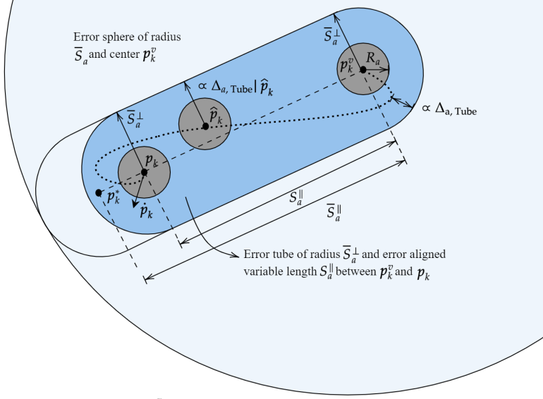
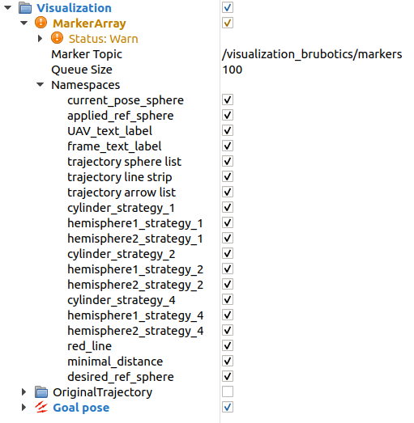

5. Introduction to visualization
================================

In this chapter, we will introduce you to the visualization on `RViz <http://wiki.ros.org/rviz>`__.
It is a great tool for ROS, used by many to debug codes or to have some nice visualization of your simulations.

5.1 The beginning
-----------------

First, especially if you have never runned any simulation using RViz, we recommand you to try some `CTU MRS simulation examples <https://github.com/ctu-mrs/simulation/tree/master/example_tmux_scripts>`__.
Let's try this `basic simulation <https://github.com/ctu-mrs/simulation/tree/master/example_tmux_scripts/one_drone_gps>`__
by running these commands:

.. code-block:: shell

   cd ~/mrs_workspace/src/simulation/example_tmux_scripts/one_drone_gps
   ./start.sh

The RViz window will open after Gazebo and it should look like this:

.. figure:: _static/one_drone_rviz.png
   :width: 800
   :alt: alternate text
   :align: center

   Figure 5.1: RViz window with CTU visualization

In this default visualization, you can see the UAV model with its frame.
You can also use the 2D Nav Goal button to choose a position and a heading to go for the UAV. Thus, you will see the UAV trajectory.
:blue:`[TODO: ask CTU what the small frames and blue arrows depict and write it here.]JV`
`Link to the discussion <https://github.com/ctu-mrs/mrs_uav_system/discussions/105>`__

   Figure 5.2: Visualization of CTU

   Figure 5.3: Navigation goal button

Next, you can run some simulations which use dedicated plugins for one specific task.
You will need to use these commands to see `all of them <https://github.com/ctu-mrs/mrs_uav_testing/tree/master/tmux>`__:

.. code-block:: shell

   cd ~/mrs_workspace/src/uav_core/ros_packages/mrs_uav_testing/tmux
   ls

Choose the one you want to test by running:

.. code-block:: shell

   cd "name_of_the_simulation"
   ./start.sh

The `test_bumper simulation <https://github.com/ctu-mrs/mrs_uav_testing/tree/master/tmux/test_bumper>`__
is an example of an advanced visualization task that you can do on RViz. It is made by a plugin created from scratch.
It represents a weighty work to create this type of visualization but it shows you the diversity of possibilities.

  Figure 5.4: Visualization of the test_bumper visualization

Below you can see the most complex visualization we made:

:blue:`[TODO: add screenshots of our final result.]JV`

.. .. figure:: _static/derg4.png
..   :width: 600
..   :alt: alternate text
..   :align: center

..   Figure 5.?: Visualization of D-ERG strategy 4

.. .. figure:: _static/derg5.png
..   :width: 600
..   :alt: alternate text
..   :align: center

..   Figure 5.?: Visualization of D-ERG strategy 5

5.2 How RViz works ?
--------------------

To run a simulation, you will use the ``start.sh`` file wich will ask to the ``session.yml`` file what ``.launch`` file is going to be ran. 
A ``.yml`` looks like this:

.. code-block:: yaml

   # mrs_workspace/src/simulation/example_tmux_scripts/one_drone_gps/session.yml
   name: simulation
   root: ./
   startup_window: status
   pre_window: export UAV_NAME=uav1; export RUN_TYPE=simulation; export UAV_TYPE=t650; export WORLD_NAME=simulation; export SENSORS="garmin_down"
   windows:
     - roscore:
       layout: tiled
       panes:
         - roscore
     - gazebo:
       layout: tiled
       panes:
         - waitForRos; roslaunch mrs_simulation simulation.launch world_name:=grass_plane gui:=true
         - waitForOdometry; gz camera -c gzclient_camera -f uav1; history -s gz camera -c gzclient_camera -f uav1
     - status:
       layout: tiled
       panes:
         - waitForSimulation; roslaunch mrs_uav_status status.launch
     - spawn:
       layout: tiled
       panes:
       - waitForSimulation; rosservice call /mrs_drone_spawner/spawn "1 $UAV_TYPE --enable-rangefinder"
     - control:
       layout: tiled
       panes:
         - waitForOdometry; roslaunch mrs_uav_general core.launch
     - takeoff:
       layout: tiled
       panes:
         - waitForSimulation; roslaunch mrs_uav_general automatic_start.launch
         - 'waitForControl;
           rosservice call /$UAV_NAME/mavros/cmd/arming 1;
           sleep 2;
           rosservice call /$UAV_NAME/mavros/set_mode 0 offboard'
     - goto:
       layout: tiled
       panes:
         - 'history -s rosservice call /$UAV_NAME/control_manager/goto \"goal: \[0.0, 10.0, 1.5, 0.0\]\"'
     - rviz:
       layout: tiled
       panes:
         - waitForControl; roslaunch mrs_uav_testing rviz.launch
         - waitForControl; roslaunch mrs_rviz_plugins load_robot.launch
     - easy_control:
       layout: tiled
       panes:
         - waitForControl; waitForControl; roslaunch mrs_uav_general logitech_joystick.launch
         - waitForControl; waitForControl; roslaunch mrs_rviz_plugins rviz_interface.launch
     - layout:
       layout: tiled
       panes:
         - waitForControl; sleep 3; ~/.i3/layout_manager.sh ./layout.json

In the RViz part, you can see that the first line ask for the ``rviz.launch`` file (see below) which is used to choose the ``.rviz`` 
file that you want to use. The ``.rviz`` file is used to save the configuration of RViz, i.e. what is displayed. 

.. code-block:: html

   <!-- mrs_workspace/src/uav_core/ros_packages/mrs_uav_testing/launch.rviz.launch -->
   <launch>

     <arg name="name" default="default_simulation" />

     <group>

       <node pkg="rviz" type="rviz" name="rviz" args="-d $(find mrs_uav_testing)/rviz/$(arg name).rviz" />

     </group>

   </launch>

In the `mrs_uav_testing <https://github.com/ctu-mrs/mrs_uav_testing>`__ package of CTU, there is a ``rviz`` folder
which contains all the ``.rviz`` files.
You can generate a ``.rviz`` file, which save your RViz configuration, by clicking in RViz on "File → Save config as".

To add a new display, click on  "Add" and choose "By display type" or "By topic" to display to the topic you want to visualize.
If you choose "By display type", you will have to write the topic name in the left window.

.. figure:: _static/add_button.png
   :width: 400
   :alt: alternate text
   :align: center

   Figure 5.?: Add button

   Figure 5.?: Topic window

To record videos of your RViz visualization, we use the free software Recordmydesktop.
If you want the RVIz camera not to move during the simulation, select a ``Target Frame`` which does not belong to the UAV in the right window.

   Figure 5.?: Views window

.. _5.3 Our work D-ERG visualization:

5.3 Our work: D-ERG visualization
---------------------------------

We want to visualize what it is computed by the `D-ERG tracker <https://github.com/mrs-brubotics/trackers_brubotics/blob/master/src/dergbryan_tracker/dergbryan_tracker.cpp>`__
of BruBotics, especially in the `two_drones_D-ERG simulation <https://github.com/mrs-brubotics/testing_brubotics/tree/master/tmux_scripts/bryan/two_drones_D-ERG>`__
that you can run with these commands:

.. code-block:: shell

    cd ~workspace/src/droneswarm_brubotics/ros_packages/testing_brubotics/tmux_scripts/two_drones_D-ERG/
    ./start.sh

We have several D-ERG (Distributed Explicit Reference Governor) strategies to illustrate. For more advanced explanations, watch `this video <https://www.youtube.com/watch?v=le6WSeyTXNU>`__.

.. _5.3.1 D-ERG strategy 0:

5.3.1 D-ERG strategy 0
^^^^^^^^^^^^^^^^^^^^^^

   Figure 5.?: D-ERG strategy 0

* :math:`p_{k}`: current pose of the UAV
* :math:`p̂_{k}`: desired reference pose
* :math:`p_{k}^{v}`: applied reference pose 
* :math:`R_{a}`: drone's radius

Communicate: :math:`p_{k}`

Sphere can **translate**.

.. _5.3.2 D-ERG strategy 1:

5.3.2 D-ERG strategy 1
^^^^^^^^^^^^^^^^^^^^^^

.. figure:: _static/DERG-1.png
   :width: 500
   :alt: alternate text
   :align: center

   Figure 5.?: D-ERG strategy 1

Communicate: :math:`p_{k}`, :math:`p_{k}^{v}`

Tube can **translate** and **rotate**.

.. _5.3.3 D-ERG strategy 2:

5.3.3 D-ERG strategy 2
^^^^^^^^^^^^^^^^^^^^^^

   Figure 5.?: D-ERG strategy 2

Communicate: :math:`p_{k}`, :math:`p_{k}^{v}`

Tube can **translate**, **rotate** and **change length**.

.. _5.3.4 D-ERG strategy 3:

5.3.4 D-ERG strategy 3
^^^^^^^^^^^^^^^^^^^^^^

   Figure 5.?: D-ERG strategy 3

Communicate: :math:`p_{k}`, :math:`p_{k}^{v}`, :math:`S_{a,min}^{⊥}`

Tube can **translate**, **rotate**, **change length and width**. The width (radius) is the minimal one for a tube with error directed longitudinal axis.

.. _5.3.5 D-ERG strategy 4:

5.3.5 D-ERG strategy 4
^^^^^^^^^^^^^^^^^^^^^^

.. figure:: _static/DERG-4.png
   :width: 500
   :alt: alternate text
   :align: center

   Figure 5.?: D-ERG strategy 4

Communicate: :math:`p_{k}^{0}`, :math:`p_{k}^{1}`, :math:`S_{a,min}^{⊥}`

Tube and cylinder can **translate**, **rotate**, **change length and width**. The width (radius) and the length are the minimal one for a tube with error directed
longitudinal axis.

.. _5.3.6 D-ERG strategy 5:

5.3.6 D-ERG strategy 5
^^^^^^^^^^^^^^^^^^^^^^

.. figure:: _static/DERG-5.png
   :width: 500
   :alt: alternate text
   :align: center

   Figure 5.?: D-ERG strategy 5

This final strategy permits to calculate the minimal distance between 2 predicted poses.

5.4 How did we build the `visualization package <https://github.com/mrs-brubotics/visualization_brubotics>`__ ?
---------------------------------------------------------------------------------------------------------------

We have developed a `visualization package <https://github.com/mrs-brubotics/visualization_brubotics>`__ which permits to visualize
in RViz the :ref:`D-ERG strategies algorithms <5.3 Our work D-ERG visualization>` in the `two_drones_D-ERG simulation <https://github.com/mrs-brubotics/testing_brubotics/tree/master/tmux_scripts/bryan/two_drones_D-ERG>`__.
This package is based on the `mrs_rviz_plugins <https://github.com/ctu-mrs/mrs_rviz_plugins>`__ structure.
We will explain you how to reproduce it. :blue:`[Maybe say that the visualization work for multiple drones simulations when the test will be done.]JV`

First, we created a new package named `visualization_brubotics <https://github.com/mrs-brubotics/visualization_brubotics>`__ in
``workspace/src_droneswarm_brubotics/ros_packages`` with:

.. code-block:: shell

   catkin_create_pkg visualization_brubotics

This command creates a `CMakeLists.txt <https://github.com/mrs-brubotics/visualization_brubotics/blob/main/CMakeLists.txt>`__ file
and a `package.xml <https://github.com/mrs-brubotics/visualization_brubotics/blob/main/package.xml>`__ file.

Then, we modified `session.yml <https://github.com/mrs-brubotics/testing_brubotics/blob/master/tmux_scripts/bryan/two_drones_D-ERG/session.yml>`__
file of the `two_drones_D-ERG <https://github.com/mrs-brubotics/testing_brubotics/tree/master/tmux_scripts/bryan/two_drones_D-ERG>`__.
At the end (line 247), you should see a RViz part. If it is commented, uncomment it. We modified these lines so it looks lite this:

.. code-block:: shell

   # workspace/src/droneswarm_brubotics/ros_packages/testing_brubotics/tmux_scripts/bryan/two_drones_D-ERG/session.yml
   - rviz:
       layout: tiled
       panes:
         - waitForControl; roslaunch testing_brubotics rviz_brubotics.launch name:=two_drones_derg
         - waitForControl; roslaunch testing_brubotics tf_connector_avoidance.launch 
         - waitForControl; export UAV_NAME=uav1; roslaunch mrs_rviz_plugins load_robot.launch
         - waitForControl; export UAV_NAME=uav2; roslaunch mrs_rviz_plugins load_robot.launch
         - waitForControl; roslaunch visualization_brubotics visual.launch

Now, we will explain you line per line why we did this.
The `rviz_brubotics.launch <https://github.com/mrs-brubotics/testing_brubotics/blob/master/launch/rviz/rviz_brubotics.launch>`__ and `tf_connector_avoidance.launch <https://github.com/mrs-brubotics/testing_brubotics/blob/master/launch/rviz/tf_connector_avoidance.launch>`__
files are based on CTU codes but we made some changes in them.
Indeed, we do not want to visualize the same things as CTU. Thus, we make our own ``.rviz`` files in the `testing_brubotics/rviz folder <https://github.com/mrs-brubotics/testing_brubotics/tree/master/rviz>`__.
So we needed to adapt the find path in the `rviz_brubotics.launch <https://github.com/mrs-brubotics/testing_brubotics/blob/master/launch/rviz/rviz_brubotics.launch>`__:

.. code-block:: html

   <!-- workspace/src/droneswarm_brubotics/ros_packages/testing_brubotics/launch/rviz/rviz_brubotics.launch -->
   <launch>

     <arg name="name" default="default_simulation" />

     <group>

       <node pkg="rviz" type="rviz" name="rviz" args="-d $(find testing_brubotics)/rviz/$(arg name).rviz" />

     </group>

   </launch>

The path find `tf_connector_avoidance.launch <https://github.com/mrs-brubotics/testing_brubotics/blob/master/launch/rviz/tf_connector_avoidance.launch>`__
file has also been changed because it calls the `tf_connector_avoidance.yaml <https://github.com/mrs-brubotics/testing_brubotics/blob/master/config/tf_connector_avoidance.yaml>`__
file which permits to visualize several drones at the same time.

.. code-block:: html

   <!-- workspace/src/droneswarm_brubotics/ros_packages/testing_brubotics/launch/rviz/tf_connector_avoidance.launch -->
   <launch>
       <!-- other args -->
     <arg name="standalone" default="true" />
     <arg name="debug" default="false" />

     <arg     if="$(eval arg('standalone') or arg('debug'))" name="nodelet" value="standalone" />
     <arg unless="$(eval arg('standalone') or arg('debug'))" name="nodelet" value="load" />
     <arg     if="$(eval arg('standalone') or arg('debug'))" name="nodelet_manager" value="" />
     <arg unless="$(eval arg('standalone') or arg('debug'))" name="nodelet_manager" value="tf_connector_nodelet_manager" />

     <arg     if="$(arg debug)" name="launch_prefix" value="debug_roslaunch" />
     <arg unless="$(arg debug)" name="launch_prefix" value="" />

     <node pkg="nodelet" type="nodelet" name="tf_connector_dummy" args="$(arg nodelet) mrs_uav_odometry/TFConnectorDummy $(arg nodelet_manager)" output="screen" launch-prefix="$(arg launch_prefix)">

       <rosparam file="$(find testing_brubotics)/config/tf_connector_avoidance.yaml" />

       <!-- Subscribers -->
       <remap from="~tf_in" to="/tf" />

       <!-- Publishers -->
       <remap from="~tf_out" to="/tf" />

     </node>

     </launch>

To create the robot model, we can use the `load_robot.launch <https://github.com/ctu-mrs/mrs_rviz_plugins/blob/master/launch/load_robot.launch>`__
file of CTU without changing it.
It permits to create one robot model so we use it two times because there are two drones in our simulation, uav1 and uav2.

Then, we launch our `launch/visual.launch file <https://github.com/mrs-brubotics/visualization_brubotics/blob/main/launch/visual.launch>`_
to start our `src/visual.cpp file <https://github.com/mrs-brubotics/visualization_brubotics/blob/main/src/visual.cpp>`__ for visualization
that we will explain in the next chapter.

.. code-block:: html

  <!-- workspace/src/droneswarm_brubotics/ros_packages/visualization_brubotics/launch/visual.launch -->
  <?xml version="1.0" ?>
  <launch>

      <node pkg="visualization_brubotics" type="visual" name="visual" output="screen"/>

  </launch>

5.5 The `code <https://github.com/mrs-brubotics/visualization_brubotics/blob/main/src/visual.cpp>`__ for visualization
----------------------------------------------------------------------------------------------------------------------

As you can see in the different :ref:`D-ERG strategies <5.3 Our work D-ERG visualization>`, we want to visualize spheres, tubes and lines.
These three shapes are `RViz standard display marker types <http://wiki.ros.org/rviz/DisplayTypes/Marker>`__, except the tube.
But we will see later that we can build this shape with one cylinder, which is also a RViz standard display marker type, and two hemispheres.

5.5.1 Beginner tutorials and knowledge
^^^^^^^^^^^^^^^^^^^^^^^^^^^^^^^^^^^^^^

To display basic shapes in RViz, we invite you to follow `this tutorial <http://wiki.ros.org/rviz/Tutorials/Markers%3A%20Basic%20Shapes>`__.
You will learn to display cubes, spheres, cylinders, and arrows in RViz.
Then, follow `this tutorial <http://wiki.ros.org/rviz/Tutorials/Markers%3A%20Points%20and%20Lines>`__ to learn how to display points and lines.
You can read `this documentation <http://wiki.ros.org/rviz/DisplayTypes/Marker#Mesh_Resource_.28MESH_RESOURCE.3D10.29_.5B1.1.2B-.5D>`__
to learn how to do a custom marker using a mesh resource.

You will need to write ROS publishers and subscribers so please follow `this tutorial <http://wiki.ros.org/ROS/Tutorials/WritingPublisherSubscriber%28c%2B%2B%29>`__.
`Here <http://docs.ros.org/en/api/std_msgs/html/index-msg.html>`__ is a list of all ROS standard message types.
We also use `callbacks and spinning <http://wiki.ros.org/roscpp/Overview/Callbacks%20and%20Spinning>`__.

Because we use quaternions to set the orientation of some markers, it could be useful for you to read `this <https://scriptinghelpers.org/blog/how-to-think-about-quaternions>`__
if you do not know anything about it.

Finally, we used `this tutorial <https://roboticsbackend.com/ros-param-yaml-format/>`__ to load the parameters from our `visual.yaml file <https://github.com/mrs-brubotics/visualization_brubotics/blob/main/config/visual.yaml>`__.

5.5.2 Architecture of our `C++ code <https://github.com/mrs-brubotics/visualization_brubotics/blob/main/src/visual.cpp>`__
^^^^^^^^^^^^^^^^^^^^^^^^^^^^^^^^^^^^^^^^^^^^^^^^^^^^^^^^^^^^^^^^^^^^^^^^^^^^^^^^^^^^^^^^^^^^^^^^^^^^^^^^^^^^^^^^^^^^^^^^^^

Like any well written C++ code, our code has to be organized. It is divided in several parts:

* the includes
* parameters
* publishers and subscribers
* messages
* function prototypes
* function definitions
* the main function

:blue:`[Change the structure if we make a .h file]JV`

5.5.3 Default visuals
^^^^^^^^^^^^^^^^^^^^^

Before all, we need to know how many UAVs are in the running simulation.
This information is located in the `SpawnerDiagnostics message <https://github.com/ctu-mrs/mrs_msgs/blob/master/msg/simulation/SpawnerDiagnostics.msg>`__
of the ``mrs_drone_spawner/diagnostics`` topic. The ``active_vehicles`` member of this message is a list of all the active UAVs.
We created a subscriber called ``diagnostics_subscriber_`` which subscribe to this topic and get this list back.
Thus, we defined a parameter called ``number_of_uav`` which is equal to the size of this list.

.. important::
  We have to wait until the related message is published because this data is the first we need to know before displaying anything, .
  That's why we use these lines of code juste after subscribing to the topic:

  .. code-block:: c

    while(!test1){
      ros::spinOnce();
      r.sleep();
      }

  ``test1`` is a boolean set to "false".
  Thus, the ``ros::spinOnce()`` will call all the callbacks waiting to be called at that point in time, including the ``DiagnosticsCallback`` function.
  The latter will be called only one time because ``test1`` is set to "true" at the end of the ``DiagnosticsCallback`` function.

To decide which strategy should be displayed, we created a publisher called ``derg_strategy_id_publisher_`` in the `tracker's code <https://github.com/mrs-brubotics/trackers_brubotics/blob/master/src/dergbryan_tracker/dergbryan_tracker.cpp>`__
which publish a `std_msgs::Int32 message <http://docs.ros.org/en/api/std_msgs/html/msg/Int32.html>`__.
The subscriber called ``DERG_strategy_id_subscriber_`` in the `visualization code <https://github.com/mrs-brubotics/visualization_brubotics/blob/main/src/visual.cpp>`__
subscribe to the ``uav1/control_manager/dergbryan_tracker/derg_strategy_id`` topic and permits to get the ``_DERG_strategy_id_`` value back.

By default, i.e. in each :ref:`D-ERG strategies <5.3 Our work D-ERG visualization>`, we display the current pose sphere,
the applied reference sphere and the trajectory (see all the :ref:`D-ERG strategies <5.3 Our work D-ERG visualization>`).
We also show a line which depict the distance between each UAV at their current pose because
we think it's useful to spot where the drones are, especially when the drones are close to each other.
Finally, we show the shortest distance line and the two related spheres from the :ref:`D-ERG strategy 5 <5.3.6 D-ERG strategy 5>` because we think this
information can be useful for someone who does not know anything about drones and robotics.

It could also be significant to enable/disable the visualization easily, including what we added in the `tracker's code <https://github.com/mrs-brubotics/trackers_brubotics/blob/master/src/dergbryan_tracker/dergbryan_tracker.cpp>`__.
In the `dergbryan_tracker.yaml file <https://github.com/mrs-brubotics/trackers_brubotics/blob/master/config/default/dergbryan_tracker.yaml>`__, we added a new
variable called ``enable_visualization`` set to ``true`` which enable/disable the code we added.

.. note::
  When you run the ``rostopic list`` command, you can still see the related topcis because the subscribers of the `visual.cpp file <https://github.com/mrs-brubotics/visualization_brubotics/blob/main/src/visual.cpp>`__
  are not disabled. For example:

  .. code-block:: shell

    $ rostopic info /uav1/control_manager/dergbryan_tracker/derg_strategy_id
    Type: std_msgs/Int32

    Publishers: None

    Subscribers:
    * /visual (http://nuc6-NUC10i7FNK:32835/)

5.5.3.1 Current pose sphere

To do so, we subscribe to the ``uavX/control_manager/dergbryan_tracker/custom_predicted_poses`` topic which contains a ``std::vector<geometry_msgs::Pose>`` message
(see `geometry_msgs::Pose message definition <http://docs.ros.org/en/noetic/api/geometry_msgs/html/msg/Pose.html>`__).
It is a vector of all the predicted uav predicted poses (position and orientation) so the first element is the current pose :math:`p_{k}`.
Consequently, we can display a sphere at the current UAV pose.
We use the `boost::function function pointer <https://www.boost.org/doc/libs/1_77_0/doc/html/boost/function.html>`__ to manage vectors of subscribers.
:blue:`[more details about the boost?]JV`

.. hint::
  For a sphere, the marker's orientation does not matter. Set the orientation parameters like this to avoid getting a warning in RViz:

.. code-block:: c

  marker.pose.orientation.x = 0;
  marker.pose.orientation.y = 0;
  marker.pose.orientation.z = 0;
  marker.pose.orientation.w = 1.0;

We created a function called ``InitMarker`` in order to avoid repeating the same lines of code a lot of times.
Indeed, we use this function to initialize some marker options:
    
.. code-block:: c
    
  void InitMarker(visualization_msgs::Marker& marker,
                  const std::string name, const int id,
                  const int type,
                  const float r, const float g, const float b, const float a,
                  const std::string &mesh = empty){
    
    marker.header.frame_id = "/common_origin";
    marker.header.stamp = ros::Time::now();
    marker.ns = name;
    marker.id = id;
    marker.type = type; 
    if(type==10){
      marker.mesh_resource = "package://visualization_brubotics/meshes/" + mesh + ".stl";
    }
    marker.action = visualization_msgs::Marker::ADD;
    marker.color.r = r;
    marker.color.g = g;
    marker.color.b = b;
    marker.color.a = a;
    marker.lifetime = ros::Duration();
  }
    
The marker type can either be a word or a number, for example: ARROW=0, SPHERE=2, CYLINDER=3, etc.
If we use a `mesh ressource marker <http://wiki.ros.org/rviz/DisplayTypes/Marker#Mesh_Resource_.28MESH_RESOURCE.3D10.29_.5B1.1.2B-.5D>`__, the name file
will be given as an argument.

5.5.3.2 Applied reference sphere

For the applied reference :math:`p_{k}^{v}`, the related topic is ``uavX/control_manager/dergbryan_tracker/uav_applied_ref`` and it contains a `mrs_msgs::FutureTrajectory message <https://ctu-mrs.github.io/mrs_msgs/msg/FutureTrajectory.html>`__.
The ``point`` field is an array of `FuturePoint messages <https://ctu-mrs.github.io/mrs_msgs/msg/FuturePoint.html>`__.

.. note::
  All the markers are part of a `MarkerArray <http://docs.ros.org/en/api/visualization_msgs/html/msg/MarkerArray.html>`__.
  That's why namespaces are attractive: we are still able to select the markers we want to display.

  .. figure:: _static/Namespaces.png
   :width: 800
   :alt: alternate text
   :align: center

   Figure 5.?: Namespaces example

  The `MarkerArray <http://docs.ros.org/en/api/visualization_msgs/html/msg/MarkerArray.html>`__ avoid to have synchronisation issues between all the markers. 

.. important::
  The `MarkerArray <http://docs.ros.org/en/api/visualization_msgs/html/msg/MarkerArray.html>`__ can not be a global variable because otherwise, it could be
  updated and published at the same time, which could result as flashing markers.
  
5.5.3.3 Goal pose frame

Because we want to know where the drone is going, we display a RGB frame at the goal position. A RGB frame is not a marker so we did not code it in the 
``PublishMarkers`` function but in the ``PublishFrame`` function.
The goal pose is contained in a `mrs_msgs::ReferenceStamped message <https://ctu-mrs.github.io/mrs_msgs/msg/ReferenceStamped.html>`__
related to the  ``uavX/control_manager/dergbryan_tracker/goal_pose`` topic.

The display type for the RGB frame is a `geometry_msgs::PoseArray <http://docs.ros.org/en/noetic/api/geometry_msgs/html/msg/PoseArray.html>`__.
First, we define the header. Then we have to orient the frame. To do so, we made a new function called ``FrameOrientation`` which is inspired by
the ``CylinderOrienation function`` from :ref:`D-ERG strategy 1 <5.5.5 D-ERG strategy 1>`.
The frame's position is set thanks to the reference.position member of the `mrs_msgs::ReferenceStamped message <https://ctu-mrs.github.io/mrs_msgs/msg/ReferenceStamped.html>`__.
The frame's orientation is set thanks to the reference.heading member of the `mrs_msgs::ReferenceStamped message <https://ctu-mrs.github.io/mrs_msgs/msg/ReferenceStamped.html>`__.
Indeed, it is the projection of the heading vector in the plane span (x,y). That's why we set the x and y member of the ``frame_z_direction`` at zero.

5.5.3.4 Predicted trajectory

To display the predicted trajectory, we need the data contained in the ``uavX/control_manager/dergbryan_tracker/predicted_trajectory`` topic which is a `mrs_msgs::FutureTrajectory message <https://ctu-mrs.github.io/mrs_msgs/msg/FutureTrajectory.html>`__.
Thus, we created a 3-dimensions array named ``predicted_trajectories``: one dimension for the predicted point, one for the coordinates x,y or z and
one for each UAV.
The ``Trajectory`` function is used to display the trajectory of each UAV.
We want to display only 50 trajectory points but this array contains 300 ones. We always want to see the first trajectory point and the last one.
So we use a ``step`` variable to show 48 others trajectory points at regular intervals from the first point.
We also want to show arrows between every other point. That's why we double the ``step``. We did not choose the arrows from the
`PoseArray display type <http://wiki.ros.org/rviz/DisplayTypes/PoseArray>`__ because we can't change their size in real time. It could be problematic
because the last points of the ``predicted_trajectories`` array are very closely grouped so the arrows would be overlapped.

Because we want to provide several options for the visual aspect of the trajectory, our code compute three different markers.
Thanks to the RViz namespaces, the user can select what he wants to see: a sphere list, a line strip or an arrow list.

  Figure 5.?: Visualization of the trajectory as a sphere list

  Figure 5.?: Visualization of the trajectory as a line strip

  Figure 5.?: Visualization of the trajectory as an arrow list

.. note::
  It is also possible to mix those options:

  .. figure:: _static/spherelistlinestriptrajectory.png
    :width: 400
    :alt: alternate text
    :align: center

    Figure 5.?: Visualization of the trajectory as a sphere list and a line strip

  .. figure:: _static/arrowlistlinestriptrajectory.png
    :width: 400
    :alt: alternate text
    :align: center

    Figure 5.?: Visualization of the trajectory as an arrow list and a line strip

5.5.3.5 Distance line between UAVs

To print the line between each current UAV position, we use a function called ``RedLines``.
It has to "for loop" in order to compute the :math:`\frac{\text{n(n-1)}}{\text{2}}` lines, with n the UAV number.
For each points doublet, we calculate the norm between them because the line we want to show is between the frontiers of the two current pose spheres.
Thus, we use another function called ``GiveTranslatedPoint``.
From point p1, it calculates the new point transposed by the drone's radius :math:`R_{a}` in the direction formed by the director vector (p2, p1).
So we use it for the two calculated points p1 and p2 and we give p_new1 and p_new1 to line marker.

  Figure 5.?: Red distance line between UAVs current pose sphere

5.5.3.6 Shortest distance line between UAVs' trajectory

The ``ShortestDistanceLines`` function is very similar to the ``RedLines`` function.
The only difference with the previous display is the points used to plot the line.
Indeed, they are determined thanks to the ``CalculNormMin`` function which calculate the index of the trajectory points list where the distance between
both trajectories is minimal. We also use this minimal norm to translate the points.
In addition, we display the two related spheres. They correspond to the points where the distance between both trajectories is minimal.

  Figure 5.?: Shortest distance line between UAVs' trajectory

5.5.3.7 Text labels

Knowing which drone goes where is fundamental. Thus, we added view-oriented text markers at the current UAV pose ``uavID`` and at the goal pose ``goalID``.
We get the ``uavID`` from the ``mrs_drone_spawner/diagnostics`` topic.
For the ``goalID``, we need to get only the ID from the ``mrs_drone_spawner/diagnostics`` so we use the `replace function <http://cplusplus.com/reference/string/string/replace/>`__
from the C++ strings library.

5.5.4 :ref:`D-ERG strategy 0 <5.3.1 D-ERG strategy 0>`
^^^^^^^^^^^^^^^^^^^^^^^^^^^^^^^^^^^^^^^^^^^^^^^^^^^^^^

In this strategy, we want to visualize the error sphere of radius :math:`\bar{S}_{a}`. We do by the same way as we display the applied reference sphere.
But we get the radius value back from the `tracker's code <https://github.com/mrs-brubotics/trackers_brubotics/blob/master/src/dergbryan_tracker/dergbryan_tracker.cpp>`__
thanks to the ``sa_max_publisher_``, similarly as we do for the D-ERG strategy value.

:blue:`[TODO: add a screenshot of the final D-ERG strategy 0 visualization.]JV`

.. .. figure:: _static/derg0.png
..   :width: 500
..   :alt: alternate text
..   :align: center

..   Figure 5.?: Visualization of D-ERG strategy 0

.. _5.5.5 D-ERG strategy 1:

5.5.5 :ref:`D-ERG strategy 1 <5.3.2 D-ERG strategy 1>`
^^^^^^^^^^^^^^^^^^^^^^^^^^^^^^^^^^^^^^^^^^^^^^^^^^^^^^

Now we want to visualiaze a blue tube. It will be composed of a cylinder and 2 hemispheres.
The cylinder has to be between :math:`p_{k}^{*}` and the applied reference :math:`p_{k}^{v}` and with a radius :math:`\bar{S}_{a}^{⊥}`.
We get :math:`p_{k}^{*}` back by the same way as we did with :math:`p_{k}`.
We made a new publisher called ``point_link_star_publisher_`` in the `tracker's code <https://github.com/mrs-brubotics/trackers_brubotics/blob/master/src/dergbryan_tracker/dergbryan_tracker.cpp>`__
in order to get the position of :math:`p_{k}^{*}`.
  
The pose will be given as a `geometry_msgs::Pose message <http://docs.ros.org/en/noetic/api/geometry_msgs/html/msg/Pose.html>`__:

* The position of the cylinder is its center, so the middle of :math:`p_{k}^{*}` and :math:`p_{k}^{v}`, the two points given in argument.
*  The ``CylinderOrientation()`` function takes 2 points as parameters and calculate the orientation of a cylinder made between these two points, together with its length. :blue:`[Maybe add more explanations about how the orientation is calculated]JV`

.. note::
  Contrary to the sphere, the cylinder needs an orientation. 

We get the radius value :math:`\bar{S}_{a}^{⊥}` by the same way we did with :math:`\bar{S}_{a}`, but with the ``sa_perp_max_publisher_`` of the `tracker's code <https://github.com/mrs-brubotics/trackers_brubotics/blob/master/src/dergbryan_tracker/dergbryan_tracker.cpp>`__
because it was not published before.

.. note::
  The cylinder could change length as the way we made the code. But this fonctionnality is implemented directly in the `tracker's code <https://github.com/mrs-brubotics/trackers_brubotics/blob/master/src/dergbryan_tracker/dergbryan_tracker.cpp>`__.

We used the `mesh ressource marker <http://wiki.ros.org/rviz/DisplayTypes/Marker#Mesh_Resource_.28MESH_RESOURCE.3D10.29_.5B1.1.2B-.5D>`__
to display the hemispheres marker. For example, you can use a .stl file.
You can search in the internet to directly get this type of file, or you can make it yourself with specific software like 3D-builder or SolidWorks on Windows.
Be careful to use the metric system on the software. You may encounter some issues of scale between your software and Rviz.
For us, there was a scale difference of 1000 between these two.
You can see in our code that every scale parameter for the hemispheres markers are divided by 1000.
In addition, RViz works with the diameter for spheres and cylinders scale.
You can see that our spheres markers are multiplied by 2 because the tracker computes the radius.
Our .stl file of hemispheres is made to work with radius, so we did not need to multiply by 2 the scale of our hemispheres.

The first hemisphere as the same orientation as the cylinder while the second one has an opposite orientation.
Indeed, the second one need to be rotated by 180° on the radius axis. 
That's why we just have to switch the points used to calculate the pose to obtain this rotation.

.. tip::
  At the beginning, we were using a full cylinder and two empty hemispheres, i.e. without a volume, just a surface.
  But the visual result was not meeting our expectations as we see a disk making the connection between the cylinder and the hemisphere:

  .. figure:: _static/derg1.png
    :width: 500
    :alt: alternate text
    :align: center

    Figure 5.?: Visualization of a full cylinder + two empty hemispheres

  That's why we also used the `mesh ressource marker <http://wiki.ros.org/rviz/DisplayTypes/Marker#Mesh_Resource_.28MESH_RESOURCE.3D10.29_.5B1.1.2B-.5D>`__
  for the cylinder to also make it empty. Now, we only see a circle as connection between the cylinder and the hemisphere:
  
  .. figure:: _static/stl2.png
    :width: 500
    :alt: alternate text
    :align: center

    Figure 5.?: Visualization of an empty cylinder + two empty hemispheres

We could create a mesh which display directly a full tube but the benefits would be insignificant and it would be way more
difficult to change its size without warping it.

:blue:`[TODO: add a screenshot of the final D-ERG strategy 1 visualization.]JV`

.. .. figure:: _static/derg1.png
..   :width: 600
..   :alt: alternate text
..   :align: center

..   Figure 5.?: Visualization of D-ERG strategy 1

5.5.6 :ref:`D-ERG strategy 2 <5.3.3 D-ERG strategy 2>`
^^^^^^^^^^^^^^^^^^^^^^^^^^^^^^^^^^^^^^^^^^^^^^^^^^^^^^

The main difference between D-ERG strategy 1 and 2 is that the blue tube become transparent and we add another blue tube between :math:`p_{k}` and :math:`p_{k}^{v}`.

:blue:`[TODO: add a screenshot of the final D-ERG strategy 2 visualization.]JV`

.. .. figure:: _static/derg2.png
..   :width: 600
..   :alt: alternate text
..   :align: center

..   Figure 5.?: Visualization of D-ERG strategy 2

5.5.7 :ref:`D-ERG strategy 3 <5.3.4 D-ERG strategy 3>`
^^^^^^^^^^^^^^^^^^^^^^^^^^^^^^^^^^^^^^^^^^^^^^^^^^^^^^

Starting from the strategy 2, we want to add an orange tube between :math:`p_{k}` and :math:`p_{k}^{v}` with a radius :math:`S_{a,min}^{⊥}`.
This radius is obtained similarly as :math:`\bar{S}_{a}^{⊥}`.

:blue:`[TODO: add a screenshot of the final D-ERG strategy 3 visualization.]JV`

.. .. figure:: _static/derg3.png
..   :width: 600
..   :alt: alternate text
..   :align: center

..   Figure 5.?: Visualization of D-ERG strategy 3

5.5.8 :ref:`D-ERG strategy 4 <5.3.5 D-ERG strategy 4>`
^^^^^^^^^^^^^^^^^^^^^^^^^^^^^^^^^^^^^^^^^^^^^^^^^^^^^^

Now, the orange tube has to be between :math:`p_{k}^{1}` and :math:`p_{k}^{0}`. These information are related to the
``uavX/control_manager/dergbryan_tracker/future_trajectory_tube`` topic which contains a `FutureTrajectoryTube message <https://github.com/mrs-brubotics/trackers_brubotics/blob/master/msg/FutureTrajectoryTube.msg>`__.
We also get the radius :math:`S_{a,min}^{⊥}` value back from this message.
Contrary to the previous strategy, the orange tube has now red hemispheres.

:blue:`[TODO: add a screenshot of the final D-ERG strategy 4 visualization.]JV`

.. .. figure:: _static/derg4.png
..   :width: 600
..   :alt: alternate text
..   :align: center

..   Figure 5.?: Visualization of D-ERG strategy 4

5.5.9 :ref:`D-ERG strategy 5 <5.3.6 D-ERG strategy 5>`
^^^^^^^^^^^^^^^^^^^^^^^^^^^^^^^^^^^^^^^^^^^^^^^^^^^^^^

For the last strategy, we start from the :ref:`D-ERG strategy 3 <5.3.4 D-ERG strategy 3>` by taking the orange tube.
We want to display the shortest distance between two desired reference sphere :math:`\hat{p}_{k}` and :math:`\hat{p}_{i}`, and these two spheres.
First, we calculate the shortest norm between all the predicted trajectory points and we get the index of the two related points back.
Then, we have to transpose by the radius :math:`R_{a}` these two points in the distance vector direction because
the line we want to plot is not between the two spheres center but between the two spheres.

:blue:`[TODO: add a screenshot of the final D-ERG strategy 5 visualization.]JV`

.. .. figure:: _static/derg5.png
..   :width: 600
..   :alt: alternate text
..   :align: center

..   Figure 5.?: Visualization of D-ERG strategy 5

5.5.10 Visual settings
^^^^^^^^^^^^^^^^^^^^^^

5.5.10.1 Settings in RViz

Below you can find the list of all the visualization parameters we provide in RViz:

  Figure 5.?: RViz parameters

5.5.10.2 Settings via .yaml file

Ideally, a user should not have to change parameters in our `visual.cpp file <https://github.com/mrs-brubotics/visualization_brubotics/blob/main/src/visual.cpp>`__.
That's why we created a `visual.yaml file <https://github.com/mrs-brubotics/visualization_brubotics/blob/main/config/visual.yaml>`__.
In this file, we define all the parameters of the visualization:

* Number of points used to display the trajectory 
* Color and transparency of each marker: r, g, b, alpha

:blue:`[Update the parameters list]JV`

.. note::
  You need to initialize a node with ``ros::NodeHandle`` in each function where you use ``getParam``.

5.5.10.3 Settings in the `code <https://github.com/mrs-brubotics/visualization_brubotics/blob/main/src/visual.cpp>`__

The only parameter in our `visual.cpp file <https://github.com/mrs-brubotics/visualization_brubotics/blob/main/src/visual.cpp>`__ is the global variable
``MAX_UAV_NUMBER``. It is used to initialize some arrays' size.

:blue:`[Update the settings list in our code]JV`
