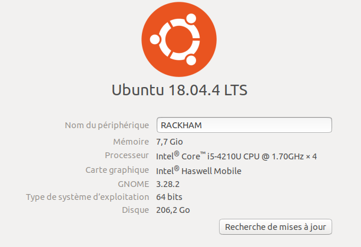
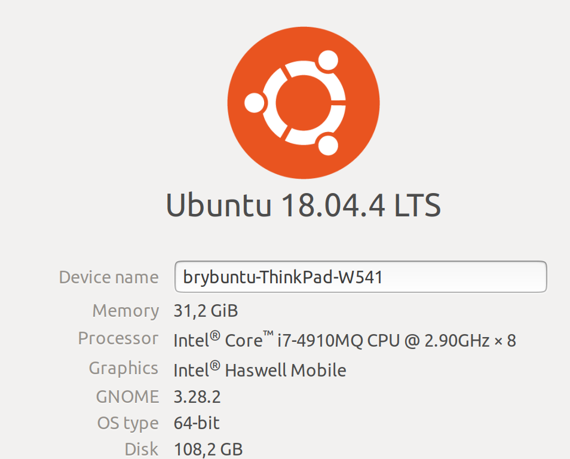
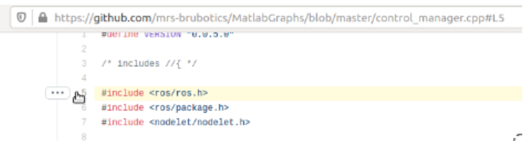
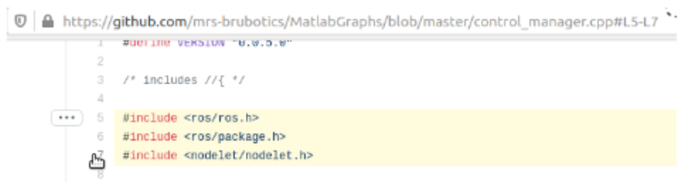

2. Prerequisites
================

.. role:: raw-html(raw)
    :format: html

:raw-html:`[explain in a logic chronology which background knowledge is required to understand the core for this report. Assume an absolute beginner
in robot software development. So think about what you knew before the internship and write here what is required in logic order. Give links to tutorials you followed
(and you think are good to learn the required skills/concepts)]BC`

Example template:
first you need to know this. Good tutorial are this (add link) and this (add link). Very important concepts are blablabla.
Then this.
Then this.
..

:raw-html:`[Explain here the basic knowledge you need to do this project. Use the references and write down the extra information you need to know or
extra things you have to do besides the explanation in a book or website you are referring to.]KM`

:raw-html:`[Each missing tutorial you think is a must to follow can be put here.]BC` :raw-html:`[don't forget to cite
papers important to be read before you can start with the rest of this report]BC`

:raw-html:`[Maybe also important to explain which hardware and software is required or recommended. E.g. give the best and worse specs of your PC
for simulation. Ubuntu 18.04 with at least 50GB disk space. Better to use a good desktop machine for simulation. need/ tested with ROS melodic and matlab simulink 2020a.
etc etc]BC`

:raw-html:`[I moved some sections here since this is required prior knowledge before starting to understand the MRS documentation.]BC`

In this chapter, we will talk about the minimum knowledge we need to understand this report. You will find in this chapter documentation links and tutorials
needed to better start with the rest of the report. Some concepts and skills from other tutorials are not indicated in the basic documentation from 
`MRS website <https://ctu-mrs.github.io>`__ and ROS documentation. That is why we will add more information about the basic information and minimum requirements
on hardware and software sides.

2.1 Hardware minimum requirements
---------------------------------

You need to have a hardware minimum requirements to be able to install and use the MRS workspace software without any issue. In this section, we will see what
kind of minimum setup requirement is needed, and which configuration is recommended.

2.1.1 PC Specs
^^^^^^^^^^^^^^

Before dealing with the Ubuntu partition, we have to talk about your minimum PC configuration. Here you can see the general PC specs used by the four interns
during the project:

   Figure 2.1: Intern PC specs

However, this configuration above could not be enough when we have to launch simulations that need a lot of resources from our PC. We may have issues with the
spawn and takeoff of the UAV later. That is why we rather recommend this kind of PC specs:

   Figure 2.2: Bryan Convens PC specs

This type of configuration is better for simulation launch. We rather recommend a PC with a processor in this category. Indeed, the CPU performance will have a
significant impact on the build of the packages in your workspace, and the proper launch of your simulation when you will need to launch more than three UAV.

.. note::
   Keep in mind that some issues with your simulation will not be related to your PC configuration. We had issues with the launch of many UAV, due to the lack
   of code optimization.

2.1.2 Ubuntu partition
^^^^^^^^^^^^^^^^^^^^^^

Then, we can talk about the Ubuntu partition. You will need a minimum **50GB** partition on your PC to install this partition.

.. note::
   The Ubuntu 18.04 version will not be updated in the future. That is why the ctu-mrs team is adapting their work for the 20.04 version (more detail
   `here <https://github.com/ctu-mrs/mrs_uav_system/issues/9>`__). However, it is still possible today to work with the 18.04 version without any issue.

That is why we recommend to install the Ubuntu 18.04 version until the change on 20.04 have been made.

2.1.3 Prepare Ubuntu
^^^^^^^^^^^^^^^^^^^^

:raw-html:`[Matlab]BC` :raw-html:`[Micorosdt visual studio code editor set as default]BC`

To install Ubuntu, you will first need to get a bootable USB stick [Recommended] or a dvd. 

To create the bootable usb disk you can follow `these steps <https://ubuntu.com/tutorials/create-a-usb-stick-on-windows#3-usb-selection>`__
if you are running on Windows and `these <https://ubuntu.com/tutorials/create-a-usb-stick-on-ubuntu#5-confirm-usb-device>`__ if you are running on Ubuntu.

2.1.4 Install Ubuntu
^^^^^^^^^^^^^^^^^^^^

To install this OS, please refer to the the `Ubuntu install documentation <https://ubuntu.com/tutorials/install-ubuntu-desktop#1-overview>`__.

2.2 Working with ROS
--------------------

MRS bases its work on the use of ROS, a framework widely used in robotics. We strongly recommend that you inquire about. You can find useful tutorial on `ROS wiki <http://wiki.ros.org/>`__.
We also recommend `Mastering ROS for ROBOTICS Programming <https://drive.google.com/file/d/1URHQAuDK1JT6X-8AUVfGe2xsPoZxqJsY/view>`__, by Lentin Joseph ans Jonathan Cacace, chapter 1, 2, 3, 4 and 7 - `here <https://github.com/jocacace>`__ you will find the github
from Jonathan Cacace.

2.3 Working with Visual Studio Code
-----------------------------------

We highly recommend you to use `Visual Studio Code <https://code.visualstudio.com/>`__ for Ubuntu. It is easier to view and edit code with syntax highlighting
tools. You just need to install extension depending on what kind of file you are working e.g. ``.cpp``, ``.py`` etc. Set visual studio code as the default
program to open files (right-click on the file and select "open with other application").

.. _2.4 Working with Git:

2.4 Working with Git
--------------------

2.4.1 Git basics
^^^^^^^^^^^^^^^^

If you are new at git, first take a look at `basic commands <https://guides.github.com/introduction/git-handbook/#basic-git>`__. We can base our usage of git on
the team on this `tutorial <https://learngitbranching.js.org>`_ or the `git tutorial advised by Bryan <https://www.coursera.org/learn/version-control-with-git>`__.
Here are some useful commands:

.. code-block:: shell

   git branch <branchname> 

Creates a new working branch independent of the master. Before committing, make sure you are on your branch and not in the master
with ``git checkout <branchname>``. You can also use ``git -b checkout <branchname>`` in order to create new branch and directly work on it.

.. code-block:: shell

   git merge <branchname>

Merges two branches, preserving the barnch structure. Be careful when merging branches: even though Git has mechanisms to make merging
seamless and simple, it can result in loss of important parts of the code. Some text editors, like `Atom <https://atom.io/>`__ and `VSCode <https://code.visualstudio.com/>`__
provide useful tools to work with git and help prevent loss of information on merges.

.. code-block:: shell

   git rebase <branchname>

Combines two branches and **deletes** one of them, usually the one that is not the master. All the commit history is transferred to the other branch, and in the
timeline of the repository, the other branch is not preserved.

.. code-block:: shell

   git cherry-pick <commitID1> <commitID2> ...

Applies the selected commit from one branch to another.

.. code-block:: shell

   git rebase -i HEAD~<numberofselectedcommit>
   
Similar to cherry-pick, it allows the reorganization of commits from the current branch.

.. code-block:: shell

   git stash

**Reverts the folder to the latest commit and throws all changes away**

2.4.2 Setup your SSH key in Git
^^^^^^^^^^^^^^^^^^^^^^^^^^^^^^^

We recommend you to setup your SSH key in Github, it's an easy thing that can avoid you some problems that are hard to understand.
Also, you will need to setup your email and your name by using these commands:

.. code-block:: shell

   git config --global user.name "FIRST_NAME LAST_NAME"
   git config --global user.email "MY_NAME@example.com"

To verify your configuration file, you can run the same commands but like this:

.. code-block:: shell

   git config --global user.name
   git config --global user.email

Now, you can follow `these steps <https://docs.github.com/en/github/authenticating-to-github/connecting-to-github-with-ssh/generating-a-new-ssh-key-and-adding-it-to-the-ssh-agent#generating-a-new-ssh-key>`__
to setup your SSH key in Github.

2.4.3 How to use github permalinks
^^^^^^^^^^^^^^^^^^^^^^^^^^^^^^^^^^

A Github permalink is an interesting way to refer to some lines of a code, here is how to create one. For example in the file `control_manager.cpp <https://github.com/mrs-brubotics/
MatlabGraphs/blob/master/control_manager.cpp>`__, if you want to highlight the line 5, you need to click on the 5 line number:

   Figure 2.3: Generation of a link to highlight the line 5

You can see in the link at the top that the 5 line is highlighted in the permalink. If you want to highlight from the line 5 to the line 7, you need to hold the
"MAJ" key and to click on the line 7:

   Figure 2.4: Generation of a link to highlight the lines from 5 to 7

You can see in the link at the top that the lines from 5 to 7 are highlighted in the permalink. With this link, if the file is updated, you may refer to lines
which are not the desired ones. In order to freeze the file as it is when you create the permalink, you need to press the "y" key after the lines are highlighted:

.. figure:: _static/canvas3.png
   :width: 800
   :alt: alternate text
   :align: center

   Figure 2.5: Modification to the link to always highlight the intended lines

You can see that the link at the top changed to always refer to this version of the file.

:raw-html:`[The idea of this report is to provide a detailed tutorial on how the use and understand the MRS software and how this is extended for
research on control and navigation of aerial robots.]BC` :raw-html:`[From this report you create something similar as the ROS book, but for a
very specific project.]BC` :raw-html:`[this report is explained for newcomers in robot software development.]BC`
:raw-html:`[explain the outline of the report. what will be discussed in each chapter.]BC`

.. _2.5_Working_with_Tmux_session:

2.5 Working with Tmux session
-----------------------------

Tmux is a powerful tool with ROS and Linux. It allows you to setup a complete and custom session for your simulation for instance, or been able to custom your
terminal as you want. Your will be able to use this tool if you have install the MRS Linux environment setup as recommented in section :ref:`2.6.1 <2.6.1_MRS_workspace_installation>`.
Multiple commands could be used to navigate in the tmux session. We can find a complete data-sheet of the tmux commands in the `MRS lab ROS platform Cheat Sheet <https://drive.google.com/drive/folders/1mCFhz56bAgA8XrwsXxz6VisY9S4GDYLP>`__
and in the `Ubuntu Tmux documentation <http://manpages.ubuntu.com/manpages/trusty/man1/tmux.1.html>`__. The following tmux commands are the most important ones
to navigate in the tmux session without any issue:

* ``<Ctrl-a and k>``: Killing tmux session (and also the simulation)
* ``<Ctrl-a and n>``: Navigation between tmux windows
* ``<Ctrl-a and number>``: Navigate to the wanted terminal
* ``<Ctrl-a and arrows>``: Navigation between windows in the same terminal
* ``<Ctrl-a and w>``: Listing tmux windows
* ``<Ctrl-a and[>``: Scrolling in the current window
* ``<Ctrl-t>``: New tmux window in the current session

.. note::
   You don't need to press Ctrl-a-k at the same time, you need to press Ctrl-a and then after k or n, etc.

.. note:: 
   The official tmux documentation use ``<Ctrl+b and ['key']>`` format. In our case, ``<Ctrl-a and ['key']>`` is the good way to issue the command. It's also possble
   that you get different shortcut, you can easily remap command into ``~/.tmux.conf``.

:raw-html:`[TODO: check summer school shortcuts and add here, check MRS cheatsheet]BC`

2.6 How to use CTU-MRS system
-----------------------------

.. _2.6.1_MRS_workspace_installation:

2.6.1 MRS workspace installation
^^^^^^^^^^^^^^^^^^^^^^^^^^^^^^^^

Once you have your Ubuntu partition, next step will be to install the MRS workspace from the `CTU-MRS github <https://github.com/ctu-mrs/mrs_uav_system>`__.
Just follow the instructions on this website in the "`I have a fresh Ubuntu 18.04 and want it quick and easy <https://github.com/ctu-mrs/mrs_uav_system#i-have-a-fresh-ubuntu-1804-and-want-it-quick-and-easy>`__"
part. We highly recommend to install the MRS Linux environment setup for been able to configure your Linux partition for the MRS workspace. For more detail about
the workspace configuration, refer to :ref:`Introduction to MRS <3. Introduction to MRS Software Extensions>`.

.. warning::
   You may encounter an issue to build the MRS packages. If the build fails, you can try in the ``mrs_workspace`` file the following command:

   .. code-block:: shell
      
      catkin build -j2

   It can not work at the the first time, but you can re-try it.

2.6.2 CTU-MRS system use
^^^^^^^^^^^^^^^^^^^^^^^^

We suggest you to read the `CTU-MRS documentation <https://ctu-mrs.github.io/>`__ to learn how to use the CTU-MRS system.

In this documentation, you will do the simulation of one drone with gps. Remember that you can use the :ref:`Tmux commands <2.5_Working_with_Tmux_session>`
to navigate through different terminals.

Also, you can try to launch others simulations created by CTU-MRS group. Go to the ``~/mrs_workspace/src/simulation/example_tmux_scripts/`` folder and
run the ``ls`` command to see the name of the different simulations. Then you can run:

.. code-block:: shell

   cd "DESIRED SIMULATION"
   ./start.sh

It will launch a Tmux session and Gazebo. It depends on your PC specs but you may not be able to run all the simulation, especially multi-drones ones.