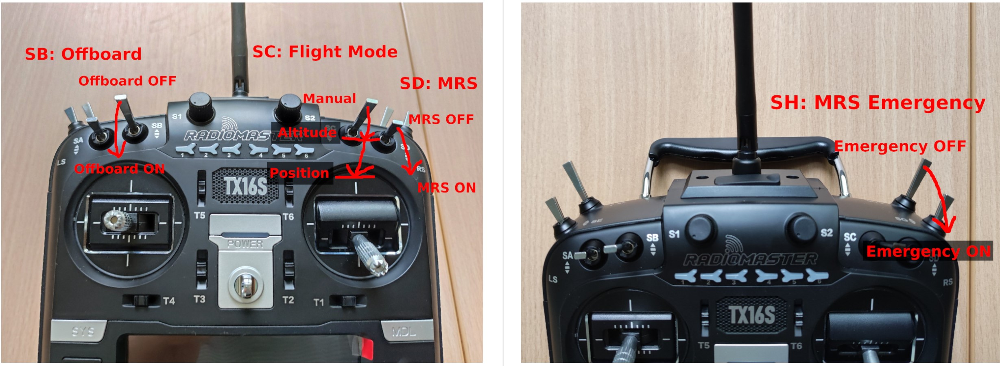
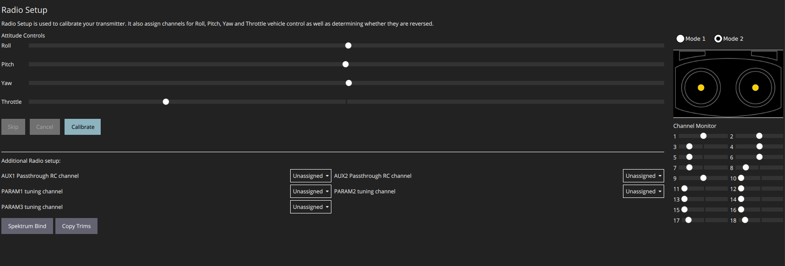
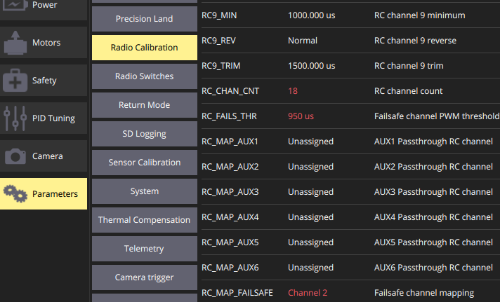
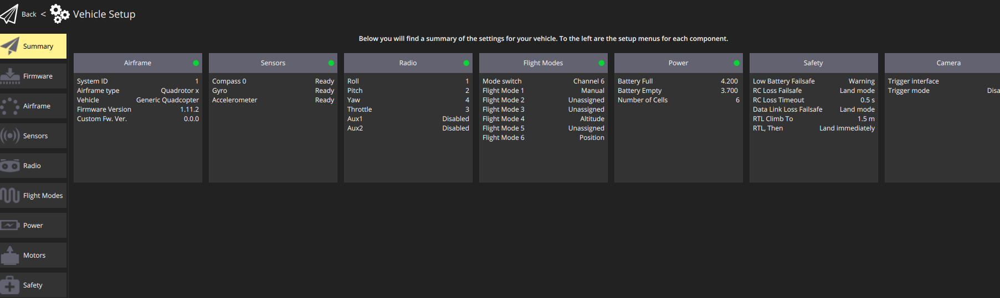

14 Setting up QGroundControl
===============================================

In this section, you'll learn how to set up the software in order to :

* Calibrate the Pixhawk, ESCs and transmitter

* Define the role of each channel of the transmitter

* Configure the safety modes 

14.1 Installation
------------

before doing all of this, you should first setup the SD card of the pixhawk otherwise the communication between the pixhawk and NUC will not be done 
(no blue light on FTDI, see section "Implementation of NUC" ). For the setup see section "SD card setup" of `this tuto <https://ctu-mrs.github.io/docs/hardware/px4_configuration.html>`__.
As a note: the etc folder does not get removed when flashing new firmware.

* Instal QGroundControl, on Windows or Ubuntu. On Ubuntu make sure you follow `these steps <https://docs.qgroundcontrol.com/master/en/getting_started/download_and_install.html>`__ for linux and copy the lines in the terminal from the Download folder.
  You can place the QGroundControl installer icon in a folder were you store later also logs files etc. Always open it from there by double clicking. 
  Do that on the ground station PC, no need to do these steps on the NUCs.

* Connect the PixHawk 4 to your computer with a USB cable and run QGroundControl.

* Update the PixHawk firmware using `the tweaked firmware <https://ctu-mrs.github.io/docs/hardware/px4_firmware.html>`__ of the CTU Prague.
  If you get a build error, try to refer to the "General Build Errors" of `this link <https://docs.px4.io/master/en/dev_setup/building_px4.html>`__ and follow the steps of `this video <https://docs.px4.io/master/en/dev_setup/dev_env_linux_ubuntu.html>`__.
  You can directly do it for the px4 firmware of CTU.
  It is important that, as explained in the video, you install the ubuntu.sh such that you have everything. Also, when you have already build (make)
  beforehand, delete the build folder as it might give problemes if the previous one was not build well. Always to this when rebuilding.

14.2 Calibrations
------------

* in QGroundControl, select vehicle setup, custom firmware file and select in the build folder the .px4 file. 
  Wait till upgrade is complete and then you will go to summary tab automatically. Once the gps is connected, you will hear a beep and it will reboot.

* Set the airframe type to quadcopter X, "Generic Quadrotor".

* Make sure that the Pixhawk is installed in the drone frame, doesn't move and is levelled as much as possible.

* In "sensors", calibrate the compass, gyroscope, accelerometer and level horizon. To do so, follow the steps asked by QGroundControl.
  Make sure to keep the front of the drone as shown by QGroundControl.

* Setup the channels on the transmitter (press both back button and scroller and select ’Channels’) such
  that each channel is paired with the correct function, according to the next figures.

.. figure:: _static/channels_functions.jpg
   :width: 800
   :alt: alternate text
   :align: center

* In the "Radio" section, calibrate your transmitter with the Calibrate button in QGroundControl in Mode 2 (not mode 1).
  You need to use mode 2 for this transmitter since the throttle and yaw are on the left stick.
  If the transmitter is correctly bind with the receiver and the receiver correctly connected with the Pixhawk, you should see the channel monitor on the left, with the channels moving while playing with the joysticks and switches, see next figure.
  Make sure that each joystick toggle the right motion (left joystick : up-down = thrust and left-right = yaw; right joystick : up-down = pitch and left-right = roll).

* Setup the flight modes as in next figure. Play with the joysticks and switches and see if it moves the right channels on QGroundControl.
  Same remark as before for the appearance of the channel monitor.

.. figure:: _static/flight_mode_QGC.png
   :width: 800
   :alt: alternate text
   :align: center

* In the "Power" section set the number of cells of your battery (e.g. 6 for the T650 drone). 
  Set the empty voltage to 3.7V (= nominal 22.2V for 6s) and 4.20V as full voltage (= 25.2V for fully charged 6S battery).

.. figure:: _static/power_QGC.png
   :width: 800
   :alt: alternate text
   :align: center

* Calibrate your ESCs in the "Power" section. You can also configure the battery there but it is not
  needed. The "Power" icon may stay red, but this can be ignored.
  Make sure the battery is charged and rightly placed on the drone. Begin with the battery disconnected and connect it when asked by QGroundControl.

* In the "Motors" section, test the motors. Make sure the propellers are NOT on the motors. Make sure the GPS is connected to the Pixhawk and click the switch button on the GPS module.
  If you encounter problems, try the steps explained `here <https://discuss.px4.io/t/motor-test-command-denied/19168/16>`__.
  Check if the motor order and spinning direction are the same than in next figure (refer to number on motor and not the A,B,C,D). 
  To easily check the spinning direction, attach some tape on the rotation axes of the motors.
  For motor spinning in wrong direction, swap 2 phases (cables between the motor and its ESC).

14.3 Safety setup
------------

In "Safety" section, configure the following failsafe actions : 

* Low Battery Failsafe Trigger, select "Warning".

* RC Loss Failsafe Trigger, select "Land mode".

* Return to Launch Settings, select "Land immediately" then in "climb to attitude of", write 1.5m.

* Leave other values in default.

.. figure:: _static/safety1_QGC.png
   :width: 800
   :alt: alternate text
   :align: center

.. figure:: _static/safety2_QGC.png
   :width: 800
   :alt: alternate text
   :align: center

The last thing to do is to setup the RC loss failsafe. This failsafe is activated when the drone is flying manually and the RC signal is lost, which is detected by PixHawk.

* Turn the RC transmitter and receiver on.

* Push the RC transmitter’s throttle stick to the lowest level.

* Press the button on the RC receiver until the red LED turns off. Then release the button. The red
  and blue LEDs will start flashing for a while. This will save the current RC configuration as the
  output which the RC receiver produces when RC signal is lost.

* Go to the ’Parameters’ section of QGroundControl, Radio Calibration
  sub tab, and set parameter ’RC_MAP_FAILSAFE’ to ’Channel2’ and ’RC_FAILS_THR’ to ’950us’.

* Restart the PixHawk. Now when you turn off the RC transmitter, QGroundControl should report
  "manual control lost" and when you turn your RC back on, either it reports "manual control regained" or not.
  In both case you should however see it working again (for example by playing with the joysticks and check if the channel monitor moves in radio).

In the "Summary" section, you should see the same parameters as the next figure :

Now you can attach the propellers to the drone. You are now ready to manually teleoperate the drone via the transmitter !

