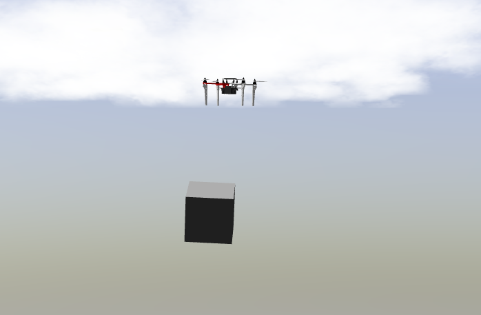
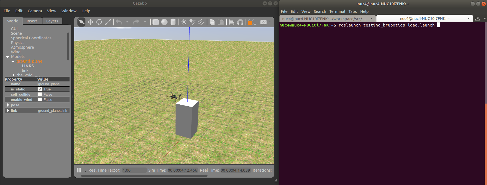
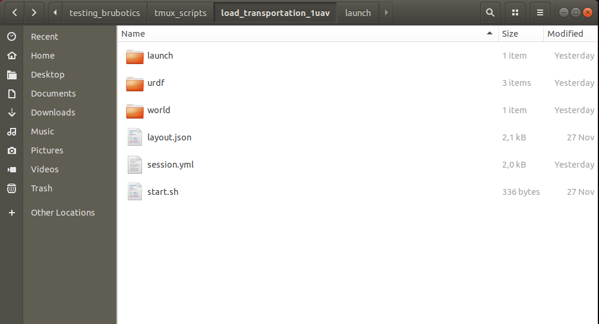

7. Adding a payload in an existing simulation
=============================================

In this section, you'll learn how to:

* make a load spawn in Gazebo
* modify the load model 
* visualize it using Rviz
* tweak the simulation parameters according to your needs. 

Creation of a new world with payload and automate it to start with simulation
-----------------------------------------------------------------------------

To create a new simulation environment, follow these steps:

* Make a new folder in the directory: "/workspace/src/droneswarm\_brubotics/ros\_packages/testing\_brubotics/tmux\_scripts"

* Copy the files ("start.sh", "layout.json" and "session.yml") of an other example (from brubotics or mrs) in your new folder. Take a simulation as close as possible to 
  what you want to achieve (e.g.:one drone gps). 

* Launch your simulation, by opening terminal and typing "./start.sh". 

* If you want to create a new world \bc{see previous chapter on creating new worlds, this "general" explanation belongs there}, copy an existing world file in in the folder 
  you created in ".../tmux\_scripts" . The location of the standard mrs world files are in following directory:\\  "/git/simulation/ros\_packages/mrs\_gazebo\_common\_resources". For our situation, we started from the standard grass plane. \bc{be more specific about which files you base yourself on for the specific task you have.}\pp{Done}

* Adapt your file by adding models, e.g. boxes or trees. We added a box that will be used as payload. Find exemples of codes to implement this models in other .world files or 
  the internet. \bc{no no need list this code if you do not talk about specific parts in the code. Better to insert a link to this file on our github. Try to explain which parameters 
  are important to set for your purpose. Now it is again "quite generic". It does not directly explain the specifics, although they might be in the code.}\pp{Done, not pushed yet so 
  we still have to add link}

* Change "world\_name:=grass\_plane" in the following lines in the "Session.yml" file:

.. code-block:: xml

  - gazebo:
    layout: tiled
    panes:
    - waitForRos; roslaunch mrs_simulation simulation.launch world_name:=grass_plane gui:=true
    to (adapt text in LARGE LETTERING)
  - gazebo:
    layout: tiled
    panes:
      - waitForRos; roslaunch mrs_simulation simulation.launch world_file:='/home/NAME OF COMPUTER SESSION/workspace/src/droneswarm_brubotics/ros_packages/testing_brubotics/tmux_scripts/NAME OF FOLDER/NAME OF WORLD FILE.world' gui:=true

Link_attacher
-------------

Installation
^^^^^^^^^^^^
The required package is normally installed directly with the dronesware brubotics installation. Check in ~/workspace/src/ if mrs_gazebo_extras_resources is present or not.
If it's there, skip the first step (cloning) and only do the next step (.worlf file modification).

To be able to attach a load to your drone, follow next steps:

* Exectute the following commands to clone the extra recources file of MRS:

.. code-block:: shell

  cd ~/workspace/src/
  git clone https://github.com/ctu-mrs/mrs_gazebo_extras_resources

* Build the workspace:

.. code-block:: shell

  catkin build

* Add the plugin of the link_attacher in the .world file:

.. code-block:: xml

  <plugin name="mrs_gazebo_link_attacher_plugin" filename="libMRSGazeboLinkAttacherPlugin.so"/>

Creation of a link
^^^^^^^^^^^^^^^^^^
Now you can use the link attacher plugin in your
simulation. To be able to use the plugin, there must be an object in your .world file to attach to your
drone (a box for example):

1. Start your simulation from previous chapter.

2. To create a box,create a new file named "box.urdf" and copy paste the following code inside (or put it inside the .world file.):

.. code-block:: xml 

  <?xml version="1.0" ?>
  <robot name="box" xmlns:xacro="http://www.ros.org/wiki/xacro">
          <!-- 1st link -->
      <link name="link_chassis">
          <pose>0 0 0 0 0 0</pose>
          <inertial>
              <mass value="0.5"/>
              <origin xyz="0 0 0.1" rpy="0 0 0"/>
              <inertia ixx="0.0395" ixy="0" ixz="0" iyy="0.106" iyz="0" izz="0.1062"/>
          </inertial>
          <collision name="collision_chassis">
              <geometry>
                  <box size=".5 .5 .5"/>
              </geometry> 
          </collision>
          <visual>
          <origin rpy="0 0 0" xyz="0 0 0"/>
              <geometry>
                  <box size=".5 .5 .5"/>
              </geometry>
          </visual>
      </link>
  </robot>

Then create another file called "box.launch" and copy paste the following code inside (if you've chosen to extend the .world file, you can skip this part, see next section):

.. code-block:: xml 

  <?xml version="1.0"?>
  <launch>
      <param name="robot_description" command="$(find xacro)/xacro '$(find testing_brubotics)/tmux_scripts/PATH/box.urdf'" />
      <arg name="x" default="0"/>
      <arg name="y" default="0"/>
      <arg name="z" default="1.5"/>

      <node name="SpawnBox" pkg="gazebo_ros" type="spawn_model" output="screen" args="-urdf -param robot_description -model load -x $(arg x) -y $(arg y) -z $(arg z)" />
  </launch>

Don't forget to change the path leading to the URDF file. The content of these two files will be explained in the next chapter.
To make the box spawn, after a simulation has been started, open a new shell and paste this:

.. code-block:: shell

  roslaunch testing_brubotics box.launch

Then move your drone above the object you want to connect it with.
The distance between the drone and the object will be the length of the link. 

3. Create the link by performing following commands in a new shell tab, while adapting all the names
between parentheses to your situation. The correct model and link names can be seen in gazebo.

.. code-block:: shell

  rosservice call /link_attacher_node/attach "model_name_1: 'uav1'
  link_name_1: 'base_link'
  model_name_2: 'unit_box'
  link_name_2: 'link1' "

This link will create a distance constraint, between the links of the two models. This means the
objects will always stay at a same distance from each other. The link will however not be visible.
The links are placed in the center of mass of a standard object. We will later, in section 5.4, see
how links can be placed at other places than the center of mass.

4. If the connection succeeded, the message "ok: True" will be given. It could not succeed if you wrote
the names of your links and models wrong. 

5. You can also change the joint type by adding "joint_type: ’INSERT_TYPE’" as shown below. The possible choices
are "revolute", "ball", "gearbox", "prismatic", "revolute2", "universal", "piston", "fixed". If you do
not specify the joint type, it will be a revolute joint. The joint type you define will be the joint
connecting the first model with the link, the connection of the second model to the link, will be
fixed.

.. code-block:: shell

  rosservice call /link_attacher_node/attach_typed "model_name_1: 'uav1'
  link_name_1: 'base_link' model_name_2: 'unit_box' link_name_2: 'link1'
  joint_type: 'ball'"

In our situation we want a ball joint (spherical joint), to approach a cable on a hinge

6. Now you can move your drone up to see your payload take off. Try moving your drone sideways,
you will see the payload is not implemented yet in the control and will oscillate.

Here is what you should see in your simulation :

Model your payload with an URDF file
------------------------------------

Instead of spawning the box in the world file as done previously, it is possible to make an urdf file of the
payload. This has the advantage that you can define more comlex connections of multiple objects and
add joints between elements.

Create urdf file
^^^^^^^^^^^^^^^^

Open a blank file and save it as MODELNAME.urdf, for the MODELNAME
you can choose what you want. Place the urdf file in an existing package or make a new package. To reproduce the steps and learn correctly, 
create a new folder in testing_brubotics/load_transportation. 
In the following code we have an example to model a box. You can copy and paste this code in the blank urdf file, then save the document. 

.. code-block:: xml

  <?xml version="1.0" ?>
  <robot name="ROBOTNAME" xmlns:xacro="http://www.ros.org/wiki/xacro">
  
     <!-- 1st link -->
    <link name="link_chassis">
      <pose>0 0 0.1 0 0 0</pose>
      <inertial>
        <mass value="5"/>
        <origin xyz="0 0 0.1" rpy="0 0 0"/>
        <inertia ixx="0.0395" ixy="0" ixz="0" iyy="0.106" iyz="0" izz="0.1062"/>
      </inertial>
      
      <collision name="collision_chassis">
        <geometry>
          <box size="1 1 2"/>
        </geometry>
        </collision>
      <visual>
        <origin rpy="0 0 0" xyz="0 0 0"/>
        <geometry>
          <box size="1 1 2"/>
        </geometry>
      </visual>
    </link>
  </robot>

The <xml> line is a standard line then in the second line of code you have to give a name to your robot
(ROBOTNAME), you can change what you want for example "payload". Start the robot description with
<robot>. The next step is to make the links and joints. There are some sub modules like inertial, collision
and visual. Again you can name them how you want. The sub modules can be modified and the collision
and visual do not have to be the same. More info can be found on http://wiki.ros.org/urdf/XML/link.
Finally, close the robot description with </robot>.

Create a launch file
^^^^^^^^^^^^^^^^^^^^
Now that you have created the urdf file, it needs to be executed. Therefore we use a launch file. Again
open a blank file and save it as NAME.launch, with "NAME" that can be what you want.Place
it in the folder with all the other documents you created in testing_brubotics/load_transportation. Below an example of a launch file 
is shown, you can copy paste this code inyour launch file.

.. code-block:: xml

  <launch>
    <param name="robot_description" command="$(find xacro)/xacro '$(find testing_brubotics)/tmux_scripts/FOLDERNAME/MODELNAME.urdf'" />
    
    <arg name="x" default="0"/>
    <arg name="y" default="0"/>
    <arg name="z" default="1.5"/>
    
    <node name="NODENAME" pkg="gazebo_ros" type="spawn_model" output="screen"
          args="-urdf -param robot_description -model ROBOTNAME -x $(arg x) -y $(arg y) -z $(arg z)" />
          
  </launch>

Again, the first line of code is as standard line that has to be put. Start the launch file with <launch>
on the second line. The param name="robot_description" is a package in ROS and cannot be changed.
Then the command find xacro is executed, this tries to find the urdf file in the path you provide. Change
the correct names that are in UPPERCASE to your directory and urdf file name!
Then some arg are defined, "x, y and z", this is were the urdf file will be spawned. You can change
those values. Finally, you create a node with "NODENAME" that can be changed to what you want for
example, spawn_payload. The pkg used is gazebo_ros with a certain type and the result is shown on the
screen. The arguments are given to the urdf file where you need to change the ROBOTNAME, to the
name you gave in the urdf file!
To test if everything works as expected launch a simulation (./start.sh in the right folder). Then
execute the launch file by opening a new terminal and pasting the following command (change the name
to your NAME.launch file).

.. code-block:: shell

  roslaunch testing_brubotics NAME.launch

 You should see a box spawn like on the following figure::

Automate this using tmux
^^^^^^^^^^^^^^^^^^^^^^^^

Instead of opening a new terminal it is possible to do it with the rest
of the simulation. Open for that your session.yml file in your directory. Add the lines that are indicated
below between the spawn and control code, and change the NAME.launch to your actual launch file. Save
then exit the document. Now when executing ./start.sh you should see the box spawn in your world. The
lines added will execute the launch file.

.. code-block:: xml

  - load:
      layout: tiled
      panes:
        - waitForSimulation; roslaunch testing_brubotics NAME.launch

Model your payload with an XACRO file
-------------------------------------
The advantage with using xacro files is that we can use macros. This means that instead of defining each
link in the urdf file we can make a macro. A macro acts line a function were we give variables and this
makes a link. This means that we use 2 xacro files, one where the "functions" are defined and one were
the parameters are given. Because the number of files begins to increase, sub folders are made to have a
clearer overview like on the figure below. Later the files will be put in the right folder and pushed to the
brubotics github.

.. note::
  For a more complete introduction, follow `this youtube tutorial <https://www.youtube.com/watch?v=ixTMFQfXfgs>`__ (part 1 to 4 are relevant to learn URDF,XACRO and using Rviz efficiently).

The first step you need to do is make a xacro file. This is done by opening a blank file and saving it
as MODELNAME.xacro. In your launch file change the PATH to the correct one and the file extension
to xacro instead of urdf. You can copy paste the code below and change the PATH and MODELNAME
to the correct one.

.. code-block:: xml

  <?xml version="1.0"?>
  <launch>
      <param name="robot_description" command="$(find xacro)/xacro '$(find testing_brubotics)/tmux_scripts/PATH/MODELNAME.xacro'" />
      
      <node name="NODENAME" pkg="gazebo_ros" type="spawn_model" output="screen"
            args="-urdf -param robot_description -model ROBOTNAME" />
            
  </launch>

Now make a second empty xacro file where we will make the "functions". Save it as FUNCTION-
NAME.xacro. In the code below an example of a macro to make a box and a joint is shown. You can
copy paste this in the file. TIP: copy paste the code from the source of overleaf.

.. code-block:: xml

  <?xml version="1.0" ?>
  <robot xmlns:xacro="http://www.ros.org/wiki/xacro">

    <xacro:macro name="m_link_box" params="name origin_xyz origin_rpy size mass ixx ixy ixz iyy iyz izz">
      <link name="${name}">
        <inertial>
          <mass value="${mass}" />
          <origin rpy="${origin_rpy}" xyz="${origin_xyz}" />
          <inertia ixx="${ixx}" ixy="${ixy}" ixz="${ixz}" iyy="${iyy}" iyz="${iyz}" izz="${izz}" />
        </inertial>
        <collision>
          <origin rpy="${origin_rpy}" xyz="${origin_xyz}" />
          <geometry>
            <box size="${size}" />
          </geometry>
        </collision>
        <visual>
          <origin rpy="${origin_rpy}" xyz="${origin_xyz}" />
          <geometry>
            <box size="${size}" />
          </geometry>
        </visual>
      </link>
    </xacro:macro>

    <xacro:macro name="m_joint" params="name type axis_xyz origin_rpy origin_xyz parent child limit_e limit_l limit_u limit_v">
      <joint name="${name}" type="${type}">
        <axis xyz="${axis_xyz}" />
        <limit effort="${limit_e}" lower="${limit_l}" upper="${limit_u}" velocity="${limit_v}" />
        <origin rpy="${origin_rpy}" xyz="${origin_xyz}" />
        <parent link="${parent}" />
        <child link="${child}" />
      </joint>
      <transmission name="trans_${name}">
        <type>transmission_interface/SimpleTransmission</type>
        <joint name="${name}">
          <hardwareInterface>hardware_interface/EffortJointInterface</hardwareInterface>
        </joint>
        <actuator name="motor_${name}">
          <hardwareInterface>hardware_interface/EffortJointInterface</hardwareInterface>
          <mechanicalReduction>1</mechanicalReduction>
        </actuator>
      </transmission>
    </xacro:macro>

  </robot>

Again the first lines is standard and the robot description is given between <robot> and </robot>.
In order to make a box we have to look at the first block of code. On the first line the parameters are
defined that we have to give to this function to make a box. Then the same structure can be recognized
as in the URDF file. The parameters are the following:

.. code-block:: xml

  <xacro:macro name="m_link_box" params="name origin_xyz origin_rpy size mass ixx ixy ixz iyy iyz izz">

Now we go back to the first MODELNAME.xacro that we made. We will call the function here and
for this you can copy paste the code below. The start is always the same and you have to modify the
UPPERCASE words to your example.

.. code-block:: xml

  <?xml version="1.0" ?>
  <robot name="MODELNAME" xmlns:xacro="http://www.ros.org/wiki/xacro">
      
  <!-- BGN - Include -->
    <xacro:include filename="$(find testing_brubotics)/PATH/FUNCTIONNAME.xacro" />
    <!-- END - Include -->
    
    <!-- BGN - PAYLOAD description -->
    <m_link_box name="LINKNAME"
                origin_rpy="0 0 0" origin_xyz="0 0 0.5"
                mass="1"
                ixx="0.1" ixy="0" ixz="0"
                iyy="0.1" iyz="0"
                izz="0.1"
                size="1 1 1" />
  </robot>

To communicate between the two xacro files, we have to add the line <include> with the right PATH
and name. Then we call the function <m_link_box> and give the parameters needed. When starting the
simulation with ./start.sh, you should see the box spawn in gazebo. 
Now you can make your own model.

This will only work on Ubuntu 18/Ros Melodic. If you are using ROS Noetic on Ubuntu 20, you must add xacro: before calling the m_link_box macro.

.. code-block:: xml

    <?xml version="1.0" ?>
    <robot name="MODELNAME" xmlns:xacro="http://www.ros.org/wiki/xacro">
        
    <!-- BGN - Include -->
      <xacro:include filename="$(find testing_brubotics)/PATH/FUNCTIONNAME.xacro" />
      <!-- END - Include -->
      
      <!-- BGN - PAYLOAD description -->
      <xacro:m_link_box name="LINKNAME"
                  origin_rpy="0 0 0" origin_xyz="0 0 0.5"
                  mass="1"
                  ixx="0.1" ixy="0" ixz="0"
                  iyy="0.1" iyz="0"
                  izz="0.1"
                  size="1 1 1" />
    </robot>

Starting from now all codes will be shown as this, to work on both Melodic and Noetic.

Using RVIZ
----------

To make the correct model in the xacro file it can be long to launch everytime the gazebo simulation. A
quicker and better way is to use RVIZ for this instance. When using RVIZ the physics are not loaded like
in gazebo so it is way quicker to see the changes and how the joints are acting. For this you will have to
make a new launch file. To keep it simple name it RVIZ.launch but is can be whatever you want. Copy
paste the code from below (change the PATH and MODELNAME) and save the file. TIP: Copy paste it
from the source code of overleaf.

.. code-block:: xml

  <?xml version="1.0"?>
  <launch>
      <param name="robot_description" command="$(find xacro)/xacro '$(find testing_brubotics)/tmux_scripts/PATH/MODELNAME.xacro'" />
      
    <!-- Combine joint values -->
    <node name="robot_state_publisher" pkg="robot_state_publisher" type="robot_state_publisher"/>

    <!-- Show in Rviz   -->
    <node name="rviz" pkg="rviz" type="rviz" />

    <!-- send joint values -->
    <node name="joint_state_publisher" pkg="joint_state_publisher" type="joint_state_publisher">
      <param name="use_gui" value="True"/>
    </node>

  </launch>

To modify the joint values and see how they change you will have to download a package. Copy paste
the following command in your terminal. Make sure to replace <your_ros_version> with the code name
of the ROS version you are using. So for Melodic, replace it with melodic! This should download the
missing package.(Normally already installed with the Droneswarm Brubotics installation.)

.. code-block:: shell

  sudo apt update
  sudo apt install ros-<your_ros_version>-joint-state-publisher-gui

Now in a terminal you can execute the command below to see your model. TIP: make sure you
spawn the objects in the origin of the plane or you will not be able to see them as RVIZ will only display a few meters away from the origin (e.g. object in 45,45,0) will not be visible).

.. code-block:: shell

  roslaunch testing_brubotics rviz.launch

This is the result you should see. 

There is still nothing shown, this is because of the error. In the fixed
frame you need to change the "map" [you should put your window in full screen] AD to the base you want
to use instead. This link will be considered the ground of your model. Take for this the "base_link" of
your model. 

Now to visualize the robot model you need:
1. Click on the add button in the left corner of the RVIZ screen
2. Search for RobotModel and click on it.
3. Click on OK
4. In this list you can also add frames.
[unclear, see video in previous note]

You should see the model now as in the following figure.

Now you can play with the joints and see how your model behaves. To see overlapping of the parts it
is possible to change the Alpha value in RobotModel to 0,5 for example and press enter. Then they are
not opaque anymore.

Instead of redoing the steps of adding a frame, change the alpha value, setting the correct frame,...
it is possible to automate this in your launch file. In rviz when all your parameters are set up, go to save
as and save it in your launch folder as "config.rviz".

Now open your launch folder and change the following line from what was there previously. You can
see that we give an argument, the config.rviz file we just made and you need to change the PATH. Save
the document and when launching again all the settings should be correct.

.. code-block:: xml

  <!-- Show in Rviz -->
  <node name="rviz" pkg="rviz" type="rviz" args="-d $(find testing_brubotics)/PATH/config.rviz" />

Example: Creation of a bar with two cables
^^^^^^^^^^^^^^^^^^^^^^^^^^^^^^^^^^^^^^^^^^
[I would sugges to follow the youtube video instead of this example, as the expected results are easier to see on a video than in such file.]

he implementation of the following example is based on `this github code <https://github.com/massimilianop/collaborative_load_lifting/blob/master/urdf/cables_and_payload.xacro>`__. We use
this approach in order to create the joints. As it is not possible to create ball joints using xacro files, this
approach simulates ball joints by overlapping two continuous joints (one allowing a rotation around the
x-axis and one around the y-axis). This example is given to demonstrate the choice of reference in the
xacro file. The following code was written to create the system

.. code-block:: xml

  <xacro:m_link_box name="${link_00_name}"
              origin_rpy="0 0 0" origin_xyz="0 0 0.05"
              mass="0.1"
              ixx="0.1" ixy="0" ixz="0"
              iyy="0.1" iyz="0"
              izz="0.1"
              size="0.5 0.1 0.1" />
              
  <xacro:m_joint name="${link_00_name}__${link_01_name}__x" type="continuous"
           axis_xyz="1 0 0"
           origin_rpy="0 0 0" origin_xyz="0.24 0 0.1"
           parent="base_link" child="link_01"
           limit_e="1000" limit_l="-3.14" limit_u="3.14" limit_v="0.5" />
           
  <xacro:m_link_sphere name="${link_01_name}"
              origin_rpy="0 0 0" origin_xyz="0 0 0.005"  
              mass="0.01"
              ixx="0.1" ixy="0" ixz="0"
              iyy="0.1" iyz="0"
              izz="0.01"
              radius="0.01" />
              
  <xacro:m_joint name="${link_01_name}__${link_02_name}__x" type="continuous"
           axis_xyz="0 1 0"
           origin_rpy="0 0 0" origin_xyz="0 0 0"
           parent="link_01" child="link_02"
           limit_e="1000" limit_l="-3.14" limit_u="3.14" limit_v="0.5" /> 

  <xacro:m_link_cylinder name="${link_02_name}"
              origin_rpy="0 0 0" origin_xyz="0 0 0.25"  
              mass="0.01"
              ixx="0.1" ixy="0" ixz="0"
              iyy="0.1" iyz="0"
              izz="0.01"
              radius="0.01" length="0.5" />                     
            
  <xacro:m_joint name="${link_00_name}__${link_03_name}__x" type="continuous"
           axis_xyz="1 0 0"
           origin_rpy="0 0 0" origin_xyz="-0.24 0 0.1"
           parent="base_link" child="link_03"
           limit_e="1000" limit_l="-3.14" limit_u="3.14" limit_v="0.5" />

  <xacro:m_link_sphere name="${link_03_name}"
              origin_rpy="0 0 0" origin_xyz="0 0 0.005"  
              mass="0.01"
              ixx="0.1" ixy="0" ixz="0"
              iyy="0.1" iyz="0"
              izz="0.01"
              radius="0.01" />
              
  <xacro:m_joint name="${link_03_name}__${link_04_name}__x" type="continuous"
           axis_xyz="0 1 0"
           origin_rpy="0 0 0" origin_xyz="0 0 0"
           parent="link_03" child="link_04"
           limit_e="1000" limit_l="-3.14" limit_u="3.14" limit_v="0.5" />    

  <xacro:m_link_cylinder name="${link_04_name}"
              origin_rpy="0 0 0" origin_xyz="0 0 0.25"  
              mass="0.01"
              ixx="0.1" ixy="0" ixz="0"
              iyy="0.1" iyz="0"
              izz="0.01"
              radius="0.01" length="0.5" />

Explanation of code:
""""""""""""""""""""

1. The "link_00_name" represents the bar on the ground. The position of the box can be changed
with "origin_xyz", this represents the center of mass of the object.
2. For joints, "origin_xyz" represents the position of the joint relative to the previous joint. If it is the
first joint (as for "${link_00_name}__${link_01_name}__x"), it is relative to (0,0,0).
3. [make sure the text fits on the page]BCFor every link that is added, the "origin_xyz" will represent
the center of mass of the object relative to the previous joint. For example, "link_03_name" is
defined relative to "${link_00_name}__${link_03_name}__x"
4. Something that cannot be done in xacro files are ball joints. A solution for thi si represented in
this example. To joints are placed in the same position to realise a rotation around both the x- and
y-axis.

To see this model, reproduce the procedure to launch it in RVIZ (see above section). If everything is working fine, you should see this:

Chaning drone initial position
------------------------------

Instead of spawning the drone in the default position, you can choose where you want to spawn it. In
order to change the initial position, you will have to create a .csv file in which you specify the position at
which the drone has to be spawned. To do you, follow the following steps:

1. create a .csv file (ex: spawn_location.csv) in the directory in which you have your session.yml file "/workspace/src/droneswarm_brubotics/ros_packages/testing_brubotics/tmux_scripts"
   (you can create a .csv file using visual studio by just creating a new file and saving it as a .csv):

2. add the following line to your file and save it.

.. code-block:: xml

  1, 0.0 , 0.0 , 0.0, 0.0

Which means :

  (a) the first number = the id of the drone (if you have 1 drone, the id is 1. if you have 2 drones,
      the first drone has id 1 and the second id 2)

  (b) the following 3 numbers are the position at which you want the drone (in this case the origin)

  (c) the last number is the heading of the drone

  (d) For the case of one drone, we spawn UAV1 with id 1 in the origin (see code above) as to make
      the connection to the payload easier since we are using the link-attacher

3. add the .csv file to your session.yml by adding the following to the line containing the command to
   spawn the UAV. Change the CSV_FILE_NAME by the name of your .csv file.
   
   .. code-block:: xml

      --pos_file `pwd`/CSV_FILE_NAME.csv

   like in this example:

   .. code-block:: xml

    - waitForSimulation; rosservice call /mrs_drone_spawner/spawn "1 $UAV_TYPE --enable-rangefinder --enable-ground-truth --pos_file `pwd`/spawn_location.csv"
  
4. To change the position of multiple drones, you will have to create a .csv for each drone (don't forget
   to change the id, depending on the drone) and follow the steps above to integrate it in the session.yml file.

Making a connection between load and drone after takeoff
--------------------------------------------------------
Sometimes weird behavior of the system can be observed if the connection between the drone and the
payload is done before takeoff. Before solving this problem, another problem has to be tackled. When
performing the simulations, there is always an offset between the desired position of the drone and its
actual position. This is because we use a regular GPS. This will result in a connection that is not perfectly
in the COM of the drone when doing the connection after takeoff. A solution is to change to a `RTK GPS <https://en.wikipedia.org/wiki/Real-time_kinematic_positioning>`__.

Use a RTK GPS
^^^^^^^^^^^^^

To switch to a RTK GPS, two things must be done:

1. The drone must be spawned with following line in the session.yml file. This enables a publisher of
   the ground truth position of the UAV.

  .. code-block:: xml

    --enable-ground-truth

2. Following line must be added in the pre-window of the session.yml file.
   
   .. code-block:: xml

      export ODOMETRY\_TYPE="rtk"

Change in code to perform connection after takeoff
^^^^^^^^^^^^^^^^^^^^^^^^^^^^^^^^^^^^^^^^^^^^^^^^^^

To perform the connection after takeoff, the drone must follow a couple of steps:

1. make the drone takeoff without connection to the payload
2. make the drone fly above the position where you will spawn the payload
3. pause the physics of the simulation
4. spawn the payload
5. use link attacher to make a connection between the payload and the drone
6. unpause the physics

This results in a change of lines 77 to 89 in Session.yml in this `Github file <https://github.com/mrs-brubotics/testing_brubotics/blob/master/tmux_scripts/load_transportation/6_one_drone_SE3controllerBrubotics_Robustness_mv1/session.yml>`__.

Change tracker after take-off and take-off height
-------------------------------------------------

Since the collision properties have to be deactivated in order to get two drone closer than 3m to each
other, the tracker has to be changed after take-off. To do so, a custom_configs has to be created inside
the folder in which the session.yml file resides. In this custom_configs folder, create a new file called
uav_manager.yaml and add the following:

.. code-block:: xml

  takeoff:

        after_takeoff:
            tracker: "LineTracker"
            controller: "Se3Controller"

    takeoff_height: 1

this code will change the tracker after take-off by the "Linetracker". The LineTracker allows the drone
to fly close to each other (remove the collision properties). In the same code it is also possible to change
the take-off height.
To implement this in the session.yml, the following code as to be added at the part of the control
inside the session.yml:

.. code-block:: xml

  - waitForOdometry; roslaunch mrs_uav_general core.launch DEBUG:=false
    config_uav_manager:=./custom_configs/uav_manager.yam

Change UAV mass
---------------

In order to simulate with a hardware UAV mass (2.40 kg for f450, TODO??kg for t650) some manual changes are required in the mrs_uav_system (explained for the f450):

* Open *~/mrs_workspace/src/simulation/ros_packages/mrs_simulation/models/mrs_robots_description/urdf/f450.xacro* and adjust the mass: *<xacro:property name="mass" value="${2.40-0.005*4.0-0.015-0.00001}" /> <!-- [kg] 2.40-->* . This ensures that Gazebo simulates a UAV 
  model with the hardware mass. Note that the xacro has slight offset from 2.4kg since afterwards some small masses (of motors, sensors) are added to the uav so we subtract them before they are added.

* Open *~/mrs_workspace/src/uav_core/ros_packages/mrs_uav_managers/config/simulation/f450/mass.yaml* and adjust the mass: uav_mass: 2.40 #2.00 # [kg]. 
  This ensures that the controllers and trackers that use mass (e.g., for feedforward actions) use th hardware mass.

* Catkin build the mrs_worspace (although not strcitly necessary if you only change configs, make a habit to catkin build more than too less)

.. note::
  Do not forget to do the above steps each time you reinstall the mrs_uav_system! For hardware experiments the UAV mass used in the controllers and trackers is the one set in the ~/.bashrc, hence the above changes do not effect operation on hardware.

* For UAVs with payload, you need to do the same for what concerns mass of only the UAV (excluding payload mass), but you also need to ensure that the xacro of the payload has the same payload mass as the one you use in 
  the controller and tracker. This is normally exported in the session.yml file of each test folder, where you have to change *LOAD_MASS:0.2* and *export LOAD_MASS=0.2* with the chosen mass. 
  For 2 UAVs each UAV offcourse compensates for half of the bar's mass instead of the total payload mass in the case of one UAV with cable suspended load. So you must put the full mass in *LOAD_MASS:m* but only half of it in *export LOAD_MASS=m/2*

.. note:: 
  For the se3_brubotics_load_controller, the mass of the UAV is loaded through the variable defined in the ~/.bashrc file as well. So changing the yaml files as explained above might not be enough.
  To solve this issue you can either change the value in the ~/.bashrc directly. Or add *export UAV_MASS="2.4"* alongside the other export in the session.yml of your test. This export will normally overwrite
  the value present in the ~/.bashrc.