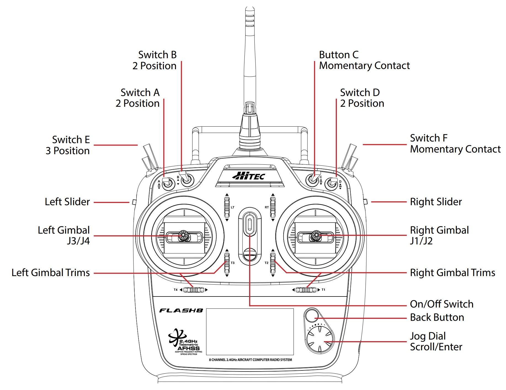
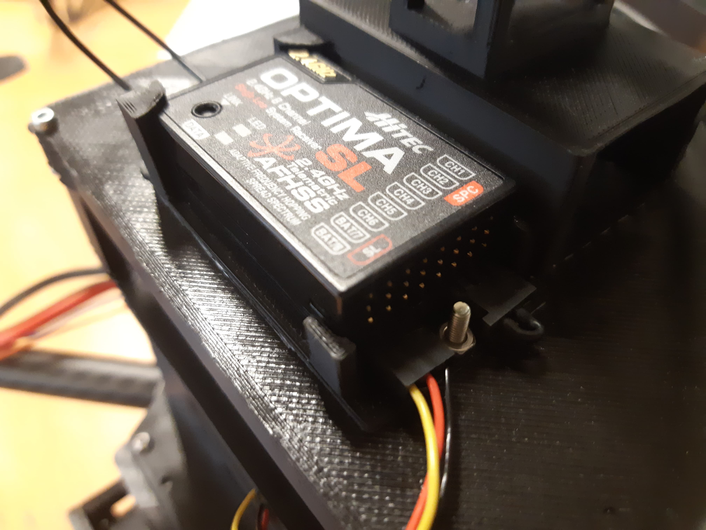

15 Binding the RC transmitter and the receiver
===============================================

In this section, you'll learn how to bind the receiver (Hitec Optima SL) and the transmitter (Hitec Flash 8).

The button "Jog Dial Scroll/Enter" will be referenced as "scroller" throughout the section.

The following steps come from `this video <https://www.youtube.com/watch?v=SzZXjZMq_po>`__. 

To bind both RC devices, follow these steps :

* Connect the SL port of the Optima SL (horizontal port below) with the DSM/SBUS RC port of
  the Pixhawk. Orientation of the cables is important!
  If you connect the cables in the opposite order, the Optima SL won’t turn on at all. (from left to
  right: yellow, red, black).

* (Optional but highly recommended) Connect one of the 4 ESCs signal cables to channel 1 of the
  Optima SL. This is not required but can help in order to know if the binding was successful.
  (Did not do it, should we keep it ?)

* Turn on the Hitec Flash 8 (On/Off switch, see picture...).

* Select not ready to transmit.

* Press and hold both buttons on the right of the Flash 8 (back button and the scroller, see picture...). A new menu with a ’System.List’ will
  open.

* Use the scroller to go to "Spectra" and press OK.

* Make sure the receiver is set on "Opti&Mini".

* Scroll on ’Binding’ and select "Optima".

* Select that you want to bind the transmitter and receiver.

* Make sure the receiver is first turned off (pull the pixhawk usb cable out of your computer). When
  the receiver is powered off press the link button of the receiver, and now turn
  it on (insert the pixhawk usb cable in your computer). When the receiver is turned on, release the
  link button.

* The screen on the transmitter should automatically go from "Press and hold the link button..." to
  "Reboot RX check all functions...". When this happens, turn the power from the receiver off and
  turn it back on.

* Press "finish". Normally you should see the battery voltage of the receiver on the lower part of the main screen of the
  transmitter (more or less 5V if you are using the Pixhawk (4.7V)) It oscilates
  at a high frequency. When you would power off the receiver, the value is fronze, turn on again and
  it oscillates. Means its working.

* (Only if you did step 2) WITH THE PROPELLERS DETACHED FROM THE MOTORS AND THE BATTERY CONNECTED, raise the throttle stick of the transmitter. If the motor starts spinning,
  then the binding process is successful. Keep in the mind that the RC calibration is not done yet, so
  it is possible that the motor will only start spinning at 50% throttle or more.
  (didn't do that, to keep ?)

* (Important) Now that everything is tested and working a last step needs to be performed in order
  to set up the RC transmitter correctly. The Hitec Flash 8 proposes 3 different modes depending
  on the model of your drone: ACRO, GLID and HELI. Press and hold both buttons on the right (back button and scroller) of the Flash 8.
  A new menu with a ’System.List’ will open. Go to "MDL Type". Make sure you have the Airplane mode on, with 1 wing and normal tail (see picture below). 
  The Airplane mode is the only mode correct for this drone, as it is also able to
  control quadcopters. If you press and hold a bit on the scroller, Acro.List opens, and scroll all the way down till
  "monitor" you will have a screen with all the different channels, when you move the joysticks in a
  certain direction. With the Airplane (ACRO) mode selected, you will see
  that only the channel linked to the throttle will move. If you do not do this the RC calibration on
  QGroundControl will be messed up and your drone will most likely crash or flip when you take off.

* You should give your model a new name. Select the letter you want to change and select the new
  replacement letter. Please don’t overwrite existing models. whenever you change MDL Type, the
  name is lost.
  

.. figure:: _static/transmitter_mode.jpg
   :width: 800
   :alt: alternate text
   :align: center

