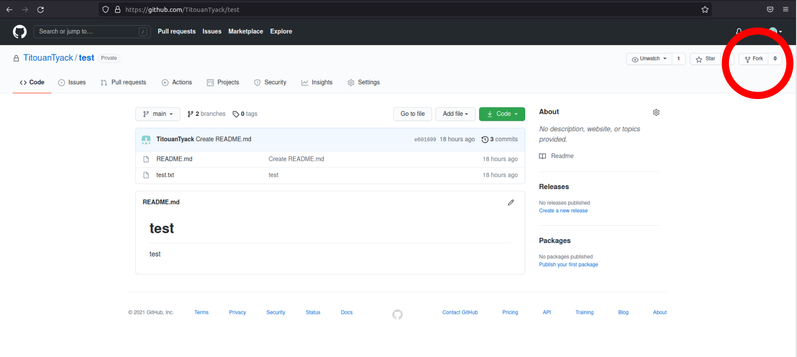
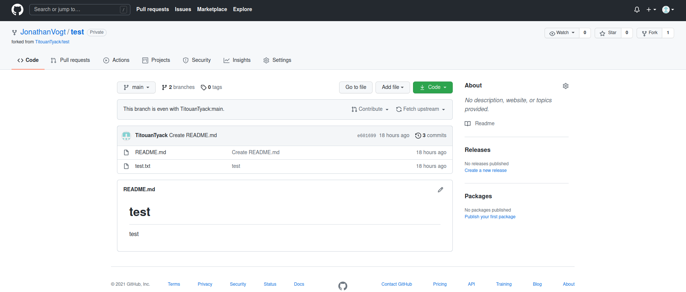
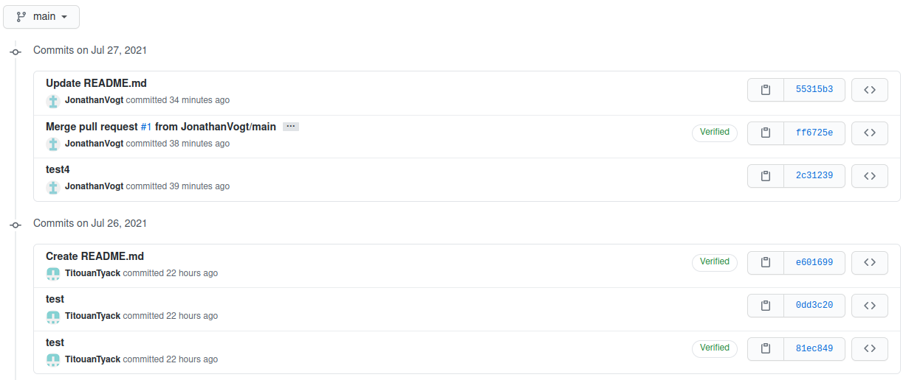

7. Version control with Github
==============================

We will explain in this section how we managed the version control.
Our goal was to update a code from two years ago based on a firmware that has since been updated. 
The code was not documented and had no version control system.
We needed to update it so that it can be used with the latest firmware version.
The first task was to think of how we can setup the version control of the old code.
It appeared that there 3 possibilities to do that.

1. Fork the repository of the latest version of the firmware
2. Make a new branch on the repository of the firmawre
3. Create a custom ROS package 

7.1. Fork a repository
----------------------

You can fork a repository on a GitHub page of this repository by using the fork button.

   Figure ?.1: fork

You can choose the account (your personnal account or to an organization) where you want to fork the repository.
After, you will be able to see the forked repository.

   Figure ?.2: fork_2

A fork is GitHub-to-GitHub operation wich copy the entire repository to an account. It copy all the branches of the repository.
You can clone it to your personal computer and change the file of your choice, create new files etc.

If you want, you can make a pull request of a branch of your forked repository to an existing branch (of your choice) of the repository of origin.
This is if you want to contribute to the work of the people who did the initial repository.

.. figure:: _static/pull_request.png
   :width: 500
   :alt: alternate text
   :align: center

   Figure ?.3: pull_request

They can accept your request, it will merge your work on the branch you have chosen.
All of your commits will be visible on the initial repository.

   Figure ?.4: commit

7.2. Make a new branch
----------------------

Make a new branch in a repository is very useful.
The easiest way to understand how it works and why it is useful is to read the `Git documentation <https://git-scm.com/book/en/v2/Git-Branching-Basic-Branching-and-Merging>`__

The most important part is to understand "Basic Branching" chapter.

7.3. Create a custom ROS package
--------------------------------

If you only have custom launch files, scripts, or firmware, you can simplify the process by creating a custom out-of-source ROS package:

.. code-block:: shell

    any/folder$ catkin_create_pkg my-new-pkg

In particular, you can create this package in any folder, including another git repository.

Then, add this package to your project workspace by using a symbolic link:

.. code-block:: shell

    project/ros_ws/src/userPackages$ ln -s /path/to/my-new-pkg .

Then you can create a repository on Github where you put your new package.
