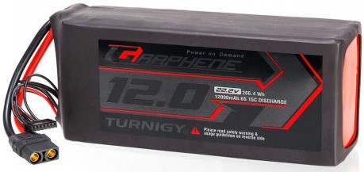
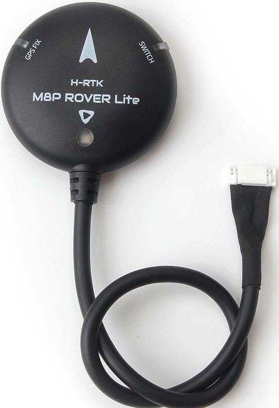
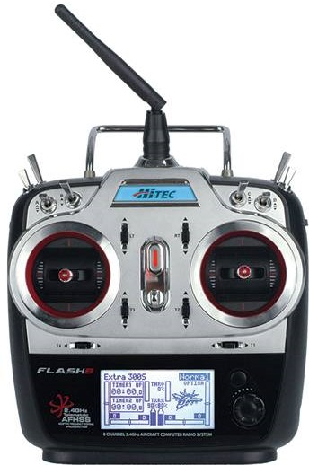
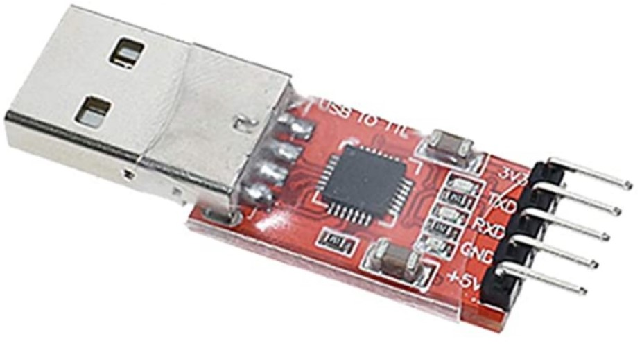

?.? Building the drone
======================
In this chapter you will learn how to build the drone from its different components.

Components
----------
In this section, you will learn the components needed to build the drone :

* Frame : The body of the drone, where everthing else is fixed.
Choice : Tarot Ironman 650

* Flight Controller : The flight controller is an electronic board with sensors (e.g. accelerometer, gyroscope, barometer), it used to send the desired speed to the motors based on the data coming from the sensors.
Choice : Pixhawk 4, it comes with its own GPS and power distribution board

* Power distribution board : The power distribution board (or PDB) is the central board of the drone where all the electrical components usually converge and are connected to the battery.
Choice : PDB from the Pixhawk

* Companion computer : The head of the drone, used to perform simulation on flight.
Choice : Intel Nuc (BXNUC10i7FNK2)

* Battery : Powers everything on the drone. LiPo batteries are usually used for drones as it provides the best energy-to-weight ratio. A drawback of these batteries is their chance to catch fire. To use them correctly, please read `this link <https://www.cnydrones.org/lipo-batteries-and-safety-for-beginners/>`__ to understand them and follow these guidelines :
	Charging : * Power on the battery charger.
		   * Set the voltage to 22.2V (6S battery) for the drone and the current to 1A for charging. The higher the current value the faster the battery will charge, but this will decrease the lifetime of the battery, so trade-off is needed.
		   * Place the battery in the fireproof bag. This is absolutely required as a safety issue since LiPo batteries can catch fire.
		   * Connect the battery to the charger. For the main lead beware of the polarity! Red on red, black on black. For the balance lead connect (back of the charger) it to its appropriate place (6S).
	           * Press start until it beeps. Then press start again.
	           * The charger will beep when the battery is charged.
	           * The battery can now be disconnected.
		   Never leave a battery charging without having an eye on it! The risk of it catching fire is existing and you should be ready to intervene if required. Try to always have a spare battery to replace the discharged one to avoid losing time. If you charge the LiPo battery and you get the low voltage error on the screen, then you should charge it under NiMH for a couple of minutes on a current below 0.7A (use blue charger for that).
	Storing : If the LiPo won’t be used for a long time it is imperative to not keep the batteries at full capacity, as this will damage them. the storage mode of the charger to discharge the battery. It is a similar procedure to the charging one.

Choice : Turnigy Graphene Professional 12000mAh 6S15C LiPo Pack

* Motor : Moves the drone.
Choice : Tarot 4114 320KV Multi-Rotor brushless motor.

* ESC : Electronic speed controller (ESC) are electronic circuits used to control the speed of the motors. One per motor.
Choice : Turnigy MultiStar BLheli_32 ARM 51A Race Spec ESC 2~6S

* Propeller : Used to move air from the motor's motion.
Choice : Tarot 15X5.5 Carbon Fiber Propeller TL2831

* GPS : To retrieve the absolute position of the drone.
Choice : GPS from the Pixhawk 4.

* RC Receiver : The RC receiver is a device that allows unidirectional wireless communication with the drone. It receives information from the RC transmitter that is located off drone.
Choice : Hitec Optima SL

* RC Transmitter : To provide information to the drone from the ground.
Choice : Hitec Flash 8

*FTDI : Enables the Pixhawk and the Nuc to communicate.
Choice : To check

*DC-DC converter : Enables to provide the good voltage to the Nuc (as the battery provides 22.2V and the Nuc can use a voltage between 12V and 19V). As the power supply of the Nuc is rated 19V/6.33A, the converter must be able to deliver at least 121W.
Choice : Wingoneer XL4016E1 (input : 4-40V, output : 1.25-36V at max 8A, max power : 200W).

.. figure:: _static/converter.jpg
   :width: 800
   :alt: alternate text
   :align: center

*RTK GPS : Used to get better measurements than the Pixhawk GPS. The Real-Time Kinematic (RTK) system is composed of the Emlid Reach RS2 as the ’base’ an the Emlid Reach M2 attached to the drone as the ’rover’. To the latter is connected the Multi-band GNSS antenna. The RTK is a GPS-based positioning system that allows to get cm-precise XYZ position from Global Navigation Satellite System (GNSS) measurements. The base and rover setup will help to get the RTK precision. Simply explained, the RTK system consists of the base (i.e. Reach RS2), the device that doesn’t move, and the rover (i.e. Reach M2), the device attached to the UAV. Both devices individually can get GNSS measurements with usual GPS precision. The RTK system computes the baseline, the difference between both measurements, which gives the rover’s position relative to the base.
Choice : Emlid Reach M2 UAV Mapping Kit
 

3D printed parts
----------------

In this section, you will learn the 3D printed parts needed and their use. They are accessible here (TO DO).
Print all the pieces with 20% infill. The pieces to print are :
* Main piece (1 piece, to print once per drone) : Used to provide enough space for all the components. PDB fixed on its lower stage, Pixhawk and the middle stage and Nuc on top of it. 

Main piece

* Pixhawk case (1 piece, 1/drone): Used to fix the Pixhawk on the main piece.

Pixhawk case

* Nuc case (2 pieces, 1/drone/piece): Used to fix the Nuc and the emlid receiver to the drone. One piece is the case itself, the second is the cover of the case.

Nuc case

* Upper case (1piece, 1/drone): Used to fix the RC receiver Optima, the Pixhawk GPS and the RTK antenna.

Upper case

All the cases together

* Motor fixation (2 pieces, 4/drone/piece) : Used to attach the motors to the frame and to fix the legs.

Motor top fixation

Motor bottom fixation

* Leg (1 piece, 4/drone) : Used to support the drone while on the ground.

Leg

* Battery case (4 pieces, 1/drone/piece) : Used to attach the battery to the frame. (Pieces : 2 sides, 1 front and core, to add picture).

Battery case

The drone totally assembled looks like this : 

.. figure:: _static/drone.jpg
   :width: 800
   :alt: alternate text
   :align: center
CAD of the drone.

Building
--------

In this section you will learn how to fix the components on the drone and how to solder/connect every cable.

All the holes used to attach something directly on the frame are for M3 bolts and the other holes M2.5 bolts. Use M3x12mm and M2.5x12mm bolts.
Every time you solder cables, put a piece of shrink tube beforehand on the cables and heat them on the soldering once it is done.

* Mount the frame as explained `here <https://www.youtube.com/watch?v=Ddvgs200OaY&ab_channel=MultiCopterBuild>`__ . You need only to attach the arms to the body (no need of the legs and the top part).
* Drill the holes of all the 3D printed pieces. Use a drill bit of size 2.5mm for every holes NOT touching directly the frame. For the holes used to fix the parts on the frame itself, use a 3mm drill bit.
* Put the motor on the "motor top fixation" (cables on the side of the elliptical hole), with the help of the screws provided with the motor. Pass the cables through the elliptical hole and solder them to the ESC. Repeat for the 4 motors.

.. figure:: _static/motor_top.jpg
   :width: 800
   :alt: alternate text
   :align: center

* Solder the 3 signal cables from the ESC (blue, brown and orange) to 1 jumper cable each. Try to keep the same colors (blue on blue etc). Repeat for the 4 ESCs.
* Fix the "motor bottom fixation" to the frame's part (shown below) with 4x M3 bolts (head on bottom).
* Put 2 straps in it through the side windows. The loops will be done downward.
* Fix the assembly to the end of an arm, using the bolts and parts (orange and blue) provided with the frame. 

* Fix the "motor top fixation" on the "motor bottom fixation" with the help of 4x M2.5 bolts (holes on the corner of the parts). Repeat the last 4 steps for each motor.

* DO NOT PUT THE PROPELLERS ALREADY, put them only when a real flight is planned.
* Take 4 pairs of battery cables (big cables, red and black, 1 pair per motor) and a pair with an XTC60 connector on them (provided with the PDB). Make sure that 4 of the pairs can reach the ESCs starting from the middle of the frame. Solder all the pairs on the power distribution board (PDB). The position of each pair is shown in the picture below. As the drone requires 4 motors but the PDB can supply 8 motors, you can solder each red cable to both B+ connections available on each corner of the PDB. Choose one of the 2 GND connection for the black cables.

* Fix the PDB to the "main piece" by help of 4x M3 bolts (head on bottom), use the 4 holes in the middle of the "main piece".
* Put the free end of each battery cables (10) outside the "main piece" with help of the windows of the piece.
* Fix the "main piece" on the upper plate of the frame, by help of 8x M3 bolts.
* Connect (by passing them through the windows of the "main piece") the signal cables of the ESCs to the "FMU-PWM-out" port of the PDB. Use the pins labelled 1 to 4 (to know which motor to connect to which set of pins, please refer to the chapter "Setting up QGroundControl"). If you have matched rightly the colors of the cables previously, connect the blues ones to the "S" pins, the brown ones to the "+" pins and the orange ones to the "-" pins (on top the blue cables, in the middle the brown cables and at the bottom the orange ones).
* Connect the cables provided with the Pixhawk to the ports "FMU-PWM-in", "PWR1" and "PWR2" of the PDB.

.. figure:: _static/pdb_connection.jpg
   :width: 800
   :alt: alternate text
   :align: center

* Put the Pixhawk in its case and connect these cables respectively to the ports "I/O PWM OUT", "POWER1" and "POWER2" of the Pixhawk.

.. figure:: _static/PX_pdb_connection.jpg
   :width: 800
   :alt: alternate text
   :align: center

* Put a cable provided with the Pixhawk on its "DSM/SBUS RC" port. It will be used for the RC receiver. 
* Connect the GPS to the Pixhawk using the "GPS MODULE" port.
* Be aware that you'll need to make another connection later. You can do it now but you'll need to follow the steps to make the picoblade cable with jumper wires explained in chapter "Connecting the Nuc to the drone".
* You will also need an USB cable to setting up QGroundControl later on, if you want, you can already put the cable on the side of the Pixhawk (and let it hang by a window of the "main piece").
* Fix the Pixhawk case to the "main piece" by help of 4x M2.5 bolts, on the middle stage. Try to have the Pixhawk as horizontal as possible in the drone.
* Solder the battery cables coming from the PDB to each pair coming from the ESCs (black on black, red on red). Don't forget to put beforhand a piece of shrink tube on the cables.

Your drone should look like this.

* On top of the "main piece", fix the Nuc case by help of 4x M2.5 bolts.
* Put the GPS, the RTK antenna (not yet done) and the Optima (RC receiver) in their respectives cases in the "upper case".
* Fix the "upper case" to the cover of the Nuc case, by help of 3x M2.5 bolts.

.. figure:: _static/upper_case_fixed.jpg
   :width: 800
   :alt: alternate text
   :align: center

* Fix the Nuc case cover on top of the Nuc case. 

* Use the straps on the motor fixation parts to fix the legs on each arm. Pass the straps through the rectangular holes on the legs and tighten well.

* Assemble the battery case by assembling the sides to the main part of the case. (I don't remeber exactly how many bolts are used with the latest changes, need to check). No need to add the front part to it for now.
* Fix the battery case to the bottom plate of the frame (clear picture with the recent changes to add).
* When needed, put the battery in its case (wires facing the wires hanging from the PDB) and add its front part to disable the movements of the battery.
* With help of tape, fix the ESCs and their wires to the frame such that none of them are hanging.

.. figure:: _static/drone_complete.jpg
   :width: 800
   :alt: alternate text
   :align: center
(Need to add a picture with the battery case).

Your drone is build !

